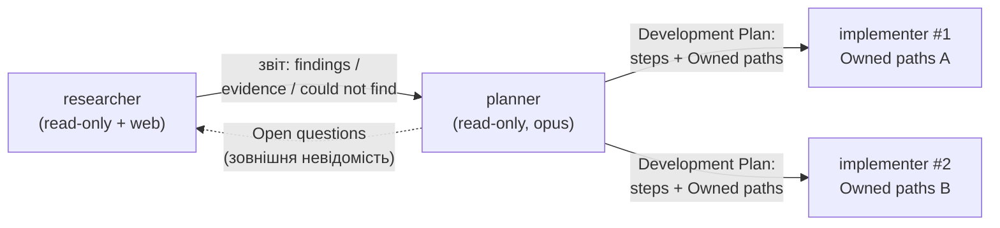
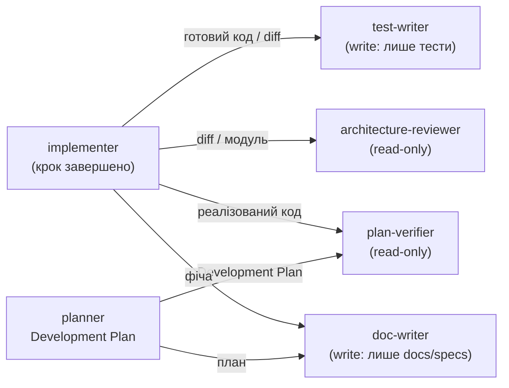
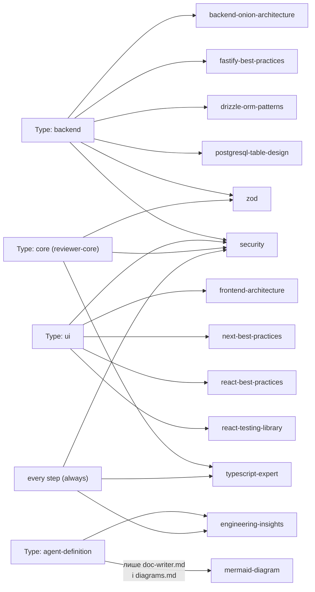

# Agent diagrams

Візуальний супровід до [README.md](README.md) — сам текст правил тут не
дублюється, лише три діаграми, на які README посилається: основний конвеєр
(`researcher → planner → implementer`), пост-імплементаційні ворота й автори
документації (чотири нові агенти), і Type→Skills.

## Потік передачі роботи

Сім агентів утворюють один конвеєр, але однією діаграмою його показувати
незручно — вийшло б занадто багато вузлів для "аркуша A4". Тому конвеєр
розбито на дві діаграми: основний цикл дослідження/планування/реалізації, і
те, що відбувається з результатом `implementer`-а після того, як крок
завершено.

### Основний конвеєр

`researcher` не має преднавантажених скілів — читає `specs/`/`docs/`/
`INSIGHTS.md` напряму і має `WebFetch`/`WebSearch`, яких немає в жодного
іншого агента з семи.

### Пост-імплементаційні ворота та автори документації

Коли `implementer` завершує крок, результат може піти в чотири боки —
писати тести, пройти два незалежні read-only аудити (архітектура і
відповідність плану), і/або лягти в документацію. Це другий, окремий
Mermaid-блок саме тому, що додавання цих чотирьох вузлів до діаграми вище
зробило б її нечитабельною.

Два принципово різні рівні довіри тут, а не один: `architecture-reviewer` і
`plan-verifier` — **аудитори**, без `Write`/`Edit`/`Skill`/`Agent`, вони
лише повертають звіт (Architecture Review / Plan Verification), ніколи не
змінюють файли. `test-writer` і `doc-writer` — **автори**, з `Write`/`Edit`,
але їхній обсяг запису обмежений не інструментом (Claude Code видає
`Write` за назвою, не за шляхом), а промптом: `test-writer` пише лише
`*.test.ts`/`*.test.tsx`/`*.it.test.ts`/`e2e/specs/*.flow.json`, `doc-writer`
— лише `docs/`+`specs/`. Жоден із чотирьох не має `Agent` — вони не
породжують інших агентів, як і всі інші три. `plan-verifier` додатково
приймає план від `planner`, а не лише код від `implementer` — це
maker-checker: він звіряє з самим планом, а не з переказом того, що зробив
`implementer`.

## Скіли за Type кроку

`planner` і `implementer` преднавантажують один і той самий набір із 12
проєктних скілів; яку частину **застосовувати** для конкретного кроку каже
його `Type` (planner лише цитує їх у плані, implementer — реально накладає
під час правок). Чотири нові агенти (`test-writer`, `architecture-reviewer`,
`plan-verifier`, `doc-writer`) працюють на кроках плану типу
**`agent-definition`** — новий, план-локальний Type, що описує роботу над
самими файлами `.claude/agents/*.md`, а не над кодом `server/`/`client`/
`reviewer-core`/`e2e`:

Вузли `security`, `zod` і `typescript-expert` навмисно спільні між гілками —
це та сама конвергенція, що й у Type→Skills таблиці `planner.md`/
`implementer.md` (§4/§3): `security` застосовується для будь-якого Type,
`zod` — для `backend` і `core`, `typescript-expert` — для `core` і `always`.
`agent-definition` — виняток із цієї конвергенції: він не перетинається з
`security`/`zod`/`typescript-expert` (ці кроки не торкаються продуктового
коду), а сходиться лише в `engineering-insights` (завжди) і додатково тягне
`mermaid-diagram`, але тільки для двох конкретних файлів — `doc-writer.md` (бо
цей агент сам авторить діаграми) і цей `diagrams.md` (Крок 6 плану
`docs/plans/new-subagents.md`, який ці два нові Mermaid-блоки й додав). Кроки
поза цією таблицею (наприклад docs-only) обидва агенти мапують окремо
через `.claude/skills/pr-self-review/references/skill-scope-map.md`.
