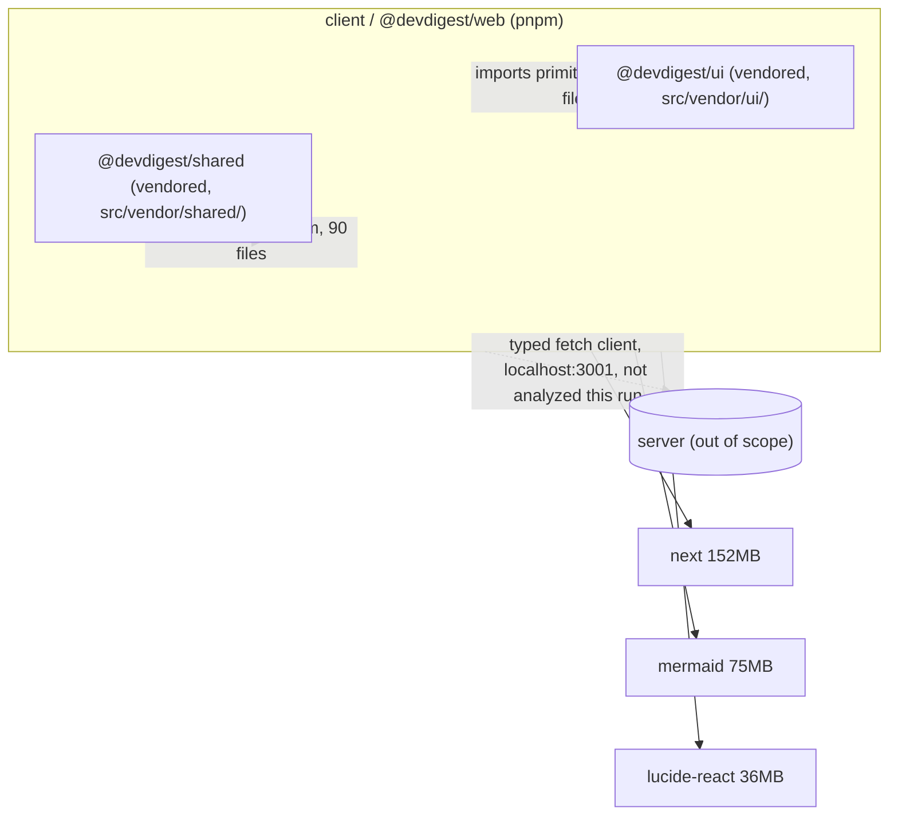

# Dependency report — dev-digest

_Generated: 2026-08-26 · Scope: `client` only (scoped run — user asked specifically about client/)_

## 1. Executive summary

`client/` (`@devdigest/web`, pnpm) has 11 prod deps, 12 dev deps, 0 peer deps.
Real installed footprint (its pnpm content-addressed store, `.pnpm/`) is
**~620 MB** on disk — `next` (152 MB), `mermaid` (75 MB) and `lucide-react`
(36 MB) alone account for roughly 40% of it. `pnpm audit` found **1 critical**,
**10 high**, **18 moderate**, and **3 low** advisories across the dependency
tree — the critical one is in `vitest`'s dev-only UI server (a workstation
risk, not a shipped-app risk), but several of the highs are in `next` itself
(SSRF, DoS) and are live in production. 21 of 23 direct dependencies are
behind their latest version; 11 of those are major-version-behind, most
notably `next` (15.5.19 → 16.3.2) and `zod` (3.25.76 → 4.4.3, a contract
dependency shared with `server/`). Single most actionable finding: **`next`
15.5.19 → 16.3.2** carries multiple high-severity advisories (SSRF, DoS) with
fixes only available via the major bump — this is the one item in this report
that is both high-risk and shipped in production.

| Package | Manager | Prod / Dev / Peer | Installed size | Vulnerabilities (C/H/M/L) | Outdated |
| ------- | ------- | ------------------ | --------------- | -------------------------- | -------- |
| client | pnpm | 11 / 12 / 0 | ~620 MB (real) · script reported 1.8 GB, see note below | 1/10/18/3 | 21 |

> **Size measurement note:** `collect-deps.mjs` derives `totalBytes` via
> `du -L` (dereferencing symlinks) over `node_modules`, which walks *every*
> top-level symlink into `.pnpm/`'s content-addressed store and then walks
> the nested symlinks *inside* those packages' own `node_modules` too — so a
> dependency shared by several packages gets its content counted once per
> place it's linked from, not once overall. That inflated the script's
> figure to 1.8 GB. A plain `du -sh client/node_modules` (no `-L`) — which
> correctly counts the real, non-duplicated content living in `.pnpm/` and
> treats the top-level symlinks as the ~0-byte pointers they are — gives
> **620 MB**, matching `du -sh client/node_modules/.pnpm` exactly. This
> report uses 620 MB as the accurate figure and flags the discrepancy rather
> than silently picking one.

## 2. Dependency graph

Scoped run — only `client`'s own structure was inspected. No other package
was collected this run, so no cross-package edges to `server`, `reviewer-core`,
etc. are drawn from data; the one runtime edge below (`client` → `server` API)
is documented in `client/src/lib/api.ts` and included for context, not derived
from this run's collection.

## 3. Per-package breakdown

### client (pnpm)

- Installed size: ~620 MB (real; see size note above) · Prod deps: 11 · Dev deps: 12 · Peer deps: 0

| Dependency | Type | Size |
| ---------- | ---- | ---- |
| next | prod | 152.3 MB |
| mermaid | prod | 75.3 MB |
| lucide-react | prod | 36.2 MB |
| typescript | dev | 22.8 MB |
| react-dom | prod | 7.1 MB |
| recharts | prod | 5.2 MB |
| zod | prod | 5.0 MB |
| jsdom | dev | 4.1 MB |
| @types/node | dev | 2.5 MB |
| vitest | dev | 1.9 MB |
| @tanstack/react-query | prod | 1.7 MB |
| next-intl | prod | 1.4 MB |
| tailwindcss | dev | 832 KB |
| @types/react | dev | 436 KB |
| @testing-library/jest-dom | dev | 412 KB |

(+6 more direct deps not shown: `react`, `react-markdown`, `remark-gfm` prod;
`@tailwindcss/postcss`, `@testing-library/react`, `@types/react-dom`,
`@vitejs/plugin-react`, `postcss` dev — each individually small, sizes not
reported by the collector for this batch.)

`lucide-react` at 36 MB for an icon set is notable — it ships every icon's
source in the package; only a handful are imported per-component, so its
on-disk weight is far higher than its actual usage footprint (tree-shaking
handles the *bundle*, not `node_modules` size).

## 4. Heaviest dependencies (client only — repo-wide comparison not available, scoped run)

| Dependency | Size | Type |
| ---------- | ---- | ---- |
| next | 152.3 MB | prod |
| mermaid | 75.3 MB | prod |
| lucide-react | 36.2 MB | prod |
| typescript | 22.8 MB | dev |
| react-dom | 7.1 MB | prod |
| recharts | 5.2 MB | prod |
| zod | 5.0 MB | prod |
| jsdom | 4.1 MB | dev |
| @types/node | 2.5 MB | dev |
| vitest | 1.9 MB | dev |
| @tanstack/react-query | 1.7 MB | prod |
| next-intl | 1.4 MB | prod |
| tailwindcss | 832 KB | dev |
| @types/react | 436 KB | dev |
| @testing-library/jest-dom | 412 KB | dev |

## 5. Vulnerabilities

Sorted critical → high → moderate → low. "Origin" traced via `pnpm why`
where the advisory package isn't a direct dependency.

| Severity | Dependency | Origin | Fix available | Advisory |
| -------- | ---------- | ------ | -------------- | -------- |
| Critical | vitest | direct (dev) | Yes | Vitest UI server allows arbitrary file read/execution when listening |
| High | next | direct (prod) | Yes | Denial of Service in App Router using Server Actions |
| High | next | direct (prod) | Yes | Server-Side Request Forgery in Server Actions on custom servers |
| High | next | direct (prod) | Yes | Server-Side Request Forgery in rewrites via attacker-controlled destination hostname |
| High | sharp | via `next` → `next-intl` (optional image dep) | Yes | Inherited libvips CVEs: CVE-2026-33327, CVE-2026-33328, CVE-2026-35590, CVE-2026-35591 |
| High | postcss | direct (dev) + via `next`'s bundled postcss@8.4.31 | Yes | Arbitrary file read via attacker-controlled `sourceMappingURL` in CSS comments |
| High | postcss | direct (dev) + via `next` | Yes | Path Traversal in Previous Source Map Auto-Loading — arbitrary `.map` file disclosure |
| High | form-data | via `jsdom` → dev only | Yes | CRLF injection via unescaped multipart field names/filenames |
| High | vite | via `@vitejs/plugin-react` / `vitest` — dev only | Yes | `server.fs.deny` bypass on Windows alternate paths |
| High | nanoid | via `postcss` (both direct and `next`'s bundled copy) | Yes | Non-secure generators loop indefinitely with negative size |
| High | nanoid | via `postcss` | Yes | Custom generators loop indefinitely when size is zero |
| Moderate | next | direct (prod) | Yes | Cache confusion of response bodies for requests with bodies |
| Moderate | next | direct (prod) | Yes | Cache confusion for requests with bodies containing invalid UTF-8 |
| Moderate | next | direct (prod) | Yes | Unbounded Server Action payload in Edge runtime |
| Moderate | next | direct (prod) | Yes | Denial of Service in Image Optimization API using SVGs |
| Moderate | next | direct (prod) | Yes | Unauthenticated disclosure of internal Server Function endpoints |
| Moderate | next-intl | direct (prod) | Yes | Open redirect vulnerability |
| Moderate | next-intl | direct (prod) | Yes | Prototype pollution via `experimental.messages.precompile` with attacker-controlled translation keys |
| Moderate | postcss | direct (dev) + via `next` | Yes | XSS via unescaped `</style>` in CSS stringify output |
| Moderate | postcss | direct (dev) + via `next` | Yes | Incomplete fix of prior sourceMappingURL advisory — reads arbitrary `.map` files when `from` unset |
| Moderate | mermaid | direct (prod) | Yes | CSS injection applying to sibling elements of the diagram |
| Moderate | mermaid | direct (prod) | Yes | Architecture diagrams vulnerable to prototype pollution |
| Moderate | mermaid | direct (prod) | Yes | XY Charts vulnerable to infinite-loop DoS |
| Moderate | mermaid | direct (prod) | Yes | Radar diagrams vulnerable to DoS |
| Moderate | dompurify | via `mermaid` | Yes | Permanent `ALLOWED_ATTR` pollution via `setConfig()` — incomplete fix of prior hook-pollution patch |
| Moderate | dompurify | via `mermaid` | Yes | `IN_PLACE` hook removal leaves a detached subtree executable — XSS |
| Moderate | esbuild | via `vite` — dev only | Yes | Dev server accepts arbitrary requests and returns responses to any website |
| Moderate | vite | via `@vitejs/plugin-react`/`vitest` — dev only | Yes | Path Traversal in Optimized Deps `.map` handling |
| Moderate | vite | via `@vitejs/plugin-react`/`vitest` — dev only | Yes | `launch-editor`: NTLMv2 hash disclosure via UNC path handling on Windows |
| Low | dompurify | via `mermaid` | Yes | `CUSTOM_ELEMENT_HANDLING` bypasses `afterSanitizeElements` for allowed custom elements |
| Low | dompurify | via `mermaid` | Yes | Trusted Types policy survives `clearConfig()`, can poison later `RETURN_TRUSTED_TYPE` output |
| Low | mermaid | direct (prod) | Yes | Configuration APIs allow prototype pollution |

All 32 advisories report a fix available (`pnpm audit fix` / a version bump
resolves them without needing an alternative package) — the blocker for most
is that the fix lives behind a **major** version bump (`next` 15→16 in
particular), not registry/tooling failure.

## 6. Outdated dependencies

Sorted major first, then minor, then patch.

| Dependency | Current | Wanted | Latest | Gap |
| ---------- | ------- | ------ | ------ | --- |
| typescript | 5.9.3 | 5.9.3 | 7.0.2 | major |
| vitest | 2.1.9 | 2.1.9 | 4.1.11 | major |
| next | 15.5.19 | 15.5.19 | 16.3.2 | major |
| zod | 3.25.76 | 3.25.76 | 4.4.3 | major |
| jsdom | 25.0.1 | 25.0.1 | 30.0.1 | major |
| @types/node | 22.19.19 | 22.19.19 | 26.3.0 | major |
| lucide-react | 0.469.0 | 0.469.0 | 1.34.0 | major |
| recharts | 2.15.4 | 2.15.4 | 3.10.1 | major |
| next-intl | 3.26.5 | 3.26.5 | 4.13.7 | major |
| react-markdown | 9.1.0 | 9.1.0 | 10.1.0 | major |
| @vitejs/plugin-react | 4.7.0 | 4.7.0 | 6.1.0 | major |
| @testing-library/jest-dom | 6.9.1 | 6.9.1 | 7.0.1 | major |
| mermaid | 11.15.0 | 11.15.0 | 11.17.1 | minor |
| @tanstack/react-query | 5.101.0 | 5.101.0 | 5.102.3 | minor |
| postcss | 8.5.15 | 8.5.15 | 8.5.26 | patch |
| react | 19.2.7 | 19.2.7 | 19.2.8 | patch |
| react-dom | 19.2.7 | 19.2.7 | 19.2.8 | patch |
| @tailwindcss/postcss | 4.3.0 | 4.3.0 | 4.3.3 | patch |
| tailwindcss | 4.3.0 | 4.3.0 | 4.3.3 | patch |
| @types/react | 19.2.16 | 19.2.16 | 19.2.18 | patch |
| @types/react-dom | 19.2.3 | 19.2.3 | 19.2.5 | patch |

21 of 23 direct dependencies (91%) are behind latest; 12 majors, 2 minors, 7
patches. `zod` is worth flagging beyond its own weight: it's the schema
library also used by `server/` for the shared contracts vendored into
`src/vendor/shared/` — bumping it in `client/` alone without coordinating
with `server/`'s copy would only be a version-string change (each package
vendors its own copy, they don't share an install), but a `3.x` → `4.x`
bump changes `zod`'s error-format API and is worth planning together with
`server/` even though this run didn't inspect it.

## 7. Unused dependencies

> Not checked this run. Unused-dependency detection needs `depcheck`
> installed locally in `client/` and adds real runtime — re-run with
> `--with-depcheck` if you want this section populated.

## 8. Prioritized recommendations

**P0 — do before the next release**
1. **client: `next` 15.5.19 → 16.3.2.** Three *high*-severity advisories
   (SSRF via Server Actions on custom servers, SSRF via rewrites with
   attacker-controlled destination hostname, DoS via Server Actions) plus
   five moderates are live in the shipped app, not a dev-only tool, and all
   have fixes only via this major bump. → `pnpm add next@16.3.2` in
   `client/`, then run `pnpm typecheck && pnpm test` and manually smoke-test
   the App Router/Server Actions paths this repo actually uses (rewrites,
   image optimization) since 15→16 is a major with documented breaking
   changes.
2. **client: `postcss`/`nanoid` high-severity file-disclosure and
   infinite-loop advisories.** Two *high* postcss advisories (arbitrary
   `.map`/source file read) and two *high* nanoid advisories (infinite loop)
   affect both the direct devDependency and the copy bundled inside `next`
   — bumping `next` (item 1) resolves the bundled copies; separately bump
   the direct `postcss` devDependency. → `pnpm add -D postcss@latest` in
   `client/`, then re-run `pnpm audit` to confirm the nanoid chain clears.

**P1 — schedule soon**
1. **client: `sharp` high-severity libvips CVEs (CVE-2026-33327/33328/35590/35591).**
   Pulled in transitively via `next` → `next-intl` as an optional image
   dependency; not fixable independently of the `next` upgrade in P0-1. →
   after bumping `next`, re-run `pnpm audit` and confirm sharp's resolved
   version clears these CVEs; if not, `pnpm add sharp@latest` explicitly to
   force a newer transitive resolution.
2. **client: `mermaid` 11.15.0 → 11.17.1 (minor) clears 6 of its own
   advisories** (1 low prototype-pollution, 4 moderate incl. two DoS
   patterns, plus contributes to the `dompurify` chain below) at only a
   minor-version cost — cheapest fix-to-risk ratio in this report. →
   `pnpm add mermaid@11.17.1`; re-run `pnpm audit` — this should also
   resolve or reduce the 4 `dompurify` advisories (dompurify is vendored
   inside mermaid's dependency tree and mermaid controls the version it
   pulls).
3. **client: `zod` 3.25.76 → 4.4.3 major bump.** No vulnerability, but
   `zod` is the schema library backing the `@devdigest/shared` contracts
   vendored into `client/src/vendor/shared/` (90 files import from it) —
   staying two majors behind risks a harder migration later and a growing
   API-surface gap from whatever `server/` is running. Coordinate the bump
   with `server/`'s own `zod` version before touching this (out of scope
   for this run — re-check with a `server`-scoped pass).
4. **client: `typescript` 5.9.3 → 7.0.2, `vitest` 2.1.9 → 4.1.11 major
   bumps.** Both are 2+ majors behind; `vitest` 2.x's dev-only UI-server
   critical advisory (section 5) is also only fixed by this bump chain.
   Budget a dedicated pass — `vitest` 2→4 changes config/API surface and
   `typescript` 5→7 may surface new strictness errors across `client/src`.

**P2 — opportunistic / when touching that code anyway**
1. **client: `lucide-react` 36.2 MB on disk for an icon set is disproportionate
   to typical per-component usage** (only a handful of icons are imported
   anywhere in the app; tree-shaking already keeps the *bundle* small, but
   `node_modules`/CI cache weight stays high). Worth a look next time
   dependencies are touched — either confirm the bundler is tree-shaking it
   correctly (no action needed) or consider `lucide-react`'s per-icon import
   subpath pattern if it isn't already used.
2. **client: remaining patch-level bumps** (`postcss`, `react`, `react-dom`,
   `@tailwindcss/postcss`, `tailwindcss`, `@types/react`, `@types/react-dom`)
   carry no known vulnerabilities — safe to batch into a routine
   `pnpm update` pass, no urgency.
