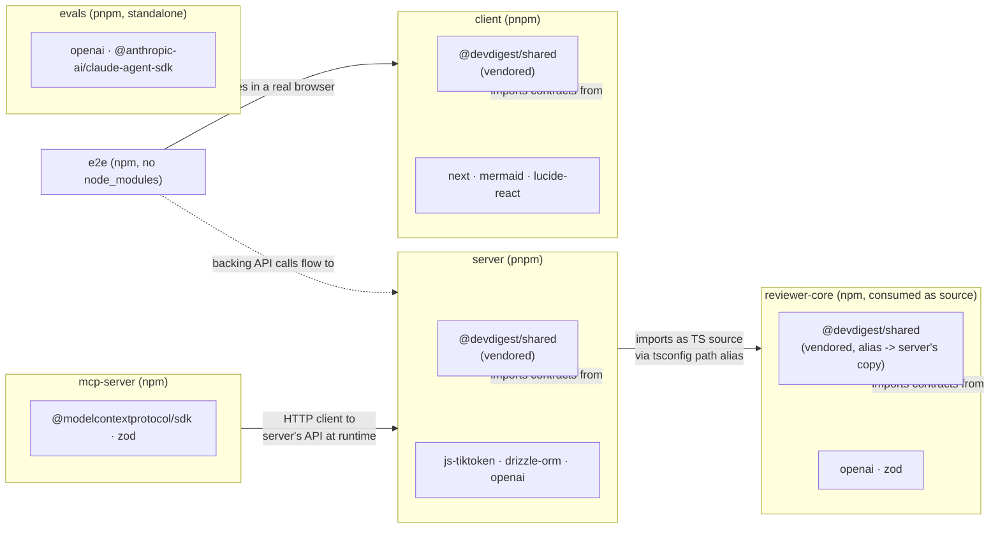

# Dependency report — dev-digest

_Generated: 2026-08-26 · Scope: all 6 packages (server, client, reviewer-core, e2e, mcp-server, evals)_

## 1. Executive summary

Across the 5 packages that currently have a `node_modules` installed, total
on-disk footprint is **~4.25 GB** (`server` 694.6MB, `client` 1.8GB,
`reviewer-core` 302.8MB, `mcp-server` 102.5MB, `evals` 1.3GB — each package
manages its own install, so these do not share a node_modules and nothing is
deduplicated across them). **`e2e` has no `node_modules` installed** (it's
not installed by default until a browser flow run pulls it in) — its size,
outdated, and audit data are a gap, not a clean bill of health.

The worst vulnerability severity found is **critical** (`vitest`, via its
bundled Vite dev-server UI, "arbitrary file can be read and executed" —
present in every package that has `vitest` as a dev dependency: server,
client, reviewer-core, mcp-server, evals). Every one of the 29 distinct
(dependency, severity) vulnerability findings collected — critical through
low — reports **`fixAvailable: true`**, i.e. every single one is closeable
with an audit-fix/upgrade rather than needing a package swap or an accepted
risk. That's the single most actionable finding: nothing here is blocked on
a hard decision, only on running the fix.

| Package | Manager | Prod / Dev / Peer | Installed size | Vulnerabilities (C/H/M/L) | Outdated |
| --- | --- | --- | --- | --- | --- |
| server | pnpm | 25 / 8 / 0 | 694.6 MB | 1 / 17 / 14 / 3 | 23 |
| client | pnpm | 11 / 12 / 0 | 1.8 GB | 1 / 10 / 18 / 3 | 21 |
| reviewer-core | npm | 2 / 4 / 0 | 302.8 MB | 1 / 4 / 3 / 0 | 5 |
| e2e | npm | 0 / 3 / 0 | **not installed — data gap** | not run | not run |
| mcp-server | npm | 2 / 4 / 0 | 102.5 MB | 1 / 1 / 3 / 0 | 4 |
| evals | pnpm | 2 / 5 / 0 | 1.3 GB | 1 / 1 / 3 / 0 | 5 |

## 2. Dependency graph

This repo is not a workspace, so nothing links packages via `node_modules`.
The real edges are: two packages vendoring the same `@devdigest/shared`
contract source, `server` consuming `reviewer-core` as TypeScript source via
a tsconfig path alias (confirmed in `server/tsconfig.json` and
`reviewer-core/tsconfig.json`, which itself points its own `@devdigest/shared`
alias at `../server/src/vendor/shared`), `mcp-server` acting as a thin HTTP
client to `server`'s API at runtime (no import edge, per
`mcp-server/README.md` / `docs/architecture.md`), and `e2e` driving `client`
in a real browser while `client` talks to `server`. `evals` has no internal
edge — its `run-openrouter.ts` comment says it "mirrors" `reviewer-core`'s
OpenAI-SDK pattern, but does not import from it.

## 3. Per-package breakdown

### server (pnpm)

- Installed size: 694.6 MB · Prod deps: 25 · Dev deps: 8 · Peer deps: 0
- 33 direct deps total; showing top 10 by size, +23 more not shown (all
  smaller than 1.2MB — see raw collection JSON for the full list).

| Dependency | Type | Size |
| --- | --- | --- |
| typescript | dev | 22.8 MB |
| js-tiktoken | prod | 21.5 MB |
| drizzle-orm | prod | 13.2 MB |
| drizzle-kit | dev | 7.4 MB |
| openai | prod | 7.4 MB |
| zod | prod | 5.0 MB |
| fastify | prod | 3.5 MB |
| graphology | prod | 2.7 MB |
| @types/node | dev | 2.5 MB |
| undici | prod | 2.0 MB |

### client (pnpm)

- Installed size: 1.8 GB · Prod deps: 11 · Dev deps: 12 · Peer deps: 0
- 23 direct deps total; showing top 10 by size, +13 more not shown.

| Dependency | Type | Size |
| --- | --- | --- |
| next | prod | 152.3 MB |
| mermaid | prod | 75.3 MB |
| lucide-react | prod | 36.2 MB |
| typescript | dev | 22.8 MB |
| react-dom | prod | 7.1 MB |
| recharts | prod | 5.2 MB |
| zod | prod | 5.0 MB |
| jsdom | dev | 4.1 MB |
| @types/node | dev | 2.5 MB |
| vitest | dev | 1.9 MB |

`next` + `mermaid` + `lucide-react` alone account for ~264MB — roughly 14%
of `client`'s footprint sits in three packages.

### reviewer-core (npm)

- Installed size: 302.8 MB · Prod deps: 2 · Dev deps: 4 · Peer deps: 0

| Dependency | Type | Size |
| --- | --- | --- |
| typescript | dev | 22.8 MB |
| openai | prod | 7.4 MB |
| zod | prod | 5.0 MB |
| @types/node | dev | 2.5 MB |
| vitest | dev | 1.9 MB |
| tsx | dev | 676.0 KB |

### e2e (npm)

- **`node_modules` not installed — size, outdated, and audit did not run for
  this package. This is a data gap, not a clean result.**
- Declared deps (from `package.json`, not measured): 0 prod, 3 dev
  (`@types/node`, `tsx`, `typescript`).

### mcp-server (npm)

- Installed size: 102.5 MB · Prod deps: 2 · Dev deps: 4 · Peer deps: 0

| Dependency | Type | Size |
| --- | --- | --- |
| typescript | dev | 22.8 MB |
| @modelcontextprotocol/sdk | prod | 5.9 MB |
| zod | prod | 5.0 MB |
| @types/node | dev | 2.5 MB |
| vitest | dev | 1.9 MB |
| tsx | dev | 668.0 KB |

### evals (pnpm)

- Installed size: 1.3 GB · Prod deps: 2 · Dev deps: 5 · Peer deps: 0

| Dependency | Type | Size |
| --- | --- | --- |
| typescript | dev | 22.8 MB |
| openai | prod | 7.4 MB |
| @anthropic-ai/claude-agent-sdk | prod | 4.5 MB |
| @types/node | dev | 2.5 MB |
| vitest | dev | 1.9 MB |
| tsx | dev | 676.0 KB |
| gray-matter | dev | 80.0 KB |

`evals` has only 7 direct dependencies but weighs 1.3GB installed — almost
double `server`'s 694.6MB with 33 direct deps. This isn't `evals` pulling
unusually heavy packages; it's the cost of every pnpm-managed package having
its own independent lockfile/install with no cross-package dedup (see §8).

## 4. Heaviest dependencies (repo-wide)

Top 15 direct dependencies by installed size, deduplicated by name.

| Dependency | Size (largest install) | Used by | Type |
| --- | --- | --- | --- |
| next | 152.3 MB | client | prod |
| mermaid | 75.3 MB | client | prod |
| lucide-react | 36.2 MB | client | prod |
| typescript | 22.8 MB | server, client, reviewer-core, mcp-server, evals | dev |
| js-tiktoken | 21.5 MB | server | prod |
| drizzle-orm | 13.2 MB | server | prod |
| drizzle-kit | 7.4 MB | server | dev |
| openai | 7.4 MB | server, reviewer-core, evals | prod |
| react-dom | 7.1 MB | client | prod |
| @modelcontextprotocol/sdk | 5.9 MB | mcp-server | prod |
| recharts | 5.2 MB | client | prod |
| zod | 5.0 MB | server, client, reviewer-core, mcp-server | prod |
| @anthropic-ai/claude-agent-sdk | 4.5 MB | evals | prod |
| jsdom | 4.1 MB | client | dev |
| fastify | 3.5 MB | server | prod |

`typescript` and `vitest` (1.9–2.0MB, just outside the top 15) are the two
dependencies with the widest reach — installed separately in all 5 packages
that have a `node_modules`, at full size each time, since there's no shared
install.

## 5. Vulnerabilities

`pnpm audit` / `npm audit` ran cleanly for all 5 installed packages
(`e2e` excluded — no `node_modules`, see §3). 85 raw advisory entries
collapse to **29 distinct (dependency, severity) findings** once duplicate
titles across packages are merged; **every one has a fix available.**
Sorted critical → high → moderate → low; grouped by dependency+severity
across affected packages (npm's audit output for `reviewer-core` and
`mcp-server` doesn't expose a title field the way pnpm's does, so a couple
of rows below carry the advisory's dependency chain instead of a title —
same underlying finding).

| Severity | Dependency | Affected package(s) | Fix available | Advisory |
| --- | --- | --- | --- | --- |
| Critical | vitest | server, client, reviewer-core, mcp-server, evals | Yes | When Vitest UI server is listening, arbitrary file can be read and executed |
| High | vite | server, client, reviewer-core, mcp-server, evals | Yes | `server.fs.deny` bypass on Windows alternate paths (+ related, via esbuild/launch-editor) |
| High | form-data | server, client, reviewer-core | Yes | CRLF injection via unescaped multipart field names and filenames |
| High | nanoid | server, client, reviewer-core | Yes | Non-secure/custom generators loop indefinitely with negative or zero size |
| High | postcss | server, client, reviewer-core | Yes | Path traversal in source-map auto-loading → arbitrary `.map` file disclosure |
| High | undici | server | Yes | Unbounded memory consumption + unhandled exception in WebSocket permessage-deflate/`server_max_window_bits` handling |
| High | drizzle-orm | server | Yes | SQL injection via improperly escaped SQL identifiers |
| High | brace-expansion | server | Yes | DoS via exponential/unbounded expansion (3 related CVEs) |
| High | shell-quote | server | Yes | Quadratic-complexity DoS in `parse()` (CWE-407) |
| High | fast-uri | server | Yes | Host confusion via backslash authority delimiter / IDN canonicalization (3 related CVEs) |
| High | find-my-way | server | Yes | DDoS with HTTP2 |
| High | sharp | client | Yes | Inherited `libvips` CVEs (image processing, Next.js image optimization path) |
| High | next | client | Yes | DoS in App Router Server Actions; SSRF in Server Actions on custom servers |
| Moderate | esbuild | server, client, reviewer-core, mcp-server, evals | Yes | Dev server accepts arbitrary cross-origin requests and echoes responses |
| Moderate | vite | server, client, evals | Yes | Path traversal in optimized-deps `.map` handling; NTLMv2 hash disclosure |
| Moderate | postcss | server, client | Yes | Incomplete fix of prior sourceMappingURL advisory; XSS via unescaped `</style>` |
| Moderate | @vitest/mocker | reviewer-core, mcp-server | Yes | (npm audit: via `vite` chain, no separate title) |
| Moderate | vite-node | reviewer-core, mcp-server | Yes | (npm audit: via `vite` chain, no separate title) |
| Moderate | undici | server | Yes | Unbounded decompression chain (resource exhaustion); request/response smuggling |
| Moderate | uuid | server | Yes | Missing buffer bounds check in v3/v5/v6 when `buf` is provided |
| Moderate | protobufjs | server | Yes | Schema-derived names shadow runtime-significant properties; infinite-loop DoS in `.proto` parsing |
| Moderate | next-intl | client | Yes | Open redirect; prototype pollution via translation-catalog keys |
| Moderate | next | client | Yes | Cache confusion of response bodies (2 related CVEs) |
| Moderate | dompurify | client | Yes | `setConfig()` bypasses hook clone-guard; `IN_PLACE` hook removal enables XSS |
| Moderate | mermaid | client | Yes | CSS injection to sibling elements; prototype pollution in Architecture diagrams |
| Low | esbuild | server | Yes | Arbitrary file read via dev server on Windows |
| Low | undici | server | Yes | Set-Cookie SameSite downgrade; response-queue poisoning via keep-alive reuse |
| Low | dompurify | client | Yes | Custom-element handling bypasses `afterSanitizeElements`; Trusted Types survives `clearConfig()` |
| Low | mermaid | client | Yes | Configuration APIs allow prototype pollution |

## 6. Outdated dependencies

58 raw outdated entries collapse to 41 unique (dependency, package) pairs.
Showing the 22 with a **major-version gap** — these need a decision, not
just a bump — sorted by how many majors behind. 19 more minor/patch-only
bumps exist across `server` (`@fastify/*`, `drizzle-orm`, `drizzle-kit`,
`fastify`, `@ast-grep/napi`, `@anthropic-ai/sdk`, `tsx`) and `client`
(`react`, `react-dom`, `@types/react*`, `tailwindcss`, `postcss`,
`@tanstack/react-query`, `mermaid`) plus one in `evals`
(`@anthropic-ai/claude-agent-sdk`, patch-only) — routine, no version
decision needed, omitted here to keep this table scannable.

| Dependency | Package(s) | Current | Latest | Gap |
| --- | --- | --- | --- | --- |
| jsdom | client | 25.0.1 | 30.0.1 | 5 majors |
| @types/node | server, client, reviewer-core, mcp-server, evals | 22.19–22.20 | 26.3.0 | 4 majors |
| fastify-type-provider-zod | server | 4.0.2 | 7.0.0 | 3 majors |
| openai | server, reviewer-core, evals | 4.104.0 | 7.5.0 | 3 majors |
| @testcontainers/postgresql | server | 10.28.0 | 12.1.0 | 2 majors |
| testcontainers | server | 10.28.0 | 12.1.0 | 2 majors |
| @vitejs/plugin-react | client | 4.7.0 | 6.1.0 | 2 majors |
| typescript | server, client, reviewer-core, mcp-server, evals | 5.9.3 | 7.0.2 | 2 majors |
| vitest | server, client, reviewer-core, mcp-server, evals | 2.1.9 | 4.1.11 | 2 majors |
| @fastify/cors | server | 10.1.0 | 11.3.0 | 1 major |
| @testing-library/jest-dom | client | 6.9.1 | 7.0.1 | 1 major |
| dependency-cruiser | server | 17.4.3 | 18.2.0 | 1 major |
| dotenv | server | 16.6.1 | 17.4.2 | 1 major |
| lucide-react | client | 0.469.0 | 1.34.0 | 1 major |
| next | client | 15.5.19 | 16.3.2 | 1 major |
| next-intl | client | 3.26.5 | 4.13.7 | 1 major |
| octokit | server | 4.1.4 | 5.0.5 | 1 major |
| p-queue | server | 8.1.1 | 9.3.3 | 1 major |
| react-markdown | client | 9.1.0 | 10.1.0 | 1 major |
| recharts | client | 2.15.4 | 3.10.1 | 1 major |
| undici | server | 7.29.0 | 8.10.0 | 1 major |
| zod | server, client, reviewer-core, mcp-server | 3.25.76 | 4.4.3 | 1 major |

## 7. Unused dependencies

> Not checked this run. Unused-dependency detection needs `depcheck`
> installed locally in each package (`npm i -D depcheck` / `pnpm add -D
> depcheck`) and adds real runtime per package — re-run with
> `--with-depcheck` if you want this section populated.

| Package | Declared but unused | Used but undeclared |
| --- | --- | --- |
| — | not checked | not checked |

## 8. Prioritized recommendations

**P0 — do before the next release**

1. **server, client, reviewer-core, mcp-server, evals: fix the `vitest`
   critical CVE.** A listening Vitest UI server lets an attacker read and
   execute arbitrary files — fix is available in every package. This is a
   dev-only dependency (not shipped to production), but the fix is one
   command and closes the single worst finding in the whole repo. →
   `cd <package> && pnpm/npm audit fix` (bumps `vitest`/`vite`/`esbuild`
   toolchain to a patched major — expect the `vitest` 2.x → 4.x jump from
   §6 to land as part of this).
2. **server: fix `drizzle-orm` high-severity SQL injection
   (CWE: improperly escaped SQL identifiers).** This is a *production*
   dependency directly on the query path — the highest-real-risk item in
   this report, since it's the only high/critical finding that isn't in
   dev tooling. → `cd server && pnpm audit fix` (or a manual bump if the
   patched range isn't auto-selected — check `pnpm why drizzle-orm` first
   since server also has a routine drizzle-orm minor bump pending, see §6).
3. **client: fix `next` high-severity findings (DoS in Server Actions,
   SSRF in Server Actions/rewrites) and `sharp` high-severity `libvips`
   CVEs.** Both are production dependencies on the Next.js
   request-handling and image-optimization paths — user-facing attack
   surface, not dev tooling. → `cd client && pnpm audit fix`; if that
   doesn't clear `next`, the fix likely requires the 15→16 major noted in
   §6, so budget for that upgrade rather than a patch-only fix.
4. **server: fix `undici` high-severity WebSocket DoS findings** (unbounded
   memory in permessage-deflate decompression, unhandled exception on
   invalid `server_max_window_bits`) — production dependency, network-facing.
   → `cd server && pnpm audit fix`.

**P1 — schedule soon**

1. **server, client, reviewer-core, mcp-server, evals: `typescript` is 2
   majors behind (5.9 → 7.0) everywhere.** Widely-used, affects every
   package's build; worth one coordinated upgrade pass rather than 5
   separate ones since they'll all hit the same breaking changes. → budget
   a dedicated typecheck-and-fix pass across all 5 packages together.
2. **server, reviewer-core, evals: `openai` is 3 majors behind (4.x →
   7.x)**, a production dependency each place. No CVE forcing this, but a
   3-major gap on a package this central (LLM calls) risks silently missing
   API-shape changes the longer it's deferred. → review the OpenAI SDK
   v5/v6/v7 migration notes before bumping; do server first since it has
   the most call sites.
3. **client: `next` is a major behind (15 → 16)**, and per P0 item 3 the
   security fix may require it anyway — treat the security fix and the
   major upgrade as one piece of work, not two.
4. **client: `jsdom` is 5 majors behind (25 → 30).** Test-only dependency,
   but the widest single gap in the repo — worth checking now while the
   delta is "only" 5 majors instead of letting it grow further.
5. **server: `@testcontainers/postgresql` + `testcontainers` are 2 majors
   behind (10 → 12).** Both test-infra, low urgency, but they move
   together — bump as a pair, not independently, to avoid a mismatched
   testcontainers/postgres-module version.

**P2 — opportunistic / when touching that code anyway**

1. **`evals` weighs 1.3GB for only 7 direct dependencies** — nearly double
   `server`'s footprint with far fewer packages. This isn't a bloat problem
   in `evals` itself; it's the structural cost of 5 independently-managed
   installs with zero cross-package dedup (`typescript`, `vitest`,
   `@types/node`, `zod`, `openai` are each installed at full size in 3-5
   places). Consolidating dev tooling versions (same `typescript`/`vitest`
   version pinned across all 6 packages) wouldn't shrink disk usage without
   a shared store, but would at least remove the "which version of
   typescript actually typechecks this" drift risk — evaluate only if this
   becomes a recurring source of confusion, not a size fix.
2. **client: `next` (152MB) + `mermaid` (75MB) + `lucide-react` (36MB) are
   the three heaviest direct dependencies in the entire repo.** `next` and
   `mermaid` are core to the product (framework, diagram rendering) and not
   realistically replaceable. `lucide-react` at 36MB for an icon set is
   worth a second look next time `client`'s bundle size comes up — most
   icon libraries ship every icon in the package; confirm tree-shaking is
   actually working in the production build rather than assuming it.
3. **e2e: install it once and re-run this check.** `e2e` is the only
   package with a real data gap in this report — no size, outdated, or
   vulnerability data. Not urgent (it's dev/CI tooling, only 3 dependencies
   declared), but the gap should be closed the next time someone runs an
   e2e flow locally rather than left open indefinitely.
4. **Minor/patch-only outdated deps (19 pairs, listed in §6's intro) —**
   bundle into routine maintenance passes per package rather than one-off
   bumps; none carry a CVE or a major-version decision.
