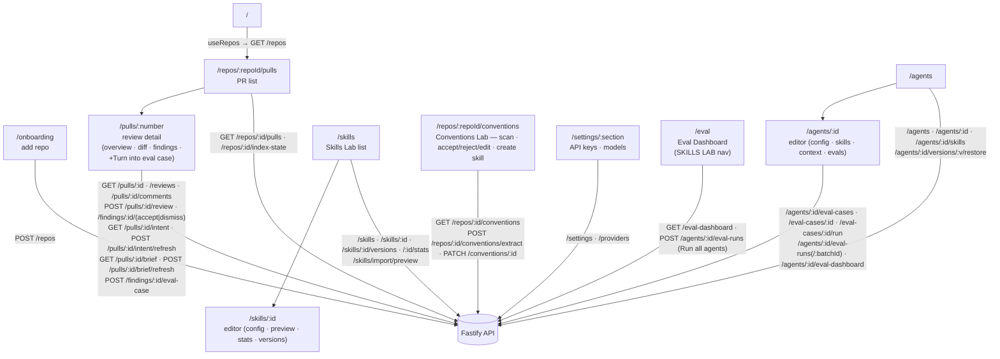

# `@devdigest/web` — the studio (Next.js 15)

The DevDigest UI: import repos, browse pull requests, run and read AI reviews,
and author agents + reusable Skills. App Router + React Server/Client
components, data via **TanStack Query** hooks over the Fastify API. (This is
the starter surface plus Skills Lab (L02) and the Intent Layer — the PR
detail page's `IntentCard` shows the classified intent/scope, the first piece
of the eventual `PrBrief`; Blast Radius, Risks, PR History, and Smart Diff are
still unbuilt future course lessons. Course lessons still add Memory,
multi-agent, CI, and dashboard screens. **Eval (L06, landed — SPEC-04)** is
also in: a per-agent Evals tab in the Agent editor, a **Turn into eval case**
action on every finding, and a workspace-wide **Eval Dashboard**, see
[`../specs/04-eval-pipeline.md`](../specs/04-eval-pipeline.md).)

- **Stack:** Next.js 15 (App Router), React 19, TanStack Query, `next-intl`
  (messages in `messages/<locale>/*.json`), `recharts`, `mermaid`,
  `react-markdown`. UI primitives are vendored under `src/vendor/ui`
  (`@devdigest/ui`) and shared Zod contracts under `src/vendor/shared`
  (`@devdigest/shared`).
- **API base:** `NEXT_PUBLIC_API_BASE` (default `http://localhost:3001`), used by
  `src/lib/api.ts`. Every data hook lives in `src/lib/hooks/*` — e.g.
  `usePrIntent`/`useRefreshPrIntent` and `usePrBrief`/`useRefreshPrBrief`
  (`src/lib/hooks/reviews.ts`), the query/mutation pair behind `IntentCard`
  and `PrBriefCard` respectively. Eval's hooks live in
  `src/lib/hooks/evals.ts`: `useEvalCases`/`useCreateEvalCase`/
  `useUpdateEvalCase`/`useDeleteEvalCase` (case CRUD),
  `useCreateEvalCaseFromFinding` (the `FindingCard` **Turn into eval case**
  action), `useRunEvalCase` (single-case sync run),
  `useDispatchEvalBatch`/`useEvalBatchStatus` (async batch dispatch + polling
  while `queued`/`running`), and `useAgentEvalDashboard`/`useEvalDashboard`
  (per-agent and workspace-wide dashboards); `useRestoreAgentVersion`
  (`src/lib/hooks/agents.ts`) backs the compare modal's "Promote prompt &
  model vN" control.
- **Run:** `pnpm dev` (`:3000`). **Test:** `pnpm test` (vitest + jsdom, fetch
  mocked — no API needed). **Typecheck:** `pnpm typecheck`.

## UI route map

Routes (`src/app/**/page.tsx`) and the API surface each leans on (via
`src/lib/hooks/*` → `src/lib/api.ts`):

Cross-cutting chrome lives in `src/components/app-shell` (nav, breadcrumbs,
`g`-then-key shortcuts). Pages are thin; feature logic sits in colocated
`_components/<Name>/` folders, each with its own `*.test.tsx`.

## Testing

Component/interaction tests (`*.test.tsx`) run under vitest + jsdom with `fetch`
mocked, so they need neither the API nor a browser. The real browser journeys
(client + API + seeded DB) are covered by the deterministic agent-browser suite
in [`../e2e`](../e2e/README.md) and the `e2e-web.yml` workflow. See
[`../TESTING.md`](../TESTING.md).
