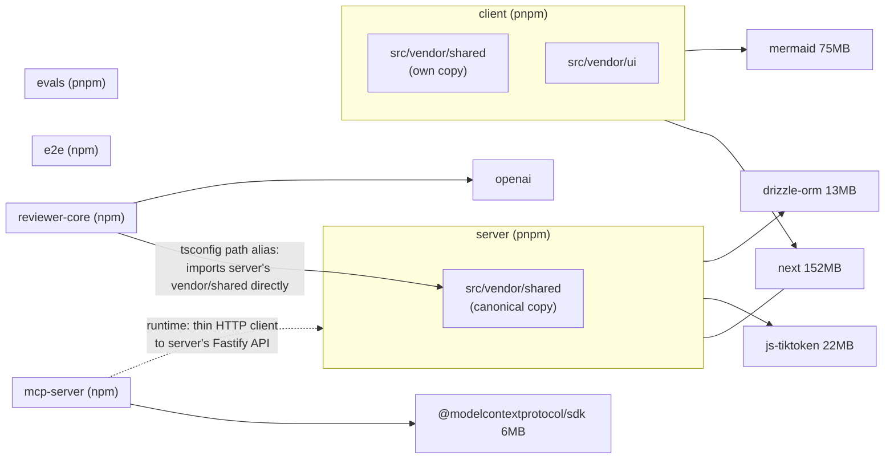

# Dependency report — dev-digest

_Generated: 2026-08-26 · Scope: all 6 packages (server, client, reviewer-core, e2e, mcp-server, evals)_

## 1. Executive summary

Across the 5 packages with `node_modules` installed, total installed footprint is
**~1.44 GB** (client alone is 620 MB, driven by `next` and `mermaid`). Every
installed package has at least one **critical** advisory — all five report a
critical `vitest` finding, all with a fix available. `e2e/` has no
`node_modules` installed, so it has **no size/vulnerability/outdated data** in
this run — that's a data gap, not a clean bill of health. The single most
actionable finding: `vitest`/`vite`/`esbuild` critical+high advisories are
fixable in every affected package with the same class of command (see §8, P0).

| Package | Manager | Prod / Dev / Peer | Installed size | Vulnerabilities (C/H/M/L) | Outdated |
| --- | --- | --- | --- | --- | --- |
| server | pnpm | 25 / 8 / 0 | 240.9 MB | 1/17/14/3 | 23 |
| client | pnpm | 11 / 12 / 0 | 620.0 MB | 1/10/18/3 | 21 |
| reviewer-core | npm | 2 / 4 / 0 | 156.3 MB | 1/4/3/0 | 5 |
| e2e | npm | 0 / 3 / 0 | — (not installed) | — (not installed) | — (not installed) |
| mcp-server | npm | 2 / 4 / 0 | 82.8 MB | 1/1/3/0 | 4 |
| evals | pnpm | 2 / 5 / 0 | 461.0 MB | 1/1/3/0 | 5 |

## 2. Dependency graph

This repo is **not** a workspace — there's no manifest linking these
packages, so the edges below come from `tsconfig.json` path aliases and
grep, not `node_modules`. `@devdigest/shared` is vendored (copy-pasted, not
symlinked) into both `server` and `client`; `reviewer-core` doesn't keep its
own copy and instead points its path alias straight at `server`'s copy —
making `reviewer-core` a **source-level dependent of `server`**, not a
peer. `mcp-server` has no source import of any other package; its
dependency on `server` is a **runtime HTTP call**, which is a materially
different (and weaker — versionable independently, fails soft) coupling
than a source import, so it's drawn as a dashed edge.

`e2e` and `evals` have no source-level edge to another package — `e2e`
drives the app as a black box (browser flows), `evals` harnesses skills and
agents from outside, not by importing their code.

## 3. Per-package breakdown

### server (pnpm)

- Installed size: 240.9 MB · Prod deps: 25 · Dev deps: 8 · Peer deps: 0

| Dependency | Type | Size |
| --- | --- | --- |
| typescript | dev | 22.8 MB |
| js-tiktoken | prod | 21.5 MB |
| drizzle-orm | prod | 13.2 MB |
| drizzle-kit | dev | 7.4 MB |
| openai | prod | 7.4 MB |
| fastify | prod | 3.5 MB |
| @anthropic-ai/sdk | prod | — |
| @ast-grep/napi | prod | — |
| ... | | +18 more, see raw collection JSON for the full list |

### client (pnpm)

- Installed size: 620.0 MB · Prod deps: 11 · Dev deps: 12 · Peer deps: 0

| Dependency | Type | Size |
| --- | --- | --- |
| next | prod | 152.3 MB |
| mermaid | prod | 75.3 MB |
| lucide-react | prod | 36.2 MB |
| typescript | dev | 22.8 MB |
| react-dom | prod | 7.1 MB |
| recharts | prod | 5.2 MB |
| jsdom | dev | 4.1 MB |
| ... | | +16 more, see raw collection JSON for the full list |

`next` + `mermaid` + `lucide-react` alone are **263.8 MB** — over 40% of
client's entire installed size from 3 direct dependencies.

### reviewer-core (npm)

- Installed size: 156.3 MB · Prod deps: 2 · Dev deps: 4 · Peer deps: 0

| Dependency | Type | Size |
| --- | --- | --- |
| openai | prod | — |
| zod | prod | — |
| typescript | dev | — |
| vitest | dev | — |
| tsx | dev | — |
| @types/node | dev | — |

Only 6 direct dependencies total — the smallest surface of any package in
the repo, consistent with its role as a pure engine (per its README).

### e2e (npm)

**`node_modules` not installed for this run** — size, outdated, and
vulnerability data are unavailable, not zero. Declared: 3 dev dependencies,
0 prod. Run the package's install command and re-run this check for full
data.

### mcp-server (npm)

- Installed size: 82.8 MB · Prod deps: 2 · Dev deps: 4 · Peer deps: 0

| Dependency | Type | Size |
| --- | --- | --- |
| typescript | dev | 22.8 MB |
| @modelcontextprotocol/sdk | prod | 5.9 MB |
| zod | prod | 5.0 MB |
| @types/node | dev | 2.5 MB |
| vitest | dev | 1.9 MB |

### evals (pnpm)

- Installed size: 461.0 MB · Prod deps: 2 · Dev deps: 5 · Peer deps: 0

| Dependency | Type | Size |
| --- | --- | --- |
| typescript | dev | 22.8 MB |
| openai | prod | 7.4 MB |
| @anthropic-ai/claude-agent-sdk | prod | 4.5 MB |
| @types/node | dev | 2.5 MB |
| gray-matter | prod | — |
| tsx | dev | — |

461 MB installed for only 7 direct dependencies is disproportionate versus
its neighbors — worth a closer look at what's being pulled in transitively
(see §8, P2).

## 4. Heaviest dependencies (repo-wide)

Top direct dependencies by installed size, deduplicated across packages —
`typescript` appears once even though 5 packages declare it separately
(this repo has no shared devDependency hoisting, since it's not a
workspace, so that cost is paid 5 times over on disk even though it's
listed once here).

| Dependency | Largest install | Used by | Type |
| --- | --- | --- | --- |
| next | 152.3 MB | client | prod |
| mermaid | 75.3 MB | client | prod |
| lucide-react | 36.2 MB | client | prod |
| typescript | 22.8 MB | server, client, reviewer-core, mcp-server, evals | dev |
| js-tiktoken | 21.5 MB | server | prod |
| drizzle-orm | 13.2 MB | server | prod |
| drizzle-kit | 7.4 MB | server | dev |
| openai | 7.4 MB | server, reviewer-core, evals | prod |
| react-dom | 7.1 MB | client | prod |
| @modelcontextprotocol/sdk | 5.9 MB | mcp-server | prod |
| recharts | 5.2 MB | client | prod |
| zod | 5.0 MB | server, client, reviewer-core, mcp-server | prod |
| @anthropic-ai/claude-agent-sdk | 4.5 MB | evals | prod |
| jsdom | 4.1 MB | client | dev |
| fastify | 3.5 MB | server | prod |

## 5. Vulnerabilities

Sorted critical → high → moderate. `e2e` excluded — audit did not run
(`node_modules` not installed).

| Severity | Dependency | Affected package(s) | Fix available | Notes |
| --- | --- | --- | --- | --- |
| Critical | vitest | server, client, reviewer-core, mcp-server, evals | Yes | Same critical finding in every package that has vitest as a dev dependency |
| High | undici | server | Yes | |
| High | drizzle-orm | server | Yes | |
| High | form-data | server, client, reviewer-core | Yes | |
| High | vite | server, client, reviewer-core, mcp-server, evals | Yes | Transitive via vitest toolchain |
| High | brace-expansion | server | Yes | |
| High | shell-quote | server | Yes | |
| High | fast-uri | server | Yes | |
| High | find-my-way | server | Yes | Fastify router — worth checking Fastify version pin, not just the leaf dep |
| High | nanoid | server, client, reviewer-core | Yes | |
| High | postcss | server, client, reviewer-core | Yes | |
| High | sharp | client | Yes | Image processing — check for any user-controlled image path before deferring this one |
| High | next | client | Yes | Framework-level advisory, not a leaf dependency |
| Moderate | esbuild | server, client, reviewer-core, mcp-server, evals | Yes | Same pattern as vite/vitest — shared dev toolchain |
| Moderate | uuid | server | Yes | |
| Moderate | protobufjs | server | Yes | |
| Moderate | next-intl | client | Yes | |
| Moderate | dompurify | client | Yes | Sanitization library — a moderate finding here deserves closer reading than the rest, not just a version bump |
| Moderate | mermaid | client | Yes | |
| Moderate | @vitest/mocker | mcp-server, reviewer-core | Yes | |
| Moderate | vite-node | mcp-server, reviewer-core | Yes | |

## 6. Outdated dependencies

Major-version gaps only (the ones that need a decision, not just a bump).
Full minor/patch lists are in the raw collection JSON — omitted here to
keep this scannable.

| Dependency | Package(s) | Current | Latest | Gap |
| --- | --- | --- | --- | --- |
| typescript | server, client, reviewer-core, mcp-server, evals | 5.9.3 | 7.0.2 | major (2 majors behind) |
| vitest | server, client, reviewer-core, mcp-server, evals | 2.1.9 | 4.1.11 | major (2 majors behind) |
| zod | server, client, reviewer-core, mcp-server | 3.25.76 | 4.4.3 | major |
| @types/node | server, client, reviewer-core, mcp-server, evals | 22.x | 26.3.0 | major |
| openai | server, reviewer-core, evals | 4.104.0 | 7.5.0 | major (3 majors behind) |
| next | client | 15.5.19 | 16.3.2 | major |
| testcontainers / @testcontainers/postgresql | server | 10.28.0 | 12.1.0 | major |
| dependency-cruiser | server | 17.4.3 | 18.2.0 | major |
| fastify-type-provider-zod | server | 4.0.2 | 7.0.0 | major (3 majors behind) |
| octokit | server | 4.1.4 | 5.0.5 | major |
| dotenv | server | 16.6.1 | 17.4.2 | major |
| p-queue | server | 8.1.1 | 9.3.3 | major |
| undici | server | 7.29.0 | 8.10.0 | major |
| @fastify/cors | server | 10.1.0 | 11.3.0 | major |
| @testing-library/jest-dom | client | 6.9.1 | 7.0.1 | major |
| @vitejs/plugin-react | client | 4.7.0 | 6.1.0 | major (2 majors behind) |
| jsdom | client | 25.0.1 | 30.0.1 | major |
| next-intl | client | 3.26.5 | 4.13.7 | major |
| react-markdown | client | 9.1.0 | 10.1.0 | major |
| recharts | client | 2.15.4 | 3.10.1 | major |
| lucide-react | client | 0.469.0 | 1.34.0 | major |

`zod`, `typescript`, and `vitest` being multiple majors behind **in every
package simultaneously** is a repo-wide pattern, not five separate
findings — see §8.

## 7. Unused dependencies

Not checked this run. Unused-dependency detection needs `depcheck`
installed locally in each package and adds real runtime per package — this
run used only the default (fast) collection. Re-run with `--with-depcheck`
if this is wanted.

## 8. Prioritized recommendations

**P0 — do before the next release**

1. **All 5 installed packages: critical `vitest` advisory, fix available.**
   Same root cause everywhere (the `vitest`/`vite`/`esbuild` dev-toolchain
   chain), so this is one fix pattern applied 5 times, not 5 separate
   investigations. → run `pnpm audit fix` in `server/`, `client/`, `evals/`
   and `npm audit fix` in `reviewer-core/`, `mcp-server/`; re-run this
   report afterward to confirm the critical count drops to 0.
2. **server: `find-my-way` high-severity advisory.** This is Fastify's
   router, not a leaf utility — a router-level vulnerability has broader
   blast radius than most of the other high findings in this table. →
   confirm the Fastify version pin picks up the patched `find-my-way`
   before treating this as resolved by the generic audit fix.
3. **client: `sharp` and `dompurify` findings need a read, not just a
   bump.** `sharp` processes images and `dompurify` sanitizes HTML — if
   either handles user-controlled input anywhere in `client/`, the
   moderate/high label undersells the actual risk. → check call sites for
   both before closing this out as "fixed by audit fix."

**P1 — schedule soon**

1. **`e2e/` has no installed data.** Every other section of this report is
   blind to `e2e`'s vulnerabilities and outdated deps. → run its install
   command and re-run this check; don't let "unknown" silently read as
   "fine" in future reports.
2. **`zod`, `typescript`, `vitest` are multiple majors behind in every
   package that has them.** Bumping one package's copy in isolation risks
   drifting the five copies further apart (this repo isn't a workspace, so
   nothing enforces them staying in lockstep). → treat this as one
   coordinated upgrade across all 5 packages, not 5 independent bumps;
   `zod`'s v3→v4 is a breaking change (see the project's own `zod` skill)
   so budget review time, not just a version-string edit.
3. **`openai` is 3 majors behind in server, reviewer-core, and evals.**
   Same repo-wide-pattern reasoning as above, plus a major SDK version gap
   this large usually means missed API surface, not just missed bugfixes.

**P2 — opportunistic / when touching that code anyway**

1. **client: `next` + `mermaid` + `lucide-react` are 263.8 MB of client's
   620 MB total.** `lucide-react` in particular is commonly imported as
   `import { X } from "lucide-react"` without tree-shaking configured
   correctly, inflating both install size and potentially bundle size — →
   worth confirming client's bundler is tree-shaking icon imports next
   time bundle size is under discussion; not urgent on its own.
2. **evals: 461 MB installed for 7 direct dependencies is disproportionate
   next to its neighbors** (mcp-server: 82.8 MB for a similar-sized
   dependency list). → worth a `npm ls`/`pnpm why` pass next time evals is
   being modified, to see what's pulling that much transitively.
3. **`dependency-cruiser` (server) is a full major behind.** Low risk on
   its own (a dev-only static-analysis tool), but worth folding into the
   coordinated devDependency pass from P1 rather than a separate PR.
