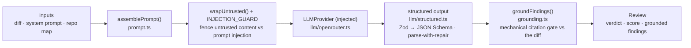
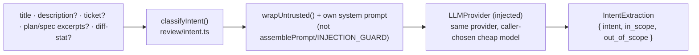

# `@devdigest/reviewer-core` — the review engine

Pure review logic: **diff → prompt → LLM → grounded findings**. No database,
GitHub, or filesystem; the only side effect is an LLM call through an **injected**
`LLMProvider`, which is what makes it mock-testable.

In the starter the **server** (`@devdigest/api`) is its only consumer — for local
reviews in the studio. (The CI runner that runs the same engine in GitHub Actions
is added back in the Export-to-CI lesson, L06.) The server wires it via a tsconfig
path alias (`@devdigest/reviewer-core` → `../reviewer-core/src`) and consumes the
TypeScript **source** directly (tsx in dev, vitest in tests). The package never
emits JS — its `build` is a type-check.

## Pipeline

The grounding step is the mandatory gate: a finding that doesn't cite a real line
in the diff is dropped, so the engine can't hallucinate locations. The score is
recomputed deterministically from the **surviving** findings, not trusted from the
model. `review/run.ts` orchestrates the run (single-pass by default).

The engine also accepts optional prompt slots the **course lessons** start
feeding it — `skills` (L02), `memory` (L07), `specs` (L05), `callers` — plus a
`reduce()`/map-reduce path and a `toReview()` CI payload helper used from L06.
`skills`, `callers`, `repoMap`, and `intent` are wired end-to-end from the server
today: `run-executor.ts` resolves an agent's linked, ENABLED skills (ordered) into
`ReviewInput.skills`, repo-intel context into `callers`/`repoMap`, and the PR's
classified intent (see below) into `ReviewInput.intent`. `memory` and `specs`
remain unfed — those slots are still omitted, so `assemblePrompt` simply leaves
those sections out until their lessons land.

## Intent classification (`classifyIntent`)

A **separate, sibling entry point** to `reviewPullRequest` — not a preceding
stage chained into the same pipeline. It answers a different question ("why was
this PR made") from a different, smaller set of inputs, and is invoked as its
own call by the server, independently of whether/when a review runs:

`classifyIntent` builds its own `ChatMessage[]` and its own system prompt +
injection-defense note — it does **not** go through `assemblePrompt` or the
diff-centric `INJECTION_GUARD` used by `reviewPullRequest`, since it has no diff
and a different, smaller framing. It deliberately never asks the model for a
`confidence` value: the caller (`server/src/modules/reviews/intent.ts`'s
`getOrComputeIntent`/`tierFor`) assigns confidence deterministically from which
signals were actually available, the same "never trust a self-report" principle
as `groundFindings()`/the recomputed score.

Once the server has a classified `Intent`, it is threaded into a *following*
`reviewPullRequest` call as `ReviewInput.intent` (a plain string), which
`assemblePrompt` then renders as a `## PR intent` section via `wrapUntrusted()` —
that is the only point where the two pipelines connect, and it happens outside
this package, in `server/src/modules/reviews/run-executor.ts`.

## Public API

Exported from `src/index.ts`: `assemblePrompt` / `wrapUntrusted` (prompt),
`groundFindings` / `groundingSummary` (grounding), `toJsonSchema` / `extractJson`
/ `parseWithRepair` (structured output), `classifyIntent` plus its
`IntentClassificationInput` / `IntentClassificationOutcome` / `IntentTicketInput`
/ `PlanExcerptInput` types (intent classification), plus the `run` entrypoint and
`reduce`. Contracts (`Review`, `Finding`, `Verdict`, …) come from
`@devdigest/shared`.

## Testing

`npm test` (vitest) — hermetic units with a stubbed `LLMProvider`: prompt
assembly, the grounding gate, `toReview` selection, and a full `run`. No keys,
no network. `npm run typecheck` doubles as the build. See
[`../TESTING.md`](../TESTING.md).
