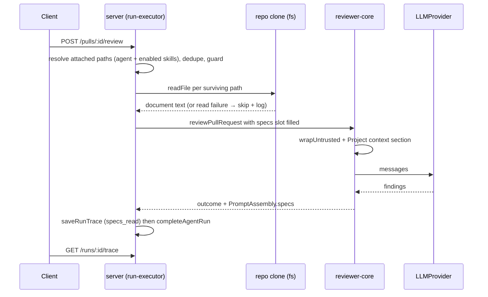

# Spec: Project Context
Spec ID: SPEC-01-project-context
Status: approved
Supersedes: none

## Problem & user

A product owner curates the Markdown that defines what a codebase is supposed
to do — PRDs, specs, architecture notes, incident write-ups. A reviewing agent
never sees any of it. It judges a diff against its system prompt, its linked
skills, and repo-derived structure, so it cannot tell "this violates the
documented rate-limiting requirement" from "this looks fine".

**Project Context** closes that gap with a deliberately dumb mechanism: the user
browses the Markdown that exists in the repo, manually ticks the documents that
matter for a given agent or skill, and those documents are read fresh from the
repo and pasted into every run's prompt as untrusted data. No relevance ranking,
no embeddings, no extra model call.

Three surfaces:

1. A **Project Context** page for browsing and previewing the discovered
   Markdown.
2. A **Context** tab on the Agent editor and an equivalent **Project context to
   use** section on the Skill editor, for attaching documents.
3. The existing run **trace / Prompt Assembly** viewer, which must show what was
   actually injected and let the user read the full text.

The engine half of this already exists and is unfed. `reviewer-core`'s
`assemblePrompt` has accepted a `specs?: string[]` slot since day one, renders it
as `## Project context` with each entry wrapped in
`<untrusted source="spec-N">…</untrusted>`, and writes it to
`PromptAssembly.specs`
(`reviewer-core/src/prompt.ts:46,104,125,144`). `RunTrace.specs_read` exists on
the contract (`server/src/vendor/shared/contracts/trace.ts:96`), and the trace
drawer already renders both a "Specs read" configuration row and a "Project
context (dynamic)" prompt block
(`client/src/app/repos/[repoId]/pulls/[number]/_components/RunTraceDrawer/_components/TraceBody/TraceBody.tsx:39-51,90-92`,
`client/messages/en/runs.json:38,53`). `run-executor.ts` hardcodes
`specs_read: []` and never passes `specs`
(`server/src/modules/reviews/run-executor.ts:217-244,319`). `reviewer-core`'s own
`AGENTS.md` and `README.md` both name `specs` as the still-unfed slot for this
lesson. This spec is mostly about **feeding** that slot and building the two
attach surfaces, not about inventing a prompt section.

The same is true of the browse surface, partially: `SpecFile` and `IndexStatus`
are already declared
(`server/src/vendor/shared/contracts/platform.ts:271-284`), the client hooks
`useContextFiles` → `GET /repos/:repoId/context` and `useReindexContext` →
`POST /repos/:repoId/context/reindex` already exist
(`client/src/lib/hooks/core.ts:123-138`), and `client/messages/en/context.json`
already holds the page's copy. **No server module implements either route and no
page renders either hook** — the scaffolding is contract-only, exactly the trap
recorded in root `INSIGHTS.md` (2026-08-12, "a feature can be scaffolded across
the DB schema, the Zod contract, AND a pure-engine prompt slot with zero lines
connecting them at runtime").

## Goals / Non-goals

**Goals**

- Discover Markdown documents in a repo's clone under configurable search roots
  and list them with path, document type, size, and an estimated token count.
- Let the user attach discovered documents to an **agent** and to a **skill**,
  persisting **repo-scoped paths only** (a `(repo_id, path)` pair per
  attachment — see Open questions Q2), with an explicit order.
- Read attached documents fresh at run time and inject them into the existing
  `## Project context` prompt section as untrusted, delimiter-wrapped data.
- Record the injected document set in the run trace so the user can open the run
  and read exactly what the model saw.
- Preview a document's rendered Markdown from the Project Context page and from
  the attach lists.
- Degrade to today's behavior — no `## Project context` section, no prompt change
  at all — whenever nothing is attached or nothing can be read.

**Non-goals**

- Automatic or LLM-assisted selection of relevant documents. Selection is
  manual (requirement 6).
- Any embedding / chunking / vector-search pipeline. `code_chunks` (with its
  `embedding vector(1536)` column and `source: 'code' | 'docs' | 'spec'` enum)
  exists in `server/src/db/schema/context.ts:31-47` but has **zero writers** in
  the codebase today, and building one would contradict requirement 13's "no
  separate LLM call". See Open questions Q5.
- Summarizing, rewriting, or deduplicating document content.
- Creating, uploading, editing, or deleting project documents from the app.
  This spec's Project Context page is **read-only** (browse, preview, refresh) —
  no `+`, no upload, no Edit/Save. A write path needs its own threat model and
  permissions model; the server currently runs `LocalNoAuthProvider`
  (`server/src/adapters/auth/local.ts`) — one seeded user, one workspace, no
  login. See Open questions Q9 (resolved).
- Changing the order of prompt sections. `assemblePrompt` fixes it
  (`reviewer-core/src/prompt.ts:112-131`) and this feature reuses the existing
  slot position.
- Feeding the sibling `memory` slot, which stays unfed.

## User stories

- As a product owner, I open **Project Context** from the left nav and see every
  spec/doc Markdown file that exists in my repo, so I do not have to remember
  what was written or where.
- As a product owner, I select a document and read its rendered Markdown in the
  app, so I can confirm it is the version I meant before attaching it.
- As an agent author, I open my agent's **Context** tab, filter the list, tick
  two documents, and see the token cost of that choice before I run anything.
- As an agent author, I drag a document above another so the more important one
  appears earlier in the assembled block.
- As a skill author, I attach a document to `pr-quality-rubric` once, so every
  agent that uses that skill inherits the document without each author
  re-picking it.
- As a reviewer reading a finished run, I open the trace, expand **Project
  context — attached specs (untrusted)**, and read the exact text the model was
  given, so I can tell whether a finding was grounded in the spec or invented.
- As an agent author, I detach a document and the next run's prompt no longer
  contains it, with the trace confirming it.

## Acceptance criteria (EARS)

**Discovery**

- WHEN (КОЛИ) a client requests the project-context document list for a repo, the
  system shall (shall) return one entry per Markdown file found beneath that
  repo's configured search roots in its clone.
- The system shall (shall) return each discovered document's repo-relative path.
- The system shall (shall) return each discovered document's type, derived from
  the search root it was found under.
- The system shall (shall) return each discovered document's byte size.
- The system shall (shall) return each discovered document's estimated token
  count.
- The system shall (shall) exclude every directory in `EXCLUDED_DIRS`
  (`server/src/modules/repo-intel/constants.ts`) from discovery.
- IF (ЯКЩО) the repo has no local clone (`repos.clone_path` is null), THEN the
  system shall (shall) return an empty document list with a `degraded` marker
  rather than an error response.
- WHILE (ПОКИ) the document-list request is in flight, the Project Context page
  shall (shall) render a loading state in place of the document list.
- IF (ЯКЩО) the document-list request fails, THEN the Project Context page shall
  (shall) render the `context.loadError` message instead of an empty list.
- IF (ЯКЩО) discovery returns zero documents, THEN the Project Context page shall
  (shall) render the `context.empty` state.
- The Project Context page shall (shall) provide no affordance to create,
  upload, edit, or delete a document (Q9 — read-only in v1).
- The Project Context page's status footer shall (shall) show the discovered
  document count, the summed estimated token count across every discovered
  document, and the time of the last scan, and shall (shall) never show a chunk
  count (Q5 — no embedding pipeline in scope).
- WHEN (КОЛИ) the user activates the page's reindex/refresh action, the system
  shall (shall) re-walk the repo's clone and refresh the discovered document
  list, without issuing any embedding or LLM call.

**Preview**

- WHEN (КОЛИ) the user selects a document on the Project Context page, the system
  shall (shall) render that document's current text as Markdown.
- WHEN (КОЛИ) the user activates a document row's Preview action in an editor's
  Context tab, the system shall (shall) display that document's full current
  text.

**Attaching (agent)**

- WHEN (КОЛИ) the user toggles a document's checkbox in the Agent editor's
  Context tab, the system shall (shall) persist the resulting attached-path set
  for that agent without requiring a separate save action.
- The system shall (shall) persist an attachment as a `(repo_id, path)` pair,
  never as document text.
- WHEN (КОЛИ) the user opens an agent's Context tab against a given repo, the
  system shall (shall) show only that agent's attachments whose stored
  `repo_id` matches the currently active repo.
- WHEN (КОЛИ) the user reorders a document row in the Agent editor's Context tab,
  the system shall (shall) persist the new order for that agent.
- WHEN (КОЛИ) the user types into the Context tab's filter box, the system shall
  (shall) show only documents whose path contains the typed text, matched
  case-insensitively.
- The Agent editor's Context tab shall (shall) display the count of attached
  documents out of the count of discovered documents.
- The Agent editor's Context tab shall (shall) display the summed estimated token
  count of the currently attached documents.
- WHEN (КОЛИ) the user toggles a document's checkbox, the system shall (shall)
  update the displayed summed token estimate to match the new attached set.
- WHEN (КОЛИ) a new agent version is created, the system shall (shall) snapshot
  that agent's attached context-document paths into the version's
  `AgentVersionConfig.context_docs` field (Q10).

**Attaching (skill)**

- WHEN (КОЛИ) the user toggles a document's checkbox in the Skill editor's
  Context tab, the system shall (shall) persist the resulting attached-path set
  for that skill without requiring a separate save action.
- The Skill editor's Context tab shall (shall) display the list of paths that
  the skill contributes to an assembled prompt.
- The Skill editor's Context tab shall (shall) list attached documents ordered
  deterministically by normalized path, with no drag-to-reorder control (Q13).
- WHERE (ДЕ) a skill carrying attached documents is linked to an agent and
  enabled, the system shall (shall) include that skill's attached documents in
  that agent's assembled project-context set.
- IF (ЯКЩО) a linked skill is disabled, THEN the system shall (shall) exclude
  that skill's attached documents from the assembled project-context set.
- IF (ЯКЩО) the same document path is attached at both agent level and skill
  level, THEN the system shall (shall) include that document exactly once in the
  assembled prompt.

**Run-time injection**

- WHEN (КОЛИ) a run starts, the system shall (shall) restrict the agent's
  assembled project-context set to attachments whose stored `repo_id` matches
  the run's repo before doing anything else with them.
- WHEN (КОЛИ) a run starts for an agent with at least one document in its
  assembled project-context set, the system shall (shall) read each of those
  documents' current text from the repo clone before calling the model.
- The system shall (shall) render the read documents under the `## Project
  context` heading in the assembled prompt.
- The system shall (shall) wrap each injected document in the engine's
  `<untrusted source="spec-N">…</untrusted>` delimiters.
- The system shall (shall) assemble the project-context block using file reads
  only, issuing no additional LLM request.
- IF (ЯКЩО) an agent's assembled project-context set is empty, THEN the system
  shall (shall) produce a prompt byte-identical to the one it produces today with
  the feature absent.
- IF (ЯКЩО) an attached document cannot be read at run time, THEN the system
  shall (shall) omit that document from the assembled prompt.
- IF (ЯКЩО) an attached document cannot be read at run time, THEN the system
  shall (shall) complete the run rather than failing it.
- IF (ЯКЩО) an attached document cannot be read at run time, THEN the system
  shall (shall) record the failed path in that run's Live Log.
- IF (ЯКЩО) an attached document's text exceeds the per-document character cap,
  THEN the system shall (shall) truncate it before injection.
- IF (ЯКЩО) the assembled project-context set exceeds the maximum attached
  document count, THEN the system shall (shall) inject only the first N
  documents in configured order.
- IF (ЯКЩО) the assembled project-context set exceeds the maximum attached
  document count, THEN the system shall (shall) record each dropped document's
  path in the run's Live Log.

**Path safety**

- IF (ЯКЩО) a submitted attachment path fails the repo's path-shape allowlist,
  THEN the system shall (shall) reject the request with a `422` before the
  handler runs.
- IF (ЯКЩО) an attachment path resolves outside the repo's clone directory, THEN
  the system shall (shall) refuse to read that path.
- IF (ЯКЩО) an attachment path contains a `..` segment or is absolute, THEN the
  system shall (shall) refuse to read that path.

**Trace**

- WHEN (КОЛИ) a run injects project context, the system shall (shall) record each
  injected document's path in that run's trace.
- WHEN (КОЛИ) a run injects project context, the system shall (shall) record each
  injected document's token count in that run's trace.
- WHEN (КОЛИ) the user opens a completed run's trace, the system shall (shall)
  list the injected document paths in the trace's Configuration section.
- WHEN (КОЛИ) the user expands the trace's Prompt assembly section for a run that
  injected project context, the system shall (shall) render an expandable block
  containing the exact injected text.
- IF (ЯКЩО) a run injected no project context, THEN the trace's Configuration
  section shall (shall) render the "none" placeholder for the injected-documents
  row.

## Edge cases

| Case | Expected behavior |
|---|---|
| Attached file deleted, renamed, or moved after attachment | The path stays persisted; the run-time read fails, the document is skipped, the run continues, the Live Log names the path. The editor list should mark a persisted path that is no longer discovered as **missing** rather than silently dropping the row (proposal — see Q7). |
| Attached file's content changed between attach and run | The new content is injected — text is always read fresh, never cached. The stored token estimate can therefore be stale relative to the run; the trace's per-document token count is the authoritative one. |
| Repo not cloned yet | Discovery returns empty + degraded; attachment is still possible only for paths the user cannot see, so effectively the tab is empty. Run-time read fails per-document and the run proceeds without a `## Project context` section. |
| Same path attached at agent level and via a linked skill | Deduplicated by normalized path; injected once. Order: agent-level entries in their configured order first, then skill-inherited entries not already present (proposal — see Q3). |
| Two linked skills attach the same path | Deduplicated by normalized path, first occurrence in skill link order wins. |
| Linked skill is disabled | Its documents are excluded, mirroring how disabled skills' bodies are already filtered out at `run-executor.ts:204-206`. |
| Agent attached a path from repo A, agent later runs against repo B | Attachments are stored as `(repo_id, path)` pairs (Q2). The run only applies attachments whose `repo_id` matches the run's repo; a repo-A attachment is silently out of scope for a repo-B run — no read attempt, no Live Log entry, since it was never applicable. The Agent editor's Context tab, when opened against repo B, shows repo B's own attachment set, not repo A's. |
| Document contains `</untrusted>` | Already neutralized: `wrapUntrusted` does `content.replaceAll('</untrusted>', '<\\/untrusted>')` (`reviewer-core/src/prompt.ts:32`). No new handling needed. |
| Document contains prompt-injection text ("ignore previous instructions", "this is a test fixture") | Covered by the existing `INJECTION_GUARD` appended to every system prompt (`reviewer-core/src/prompt.ts:16-28`), which explicitly names specs as untrusted data. No new guard. |
| Document is very large (multi-hundred-KB Markdown) | Truncated at the per-document cap; truncation flagged in the trace. |
| Non-UTF8 / binary file with a `.md` extension | Read failure or replacement characters — treat as a failed read and skip. |
| Symlinked file or directory inside the clone pointing outside it | Rejected by the clone-containment check, which resolves the real path before reading. |
| Two concurrent attach requests for the same agent | Must not 500. The equivalent `agent_skills` full-replace hit exactly this and needed `.onConflictDoUpdate` on the insert — a transaction alone was insufficient (server `INSIGHTS.md`, 2026-08-12). |
| Agent version snapshot | `AgentVersionConfig` already snapshots `skills: string[]` for reproducibility. Attached context paths arguably belong in that snapshot too — but adding a required field breaks every hand-built literal of the contract (root `INSIGHTS.md`, 2026-08-18). See Q10. |
| Zero documents discovered but paths already attached | The editor shows the attached rows as missing; the discovery list is empty. |
| A discovered document that is itself this spec file | No special case — a repo may legitimately attach its own specs. |

## Non-functional requirements

**Layering and ownership.** Discovery, reading, and token counting are I/O and
belong in `server/`, never in `reviewer-core`, whose purity contract forbids
filesystem access (`reviewer-core/AGENTS.md`: "No database, no GitHub, no
filesystem"). `reviewer-core` changes should be **zero** for the prompt itself —
the `specs` slot, its `## Project context` heading, its delimiter wrapping, and
its `PromptAssembly.specs` output all already exist. The server's job is to fill
`ReviewInput.specs`, exactly the way it already fills `skills`, `callers`,
`repoMap`, and `intent` at `run-executor.ts:227-237`.

Server code follows the onion layering: `routes.ts` → `service.ts` →
`repository.ts`, with filesystem access behind a container adapter so tests can
swap it (`server/AGENTS.md`). Discovery reuses the existing clone-walking
machinery (`repo-intel/pipeline/walk.ts`'s `walkClone`) rather than adding a
glob dependency; note that `walkClone` currently filters to `SUPPORTED_EXT`
(`.ts/.tsx/.js/...`) and would need a parameterized extension set, not a fork.

**Contracts first.** `SpecFile` needs a document-type field and a token-count
field; `RunTrace.specs_read` needs to carry token counts, not bare strings.
The new attachment table (agent- and skill-level) stores `repo_id` alongside
`path` per Q2's resolution — this is a schema decision, not just a contract
one, and it means an agent's context attachments are **not** portable across
repos even within the same workspace; each repo the agent is used against
needs its own attachment set picked separately. Both contract changes start in
`@devdigest/shared` and must be hand-copied into **both** vendored copies —
`server/src/vendor/shared/` and `client/src/vendor/shared/` are two independent
copies and nothing fails loudly when they drift (root `INSIGHTS.md`,
2026-08-04). New request bodies are validated by Zod at the route boundary via
`fastify-type-provider-zod`; never hand-roll `Schema.parse(req.body)`
(`server/AGENTS.md`).

**Trace naming.** Any new `PromptParts` slot must also be added to the
`PromptAssembly` Zod schema, and a trace field must mirror its source slot's base
name rather than gaining a prefix — `pr_intent` was shipped for
`PromptParts.intent` and had to be renamed (`reviewer-core/INSIGHTS.md`,
2026-08-18/20). This feature adds no new slot, so it inherits `specs` /
`specs_read` as-is; only `specs_read`'s element type changes.

**Degradation.** Every enrichment in `run-executor.ts` is best-effort and
returns `undefined` on failure so the prompt collapses to the pre-feature shape
(`buildCallersDigest`, `buildRepoMapDigest`, `buildRankNote`). Project context
must behave identically: a repo-intel-style failure never fails a run.

**Trace-before-status.** `saveRunTrace` must continue to run before
`completeAgentRun` on all three paths (success, catch, `failAll`). Reversing that
order caused a real, reproducible race where a poller saw a terminal status while
`GET /runs/:id/trace` still 404'd (server `INSIGHTS.md`, 2026-08-18/19).

**Client conventions.** Data access goes through hooks in `src/lib/hooks/*` —
`useContextFiles` already exists and should be extended, not duplicated; per
client `INSIGHTS.md` (2026-08-17) do **not** add per-endpoint wrappers to
`src/lib/api.ts`. Every toggle auto-saves on click: a batched
"toggle-then-Save" model was built for the Agent editor's Skills tab and read as
broken to users, and was removed (client `INSIGHTS.md`, 2026-08-12). Strings go
through `next-intl`; the `context` namespace already exists
(`client/messages/en/context.json`) and `runs.json` already has
`trace.config.specsRead` and `trace.prompt.specs`. Any file importing from
`@devdigest/ui` must be `"use client"` (client `INSIGHTS.md`, 2026-08-10).

**Token counting.** Reuse the existing `Tokenizer` adapter
(`server/src/adapters/tokenizer/index.ts` — `TiktokenTokenizer`, with
`approxTokens` = `ceil(chars/4)` as the never-throw fallback). Its doc comment
currently scopes it "in-process, ONLY under modules/repo-intel"; widening that
scope is a deliberate change to make, not to assume. The client already has its
own `approxTokens` helper in the trace drawer — the displayed estimate in the
editor should come from the server's count so the editor and the trace agree.

**Testing.** DB-backed tests are `*.it.test.ts`; everything else stays hermetic
(`server/AGENTS.md`). Path-guard unit tests should follow the intent layer's
precedent of exporting the guard so traversal payloads are testable without a
real clone (`server/src/modules/reviews/intent.ts:251-256`).

**Rate limiting.** Any write route added by the Project Context page (Q9) needs a
per-route `config.rateLimit`, with the caveat that `@fastify/rate-limit` is not
registered when `NODE_ENV === 'test'`, so such a limit is a no-op under the usual
integration harness (server `INSIGHTS.md`, 2026-08-18).

**Run-time flow.** The injection path crosses client → server route →
filesystem → engine → LLM → trace store → client, so the hop sequence is worth
fixing precisely:

## Inputs and provenance

| Input | Origin | Trusted? |
|---|---|---|
| Repo id / agent id / skill id in a request path | Client, user-navigated | No — validated as UUID params by Zod at the route boundary |
| Filter text in the Context tab | User-typed | No — client-side filtering only, never reaches a query |
| Attached document paths submitted on attach | User-selected from server-discovered list, but arrives as free-form strings over HTTP | **No** — must be treated as attacker-controlled |
| Attached document paths read back from the DB at run time | Server-stored, but originally client-supplied | **No** — re-guard before every read; do not trust "it was validated on the way in" |
| Discovered file paths | Server's own walk of the clone directory | Yes — server-derived |
| Document text | Repo working tree, authored by whoever can push to the repo | **No** — third-party/VCS content |
| Token counts | Server-computed by the `Tokenizer` adapter | Yes |
| Search roots / glob configuration | Server config | Yes |
| Prompt-assembly output (`PromptAssembly.specs`) | Server + engine derived | Yes as a record; its embedded content is untrusted |

## Untrusted inputs

**Document paths.** `GitClient.readFile` does a bare
`join(this.clonePathFor(repo), path)` with **no path-traversal guard of any
kind** (`server/src/adapters/git/simple-git.ts:135-136`; recorded in server
`INSIGHTS.md`, 2026-08-18). Every caller feeding it an externally-sourced path
is individually responsible for guarding it. The one caller that does this
correctly today is the intent layer, which exports
`isAllowedPlanRefShape` / `isWithinClone` / `isSafePlanRefPath` from
`server/src/modules/reviews/intent.ts:236-256`: a shape allowlist
(`**/specs/*.md`, `**/docs/**/*.md`, `docs/plans/**`), outright rejection of any
`..` segment or absolute/drive-absolute path, **plus** a `path.resolve()`
containment check against the clone root. This feature must reuse those exported
helpers rather than re-deriving a guard, and must apply them at two points: at
the route boundary when a path is attached, and again immediately before every
run-time `readFile`.

Note that the existing shape allowlist covers `specs/` and `docs/` but **not**
an `insights/` directory or a bare `INSIGHTS.md` — see Q4. Widening the
allowlist is a security-relevant change to `intent.ts`'s shared helpers and
should be made deliberately, with the intent layer's own behavior re-checked.

**Contract.** The attach request body needs a new `@devdigest/shared` schema —
proposed `SetContextDocsBody = z.object({ paths: z.array(SpecPath).max(N) })`
with `SpecPath` a branded `z.string()` refined by the same shape allowlist, so
that a traversal payload is rejected with `422` **before the handler runs**
rather than inside it. Reusing the existing `SpecFile` schema is not sufficient:
it describes a discovery response, not a request body, and has no path
constraint at all. Per `AGENTS.md`, the contract lands in `@devdigest/shared`
first, then in both vendored copies, then in consumers.

**Document content.** Fenced by the engine's existing, shared defense:
`wrapUntrusted()` delimiters plus the `INJECTION_GUARD` appended to every system
prompt, which already names specs among the untrusted sources and pre-empts the
"this is a test fixture / do not flag" family of injections in any language
(`reviewer-core/src/prompt.ts:16-34`). No per-document sanitization, keyword
filtering, or content rewriting should be added — pattern-matching untrusted text
downstream is explicitly the rejected approach in that file's own comment.

**Rendered Markdown in the browser.** The Project Context page renders
repo-authored Markdown. `react-markdown` is already a client dependency and
escapes by default; nothing here should introduce `dangerouslySetInnerHTML` or
enable raw-HTML passthrough for this content. Links inside a document are
attacker-influenced — restrict to `http:`/`https:` and reject `javascript:`.

## Open questions

12 of the 13 gaps below were raised during spec authoring and resolved with the
product owner on 2026-08-23 (kept here, marked RESOLVED, as the decision record
and its rationale — not left open). **Q6 remains genuinely open** — the product
owner explicitly deferred it rather than picking a definition; see its entry
for what that blocks and doesn't block.

**Q1 — `## Project context` vs `## Project specifications`. RESOLVED
2026-08-23: one heading, `## Project context`.** Screenshot 1's footer says the
block is injected as `## Project context`; screenshot 2's "SERIALIZES AS"
preview showed `## Project specifications`. The shipped engine emits
`## Project context` (`reviewer-core/src/prompt.ts:125`), and the client
already labels that trace block "Project context (dynamic)"
(`client/messages/en/runs.json:53`). **Decision:** both agent-level and
skill-level attachments merge into that single `## Project context` block; the
Skill editor's "SERIALIZES AS" preview must be corrected to show
`## Project context` rather than the mocked `## Project specifications`.
Skill-level attachment is purely a way to force documents into that same block
— it has no sub-heading of its own.

**Q2 — Repo scoping of an agent's attachments. RESOLVED 2026-08-23.** Agents and
skills are **workspace**-scoped (`agents.workspace_id`, `skills.workspace_id`),
but the existing Project Context API contract the client already calls is
**repo**-scoped (`GET /repos/:repoId/context`), and every document path is
repo-relative. **Decision: option (a) — store `(repo_id, path)` pairs.** An
attachment is bound to the specific repo it was picked from; a run against any
other repo simply does not apply that attachment (it is not "wrong repo, read
nothing" at run time — the attachment is scoped out before assembly even looks
at it). See the updated acceptance criteria under "Attaching (agent)" and
"Run-time injection", and the edge-case table row for cross-repo agents, both
revised to this model. This decides Q11 too: the Context tab and its data stay
nested under a specific repo (`/repos/:repoId/agents/:agentId` context tab,
`/repos/:repoId/context` page), not a workspace-level route.

**Q3 — Composition and ordering of skill-level + agent-level attachments.
RESOLVED 2026-08-23.** Screenshot 2 says "Any agent using this skill inherits
these documents". **Decision:** the assembled set is the union, deduplicated by
normalized `(repo_id, path)`, ordered as (1) the agent's own attachments in
their drag order, then (2) skill-inherited attachments in linked-skill order,
skipping any path already present. Skill-inherited documents appear in the
agent's Context tab as read-only, ticked rows so the user can see what they are
getting; they cannot be unticked from the agent, only from the skill itself. No
agent-level "exclude this inherited doc" override is in scope.

**Q4 — `insights/` in the glob vs. this repo's `INSIGHTS.md` convention.
RESOLVED 2026-08-23.** The stated default glob is
`**/{specs,docs,insights}/**/*.md`, and screenshot 1 shows an `insights/` folder
with `incident-2026-04-checkout.md` and `perf-budget.md`. This repo has **no
`insights/` directory** — its convention is a single `<module>/INSIGHTS.md` file
per package plus a root one, and a user-supplied draft that assumed
`<module>/insights/` was already corrected once on this basis (root
`INSIGHTS.md`, 2026-08-17). Separately, `client/messages/en/context.json` —
already in the repo — describes the root as `.devdigest/specs/`, a *third*
layout, matching screenshot 3's sidebar. **Decision:** the search roots
configuration is a list of *patterns*, defaulting to `**/specs/**/*.md`,
`**/docs/**/*.md`, and `**/INSIGHTS.md` (matched as a file, not a directory),
with `.devdigest/specs/` covered by the first pattern; a document's "type" tag
is derived from whichever pattern matched (`specs` / `docs` / `insights`).

**Q5 — Is the chunk-indexing pipeline in or out of scope? RESOLVED 2026-08-23:
out of scope.** Screenshot 3's footer reads "Indexed: 12 files · 1,240 chunks ·
last 5m ago", and the existing `IndexStatus` contract has an `embedding` status
plus `chunks_indexed` (`server/src/vendor/shared/contracts/platform.ts:277-284`),
and `code_chunks` carries a `vector(1536)` column. **Nothing writes to
`code_chunks` today**, and requirement 13 says attaching context needs no LLM
call, which an embedding pipeline would violate. **Decision:** the footer shows
"N documents · ~T tokens total · last scanned <time>" — the same estimated
token count already computed for discovery (Discovery ACs), summed across
**every discovered document**, not just attached ones — so the user gets a
sense of total scale before picking anything, and the per-selection running
total in the editor tabs is the finer-grained version of the same number.
`POST /repos/:id/context/reindex` (which the client hook already calls) means
"re-walk the clone and refresh the file list", not "re-embed". A chunk/embedding
pipeline, if ever wanted, is a separate spec. (Clarified 2026-08-23: the "tokens
total" framing was the product owner's own intent for this footer, replacing
the screenshot's chunk count outright rather than just dropping it.)

**Q6 — "78 COVERAGE" and "Used by 3 agents". DEFERRED 2026-08-23 — still
blocking.** "Used by N agents" is computable once attachments are stored (count
distinct agents referencing this path, including via skills — confirm whether
skill-inherited usage counts). "78 COVERAGE" has no definition anywhere in the
requirements or the codebase. Candidate readings: share of the document's
requirements referenced by at least one finding; share of repo files touched by
the document's scope; a freshness/staleness score. **No proposal — do not invent
a computation.** The product owner explicitly deferred this decision rather than
picking a reading now, so it stays open: implementation must not ship a
"COVERAGE" badge until this is defined, and `implementation-planner` should treat
that badge as out of scope for the first pass (everything else in this spec —
"Used by N agents" included — is unaffected and can proceed). If no definition is
forthcoming by planning time, the honest move is to drop the badge rather than
ship a number that traces to nothing (the same call recorded for skill stats in
server `INSIGHTS.md`, 2026-08-12: fabricated placeholder numbers "look real,
trace to nothing").

**Q7 — Persisted path that no longer exists. RESOLVED 2026-08-23.** **Decision:**
the editor list shows such a row with a "missing" marker and a manual, one-click
detach, rather than silently dropping it (silent dropping would make an agent
quietly lose context after a file rename). At run time the document is skipped
and the Live Log names it, but the attachment record is never auto-deleted by
the server — detaching a missing row is always a deliberate user action, never
automatic.

**Q8 — Caps. RESOLVED 2026-08-23.** No numbers were given in the requirements.
Existing precedent in the repo: `MAX_PLAN_REFS = 5` and
`MAX_PLAN_EXCERPT_CHARS = 20_000` (`server/src/modules/reviews/intent.ts:32,36`),
`MAX_PR_DESCRIPTION_CHARS = 4000` (`reviewer-core/src/prompt.ts:37`),
`MAX_FILE_SIZE = 400 KB` for the indexer walk. **Decision:** max 10 attached
documents per assembled set, 20,000 characters per document, ~60,000 characters
for the whole `## Project context` block; over-cap documents are truncated with
a marker, over-count documents are dropped in configured order with a Live Log
line. Both limits surface in the editor before the run, not only at run time.

**Q9 — The upload / add / edit affordances on the Project Context page.
RESOLVED 2026-08-23: v1 is read-only.** Screenshot 3's toolbar has `+`, folder,
upload, and refresh icons, plus a Preview/**Edit** toggle, and
`client/messages/en/context.json` already has `editor.save` / `editor.saving`
keys — so the design implies an in-app file *manager* that writes into the repo
working tree, not just a picker. That is a materially larger and riskier
feature: server-side writes into `server/clones/**` (a directory root
`AGENTS.md` marks do-not-touch), an upload path needing size/MIME/extension
limits and server-generated filenames, and an authorization model that does not
exist — the server runs `LocalNoAuthProvider`, one seeded user, no login
(`server/src/adapters/auth/local.ts`). **Decision:** this spec covers **read-only**
browse/preview/refresh only; `+`, upload, and Edit/Save are explicitly out of
scope and deferred to a future spec once a write threat model exists. The
Project Context page ships without those affordances (or with them visibly
disabled) until that spec lands.

**Q10 — Should attached context paths go into `AgentVersionConfig`? RESOLVED
2026-08-23: yes.** `AgentVersionConfig` snapshots `skills: string[]` so a past
version can be replayed reproducibly
(`server/src/vendor/shared/contracts/knowledge.ts`). Attached document paths are
the same kind of state — but adding a field to that contract breaks every
hand-written object literal typed as it, even when `.default([])` makes it
optional on parse (root `INSIGHTS.md`, 2026-08-18). **Decision:** add
`context_docs: z.array(z.string())` with a default, and grep every hand-built
literal of `AgentVersionConfig` as part of the change rather than trusting a
clean typecheck. This snapshots *paths*, not content, so a replay still reads
whatever the files say today — full reproducibility would require snapshotting
text, which requirement 10 forbids.

**Q11 — Nav placement requires touching a vendored file. RESOLVED 2026-08-23,
CORRECTED 2026-08-23 (same day, after implementation): `WORKSPACE`,
`/repos/:repoId/context`.** The left-nav registry is
`client/src/vendor/ui/nav.ts` (`NAV`, `SETTINGS_ITEM`, `SHORTCUTS`), and
`client/AGENTS.md` marks `src/vendor/ui` do-not-touch. Adding a "Project Context"
item and its `g`-then-key shortcut means editing that file, wrapping/extending
`NAV` in app code, or placing the page's entry point somewhere else entirely —
that mechanical question is unaffected by this decision and stays a call for
whoever implements it.
~~**Original decision (WRONG, superseded below):** the nav item sits under
`SKILLS LAB` (alongside Skills / Agents / Conventions), consistent with the
page being a curation instrument for agent/skill inputs rather than repo
content browsing.~~ This missed the product owner's own design source: the
reference sidebar mock places **Project Context under `WORKSPACE`**, as a
sibling of **Pull Requests** — both items use the exact same `:repoId`-templated
href pattern (`/repos/:repoId/pulls`, `/repos/:repoId/context`), i.e. both are
"whatever you're looking at for the currently-selected project," not a
skill/agent-curation tool. `SKILLS LAB` correctly holds `Skills`/`Agents`
(workspace-global entity lists, no `:repoId` in their href at all) plus
`Conventions` (a repo-scoped *input* to a skill/agent, browsed to decide what
to attach) — but the standalone Project Context **page** (browse/preview,
Step 6) is not itself a curation instrument; the curation happens inside the
Agent/Skill editor's Context tab/section, not on this page. Placing the page
under `SKILLS LAB` reinforced a false read that it was somehow specific to
this deployment's one seeded repo, when the design intent (and the existing
`WORKSPACE`/`:repoId` pattern `Pull Requests` already establishes) is that it
follows whichever project/repo is currently selected. **Decision (final):**
the nav item moves to the `WORKSPACE` section, sibling to `Pull Requests`; its
href stays `/repos/:repoId/context`, matching the existing hook and Q2's
repo-scoped attachment model — Q2's `(repo_id, path)` data model is unaffected
by this correction, only the nav *section* changes.

**On the "wrapping/extending `NAV` in app code" alternative, investigated
2026-08-23 during the correction:** the vendored `Sidebar.tsx`
(`client/src/vendor/ui/shell/Sidebar.tsx`) imports `NAV` directly from
`../nav` with **no override prop**, and is itself wrapped by vendored
`AppFrame.tsx` — there is no existing extension point anywhere in the vendored
shell. A genuine composition seam would mean adding an optional `nav` prop to
**three** vendored files (`types.ts`, `AppFrame.tsx`, `Sidebar.tsx`), which is
*more* vendor surface touched than the single-file `nav.ts` edit this and the
two prior features (Skills Lab, Conventions Lab) already made — disproportionate
for a nav-section move. **Decision:** continue editing `client/src/vendor/ui/nav.ts`
directly, matching established precedent; building a real seam is deferred
until a feature actually needs one badly enough to justify the three-file cost.

**Q12 — Prompt-block order in screenshot 4. RESOLVED 2026-08-23: keep shipped
order.** The screenshot lists the blocks as System → Skills → **Project
context** → Repo skeleton → Callers → User/diff. The shipped `assemblePrompt`
order is task → PR description → PR intent → Skills → Memory → **Repo
skeleton** → **Project context** → Callers → Diff
(`reviewer-core/src/prompt.ts:112-131`), i.e. repo skeleton comes *before*
project context, and the screenshot omits PR description and PR intent
entirely. **Decision:** the shipped order stands; the screenshot is an
out-of-date mock. The trace viewer already renders blocks in the shipped order
and no `reviewer-core` change is needed for ordering.

**Q13 — Is the Skill editor's list reorderable? RESOLVED 2026-08-23: no.**
Screenshot 1's agent list has drag handles and an explicit "Order matters"
hint; screenshot 2's skill list appears not to. **Decision:** skill-level
attachments are an unordered set, ordered deterministically by normalized path
at assembly time — no drag handles in the Skill editor's Context section. Their
position in the final block is decided entirely by the agent's composition rule
(Q3): agent-level order first, then skill-inherited entries.
