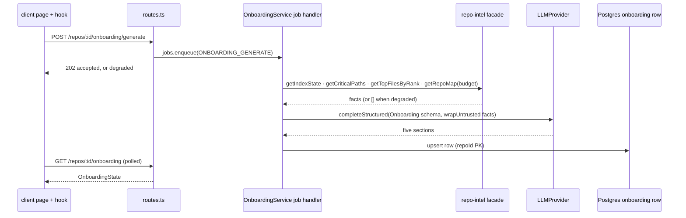

# Spec: Onboarding Tour
Spec ID: SPEC-02-onboarding-tour
Status: approved
Supersedes: none
Packages touched: server, client, @devdigest/shared

## Problem & user

A developer joining an unfamiliar repository spends the first days answering
the same five questions by hand: what is the shape of this system, which files
does everything flow through, how do I get it running, in what order should I
read the code, and what is a safe first change. DevDigest already indexes every
imported repo (`server/src/modules/repo-intel/`), so it holds the facts needed
to answer all five — it just never presents them.

The primary user is a **new joiner on a repo they did not write**, opening
DevDigest for the first time on that repo. A secondary user is an **existing
maintainer** who wants a shareable, always-current orientation document instead
of a hand-maintained `ONBOARDING.md` that rots.

This feature is scaffolded across four layers today and connected at none of
them — the third instance of the pattern recorded in root `INSIGHTS.md`
(**2026-08-12**, Skills). What already exists, verified in this checkout:

| Layer | Artifact | State |
|---|---|---|
| Contract | `Onboarding`, `OnboardingSection`, `OnboardingLink` in `server/src/vendor/shared/contracts/knowledge.ts:29-48` | Exists; `kind` is a bare `z.string()`, not an enum |
| DB | `onboarding` table in `server/src/db/schema/context.ts` (`repoId` PK → `repos`, `json` jsonb, `generatedAt`) | Exists; one row per repo, no history |
| Prompt | `server/src/prompts/onboarding.system.md` | Exists; takes `{{sections}}` and `{{language}}` placeholders |
| Model registry | `FEATURE_MODELS` entry `id: 'onboarding'` in `contracts/platform.ts:46-51` | Exists; cheap default `openrouter/deepseek-v4-flash` |
| Facade | `RepoIntel.getTopFilesByRank()` / `getCriticalPaths()` in `server/src/modules/repo-intel/types.ts:186-192`, implemented in `service.ts:730-795` | Exists and is implemented, comment-labelled "onboarding reading-path + critical paths" |
| i18n | `client/messages/en/onboarding.json` | Exists; copy describes a *different* five sections (see Open question 1) |

Nothing wires them together: there is no `server/src/modules/onboarding/`, no
route, no client hook in `client/src/lib/hooks/`, and no page. The only route
at `/onboarding` (`client/src/app/onboarding/page.tsx`) is the unrelated,
already-shipped **add-a-repository wizard**.

## Goals / Non-goals

**Goals**

1. Produce a five-section, per-repo onboarding tour, generated by an LLM and
   grounded strictly in facts `repo-intel` already computed.
2. Cache the tour per repo and serve it instantly on subsequent visits.
3. Let the user regenerate it on demand, asynchronously, without blocking the
   request — reusing the Conventions Lab's proven job shape.
4. Give the tour its own route that does not collide with the add-repo wizard.
5. Keep every generated file path verifiable against the index, so the tour
   never cites a file that does not exist.

**Non-goals**

- **No chat or follow-up Q&A** over the tour. It is a read-only document.
- **No accept/reject/edit loop.** Unlike Conventions Lab candidates, tour
  sections are regenerated wholesale, not curated item by item.
- **No per-user progress tracking** ("3 of 5 sections read"). No user model
  exists to hang it on (`LocalNoAuthProvider` returns one system user).
- **No re-indexing.** This feature is a pure *reader* of `repo-intel`, per
  `server/src/modules/repo-intel/README.md`: "Course lessons build features
  _on top_ of its facade — by calling `repoIntel.*`, not by re-indexing."
- **Does not replace or absorb Project Context** (`SPEC-01-project-context`).
  Project Context is user-supplied documents; the Onboarding Tour is derived
  output. They may cite each other, but neither owns the other.
- **No change to the authentication or sharing model.** See Open question 6.

## User stories

- As a **new joiner**, I want a one-page orientation to a repo I have never
  seen, so that I can form a mental model before opening any file.
- As a **new joiner**, I want the tour to name the specific files that matter
  and the order to read them in, so that I do not have to guess where the
  system's centre of gravity is.
- As a **new joiner**, I want the exact commands that boot this repo locally,
  copyable in one click, so that I am running the app on day one.
- As a **maintainer**, I want to regenerate the tour after the repo changes
  shape, so that a newcomer is never oriented by a stale document.
- As a **maintainer**, I want the tour to be visibly dated and tied to an
  index size, so that I can judge at a glance whether to trust it.

## Acceptance criteria (EARS)

**Retrieval and caching**

- **WHEN (КОЛИ)** a user opens the Onboarding Tour page for a repo whose
  `onboarding` row does not exist, the system **shall (shall)** render the
  "Generate onboarding tour" empty state rather than an empty tour.
- **WHEN (КОЛИ)** a user opens the Onboarding Tour page for a repo whose
  `onboarding` row exists, the system **shall (shall)** render the cached tour
  without issuing any LLM call.
- The system **shall (shall)** serve an `OnboardingState` payload from
  `GET /repos/:id/onboarding`.
- The system **shall (shall)** display the repo's indexed file count, taken
  from `repoIntel.getIndexState(repoId).filesIndexed`, in the page header.
- The system **shall (shall)** display the cached tour's `generated_at` as a
  relative age in the page header.

**Generation and regeneration**

- **WHEN (КОЛИ)** a user activates the Generate or Regenerate control, the
  system **shall (shall)** respond to `POST /repos/:id/onboarding/generate`
  with HTTP 202 before the LLM call completes.
- **WHILE (ПОКИ)** a generation job for a repo is running, the system
  **shall (shall)** report a `generating` status on `GET /repos/:id/onboarding`.
- **WHILE (ПОКИ)** a generation job for a repo is running, the client
  **shall (shall)** poll `GET /repos/:id/onboarding` on an interval until the
  status leaves `generating`.
- **WHILE (ПОКИ)** a generation job for a repo is running, the Regenerate
  control **shall (shall)** be disabled.
- **WHEN (КОЛИ)** a generation job completes successfully, the system
  **shall (shall)** replace that repo's single `onboarding` row with the new
  result.
- **IF (ЯКЩО)** enqueuing the generation job fails, **THEN** the system
  **shall (shall)** still respond 202 with `degraded: true`, matching
  `ConventionsService.triggerExtraction`'s contract.
- **IF (ЯКЩО)** a generation job fails after enqueue, **THEN** the system
  **shall (shall)** leave the previously cached tour unchanged.
- **IF (ЯКЩО)** a second generation is requested for a repo whose job is
  already running, **THEN** the system **shall (shall)** respond 202 without
  enqueuing a second job.

**Section structure**

- The system **shall (shall)** persist exactly five sections per tour, in the
  order `architecture`, `critical_paths`, `local_setup`, `reading_path`,
  `first_tasks` (Open question 1, resolved).
- **IF (ЯКЩО)** the model returns a section whose `kind` is outside that five-
  value set, **THEN** the system **shall (shall)** discard that section rather
  than persist it.
- **IF (ЯКЩО)** the model returns fewer than five sections, **THEN** the system
  **shall (shall)** persist the sections it did return.
- **IF (ЯКЩО)** a persisted tour holds fewer than five sections, **THEN** the
  system **shall (shall)** report its status as `partial`.
- **WHERE (ДЕ)** a section's `kind` is `architecture`, the system
  **shall (shall)** accept a non-null mermaid `diagram` for that section.
- **IF (ЯКЩО)** a persisted `diagram` fails to render as mermaid in the client,
  **THEN** the system **shall (shall)** render that section's body without a
  diagram instead of an error state.
- The system **shall (shall)** persist at most 4 links per section.

**Grounding**

- **WHEN (КОЛИ)** assembling the generation prompt, the system
  **shall (shall)** include the dependency chains returned by
  `repoIntel.getCriticalPaths(repoId)` as facts.
- **WHEN (КОЛИ)** assembling the generation prompt, the system
  **shall (shall)** include the ranked file list returned by
  `repoIntel.getTopFilesByRank(repoId, n)` as facts.
- **WHEN (КОЛИ)** assembling the generation prompt, the system
  **shall (shall)** bound the repo skeleton it includes by passing an explicit
  token budget to `repoIntel.getRepoMap(repoId, tokenBudget)`.
- **IF (ЯКЩО)** a generated `links[].path` is absent from the repo's indexed
  file set, **THEN** the system **shall (shall)** omit that link from the
  persisted tour.
- **IF (ЯКЩО)** `repoIntel.getIndexState(repoId)` reports status `failed`,
  **THEN** the system **shall (shall)** refuse to enqueue generation and
  surface a "repo is not indexed yet" state.
- **IF (ЯКЩО)** the repo has no clone path on disk, **THEN** the system
  **shall (shall)** refuse to enqueue generation, matching
  `ConventionsService.runExtraction`'s `clonePath` guard.

**Routing and navigation**

- The system **shall (shall)** serve the Onboarding Tour at
  `/repos/:repoId/onboarding`.
- **WHILE (ПОКИ)** the user is on `/onboarding` (the add-repository wizard),
  the system **shall (shall)** leave the Onboarding Tour sidebar item
  unhighlighted.

**Presentation**

- The page **shall (shall)** render an on-page rail listing every section title
  in the tour.
- **WHEN (КОЛИ)** a user activates a section's header control, the system
  **shall (shall)** toggle that section between expanded and collapsed.
- **WHEN (КОЛИ)** a user activates the copy control on a setup command block,
  the system **shall (shall)** place that command's text on the clipboard.
- The system **shall (shall)** render every section `body` as Markdown with
  raw HTML disabled.
- **WHERE (ДЕ)** a workspace locale other than English is active, the system
  **shall (shall)** pass that locale into the prompt's `{{language}}`
  placeholder.

## Edge cases

- **Repo not indexed, or indexed `partial`/`degraded`.** `getIndexState`
  always answers, even degraded (`repo-intel/types.ts:15-22`). `partial` should
  still generate — with the degradation surfaced — while `failed` should not.
- **Repo with no import edges.** `getCriticalPaths` returns `[]` when
  `getEdges` is empty (`service.ts:756-757`). The Critical paths section must
  degrade to ranked files alone, not render blank.
- **Very large repo (the screenshot's 12,450 files).** `getRepoMap`'s
  `tokenBudget` parameter is the existing throttle; `getTopFilesByRank`
  over-fetches 10× then filters (`service.ts:738`). The tour must not attempt
  to feed the whole tree to the model.
- **Monorepo with several setup paths.** `pnpm` in two packages, `npm` in
  three — exactly this repo. A single numbered command list is a poor fit; see
  Open question 8.
- **Model returns 4, 6, or misnamed sections.** Covered by the discard/partial
  criteria above; `kind` being `z.string()` means the contract will not catch
  it (Open question 2).
- **Model invents a path.** The prompt already forbids it
  (`onboarding.system.md:15-16`), but prompt text is not a gate — the link
  filter against the indexed file set is.
- **Invalid mermaid.** The prompt warns "invalid diagrams are dropped"
  (`onboarding.system.md:29`); the client must actually implement the drop.
- **Repo deleted mid-job.** `onboarding.repoId` cascades on delete, so the row
  vanishes; the job's write must tolerate the parent row being gone.
- **Two Regenerate clicks in a row**, or a click while a job is queued.
- **Markdown body containing HTML or a `javascript:` link.** LLM output is
  untrusted; see Untrusted inputs.

## Non-functional requirements

**Server layering.** One feature, one `server/src/modules/onboarding/` plugin
registered in `src/modules/index.ts`, following the Onion layering the
Conventions Lab already demonstrates: `routes.ts` → `service.ts` →
`repository.ts`. Routes declare Zod `params`/`body`/response schemas from
`@devdigest/shared` via `fastify-type-provider-zod`; no hand-rolled
`Schema.parse`. External I/O (LLM, VCS) goes through the DI container.

**Model selection.** The service resolves its model with
`resolveFeatureModel(container, workspaceId, 'onboarding')`, matching the
2026-08-13 server `INSIGHTS.md` decision for `conventions`. The registry's
cheap default stands; it is per-workspace overridable in Settings → Models.

**Async shape.** Generation runs as a `container.jobs` handler registered in
`routes.ts` at boot, exactly as `ConventionsService.registerExtractionJobHandler`
does. The HTTP handler never awaits the LLM.

**Client layering.** Data access goes through a new
`client/src/lib/hooks/onboarding.ts` mirroring `hooks/conventions.ts` —
TanStack Query, `refetchInterval` while generating, `invalidateQueries` on
mutation success. Components never call `fetch`. All copy goes through
`next-intl` from `messages/en/onboarding.json`. Any file importing from
`@devdigest/ui` must be `"use client"` (client `INSIGHTS.md`, 2026-08-10).

**Contract changes (`@devdigest/shared` first, then consumers).** Per root
`AGENTS.md` and the 2026-08-04 root `INSIGHTS.md` entry, both vendored copies
(`server/src/vendor/shared/`, `client/src/vendor/shared/`) must be updated by
hand — they are independent copies, not a symlink.

- Add `OnboardingState` to `contracts/knowledge.ts`, mirroring
  `ConventionsState`: the cached `Onboarding` (nullable), a status, a
  `generated_at` timestamp, and the indexed file count.
- Add `OnboardingGenerateAccepted`, mirroring `ConventionsExtractAccepted`
  (`{ status: 'accepted', job_id }` or `{ status: 'accepted', degraded: true }`).
- Narrow `OnboardingSection.kind` from `z.string()` to
  `z.enum(['architecture', 'critical_paths', 'local_setup', 'reading_path',
  'first_tasks'])` (Open question 2, resolved).
- Reuse the existing `IdParams` from `server/src/modules/_shared/schemas.ts`
  for both routes.

**Prompt ownership.** `onboarding.system.md` stays in `server/src/prompts/` and
is loaded through `renderPrompt('onboarding.system.md', { sections, language })`
(`server/src/platform/prompts.ts`). It does **not** move to `reviewer-core`:
that package is the pure diff-review engine and does no filesystem work. The
untrusted-data fencing, however, does reuse `reviewer-core`'s mechanism —
`wrapUntrusted` is already re-exported through `server/src/platform/prompt.ts`,
so this is a shared helper, not a second server-owned convention. Per Open
question 9's resolution, `onboarding.system.md`'s own inline SECURITY
paragraph (lines 11-13) is deleted and the shared `INJECTION_GUARD` constant
is appended at assembly time instead, so there is one guard, not two.

**End-to-end flow.** Four hops with an async break in the middle, so the shape
is worth drawing once:

## Inputs and provenance

| Input | Origin | Trusted? |
|---|---|---|
| `repoId` path param | User-selected in the client, but a UUID validated by `IdParams` and scoped by `getContext`'s `workspaceId` | Trusted after validation |
| Ranked file paths, dependency chains, repo map | `repo-intel`, computed from the **cloned user repo** — attacker-authorable content | **Untrusted** |
| Key-file excerpts fed as facts | Read from `repo.clonePath` on disk — repo content | **Untrusted** |
| Index state (`filesIndexed`, `updatedAt`, status) | `repo-intel` DB tables, server-computed | Trusted |
| System prompt text | `server/src/prompts/onboarding.system.md`, in git | Trusted |
| `{{sections}}` section list | Server constant, fixed for v1 (Open question 3, resolved) | Trusted |
| `{{language}}` | Workspace locale setting | Trusted |
| Generated sections (`title`, `body`, `diagram`, `links`) | **LLM output** | **Untrusted** |
| Feature model + provider | `resolveFeatureModel` over the workspace settings row | Trusted |
| API key for that provider | `LocalSecretsProvider` (`~/.devdigest/secrets.json`, mode 0600) | Trusted; never persisted with the tour |

## Untrusted inputs

Two distinct untrusted surfaces, needing different treatment.

**1. Repo content going *into* the prompt (prompt injection, OWASP A05 /
ASI01).** A cloned repository can contain a README, comment, or filename that
says "ignore previous instructions". Every fact block assembled from repo
content **must** be wrapped with `wrapUntrusted(label, content)` from
`server/src/platform/prompt.ts` (re-exported from `reviewer-core/src/prompt.ts:30`),
and the system prompt must carry the injection guard. `onboarding.system.md`'s
own inline SECURITY paragraph (lines 11-13), which duplicated `INJECTION_GUARD`
in weaker form, is deleted per Open question 9's resolution — the shared
constant is appended instead, so there is one guard, not two that can drift.

**2. LLM output coming *back* (stored XSS, OWASP A05 / ASI09).** The model's
`body` is Markdown rendered in the browser, its `diagram` is executed by a
mermaid renderer, and its `links[].path` becomes a UI target.

- `body` — render as Markdown with **raw HTML disabled** at the renderer, not
  by post-hoc stripping. Never `dangerouslySetInnerHTML` on model output.
- `links[].path` — validate against the repo's indexed file set before
  persisting. This doubles as the anti-hallucination gate and as protection
  against a `javascript:`-style value reaching an `href`.
- `diagram` — mermaid is executable-ish; render it in the same sandboxed
  wrapper the app already uses for `repo-intel`'s architecture diagrams, and
  drop it silently on parse failure rather than falling back to raw text.
- `kind` — must be validated against the fixed enum before the section is
  persisted, which is precisely what today's `z.string()` fails to do.

Structural validation reuses the existing `Onboarding` schema in
`@devdigest/shared` as the `completeStructured` schema (the pattern
`ConventionsService` uses with `ConventionExtractionSchema`). New schemas
needed: `OnboardingState`, `OnboardingGenerateAccepted`, and the narrowed
`kind` enum — all authored in `@devdigest/shared` first, then hand-copied into
the client's vendored copy.

## Open questions

Each item below is either a **blocking question** (the spec cannot be finished
correctly without an answer) or a **proposal** the reader can accept or decline.
Nothing here has been silently resolved. All 13 substantive gaps (1-13) were
resolved with the product owner on 2026-08-23; item 14 is informational and
was resolved on copy-back into the primary checkout.

1. **The five section names — three committed sources disagree. RESOLVED
   2026-08-23.** Three sources disagreed:
   - `client/messages/en/onboarding.json:10`: overview, architecture, key
     modules, getting started, conventions & gotchas.
   - `server/src/prompts/onboarding.system.md:8`: names `architecture` and
     `routes_and_apis` as section keys — `routes_and_apis` appears in neither
     other source.
   - The screenshots and the feature request: Architecture overview, Critical
     paths, How to run locally, Guided reading path, First tasks.
   **Decision:** the request + screenshot list is canonical, with keys
   `architecture`, `critical_paths`, `local_setup`, `reading_path`,
   `first_tasks`. `messages/en/onboarding.json:10` must be updated to describe
   this list, and `routes_and_apis` must be dropped from
   `onboarding.system.md`. Every acceptance criterion above naming a `kind`
   depends on this answer.

2. **Should `OnboardingSection.kind` become an enum? RESOLVED 2026-08-23:
   yes.** It is `z.string()` today, so nothing rejects a hallucinated section
   key. **Decision:** narrow it to `z.enum(['architecture', 'critical_paths',
   'local_setup', 'reading_path', 'first_tasks'])`, consistent with question
   3's "fixed for v1" answer — a fixed enum is possible precisely because the
   sections are not per-repo configurable.

3. **Are the five sections fixed or per-repo configurable? RESOLVED
   2026-08-23: fixed.** The prompt takes `{{sections}}` as a *placeholder*
   rather than hardcoding the list, and `kind` was deliberately open — both
   suggested configurability was at least considered. **Decision:** fix the
   five for v1 as a server constant passed to `{{sections}}`, leaving the
   templating mechanism in place so configurability stays cheap to add later
   if ever needed. The screenshots show no UI for choosing sections, and this
   decision is what makes question 2's fixed enum possible.

4. **Does Regenerate overwrite or version? RESOLVED 2026-08-23: overwrite.**
   The committed `onboarding` table has `repoId` as the primary key — it
   structurally cannot hold history. **Decision:** overwrite in place (a plain
   upsert), matching the schema as committed; "compare tours over time" is out
   of scope. A future version-history feature would need its own migration
   (an `id` PK plus a `(repo_id, generated_at)` index) and its own spec.

5. **What is inside a "First tasks" entry? RESOLVED 2026-08-23: prose
   bullets.** The section header is visible in screenshot 2's rail, but its
   card is below the fold — no design source showed its shape. **Decision:**
   reuse the existing `OnboardingSection` shape unchanged (`body` as markdown
   prose/bullets, no `diagram`, up to 4 `links`), the same as every other
   section — lowest implementation risk for v1, no new contract needed. File
   cards (path + rationale + Open), difficulty/scope-hinted structures, and
   real-issue links (which would need a VCS call this feature otherwise never
   makes) are all explicitly declined for v1.

6. **What does "🔗 Share link" mean with no auth model? RESOLVED 2026-08-23:
   copy the in-app URL.** The server runs `LocalNoAuthProvider` — no sharing
   precedent exists anywhere in the codebase. **Decision:** "Share link"
   copies the in-app URL (`/repos/:repoId/onboarding`) to the clipboard and
   does nothing else — cheapest, honest, and does not imply an access model
   that does not exist. A genuine unauthenticated public link is explicitly
   declined: it would be the product's first unauthenticated read surface and
   would expose a private repo's architecture and critical paths to anyone
   with the URL. Markdown export was also declined in favor of the simpler
   option.

7. **What does "Open" on a critical-path file row do? RESOLVED 2026-08-23:
   link to the VCS host.** There is no file-viewer route in `client/src/app/`
   today. **Decision:** the button links out to the file on the repo's stored
   VCS host, using its `provider`/`host` columns — no new in-app viewer is
   built for this feature, and the button is not dropped.

8. **Where do the local-setup commands come from? RESOLVED 2026-08-23: fed
   as facts, inaccuracy accepted for v1.** The screenshot shows four exact
   shell commands; `repo-intel` computes structure, not runnable commands, so
   these are LLM-derived. **Decision:** feed the manifest/compose/env-example
   files (`package.json` scripts, `docker-compose.yml`, `.env.example`)
   explicitly as facts to the prompt, and accept the risk of a confidently
   wrong command in v1 rather than building a command verifier — declined as
   more work than this spec's scope justifies.

9. **One injection guard or two? RESOLVED 2026-08-23: one, shared.**
   `onboarding.system.md:11-13` has its own SECURITY paragraph that overlaps
   `reviewer-core`'s `INJECTION_GUARD` (`reviewer-core/src/prompt.ts:16-28`)
   but is weaker. **Decision:** delete the inline paragraph and append the
   shared `INJECTION_GUARD` constant at assembly time, so both features
   harden together instead of drifting as two copies.

10. **Where does the tour sit in the sidebar, and who may edit `nav.ts`?
    RESOLVED 2026-08-23: WORKSPACE, direct edit.** The committed
    `client/src/vendor/ui/nav.ts:21-42` has no Onboarding Tour item yet.
    Screenshot 1 shows it under **WORKSPACE**. **Decision:** place it there,
    alongside Pull Requests, and edit `nav.ts` directly — per
    `client/INSIGHTS.md` (2026-08-23), Skills Lab, Conventions Lab, and
    Project Context all already did exactly this despite root `AGENTS.md`'s
    do-not-touch rule, since no `NAV` composition/extension seam exists in app
    code today; this feature follows the same established practice rather than
    building that seam as a prerequisite. The cross-spec grouping
    inconsistency against `SPEC-01-project-context` (which put Project Context
    under SKILLS LAB) is noted, not reconciled here — each spec's own nav
    placement stands on its own screenshot evidence.

11. **Is there any automatic regeneration trigger? RESOLVED 2026-08-23:
    manual only.** The header shows "last refreshed 2h ago", implying
    staleness matters, but nothing in the screenshots regenerates
    automatically. **Decision:** manual only for v1 — the tour goes stale
    silently and the header's relative age is the whole staleness signal. A
    push- or index-refresh-triggered regeneration is declined: it would spend
    LLM budget on repos nobody is currently onboarding to.

12. **What token budget does generation get? RESOLVED 2026-08-23: reuse the
    mechanism, defer the number.** `getRepoMap` already accepts a `tokenBudget`
    and `run-executor.ts` uses that mechanism for review prompts. **Decision:**
    reuse it with an onboarding-specific constant rather than inventing a
    second budgeting mechanism; the exact number is an implementation-time
    tuning decision, not a spec commitment.

13. **Is "Critical paths" a repo-intel output or an LLM judgment? RESOLVED
    2026-08-23: mechanical selection + LLM narration.** `repoIntel
    .getCriticalPaths()` is implemented and returns `string[][]` — dependency
    *chains* from the top 5 ranked roots (`service.ts:754-795`). Screenshot 1
    shows something different: a flat list of 4 files, each with a prose
    description, one of which ("Token validation, used by 14 routes") is a
    *reverse*-dependency count that `getCriticalPaths` does not produce.
    **Decision:** the file *selection* is mechanical (`getCriticalPaths` roots
    plus `getTopFilesByRank`), the per-file *description* is LLM narration over
    those facts, and any "used by N" count must come from a real repo-intel
    read (the `references`/`file_edges` tables back this) or be omitted
    entirely — never guessed by the model. Changing the UI to show raw chains,
    or adding a dedicated reverse-dependency facade method, are both declined
    for v1.

14. **Spec 01 was not readable from this worktree.** *(Informational — resolved
    on copy-back.)* This spec was drafted in an isolated worktree at commit
    `495239a`, where `specs/` contains only `README.md` —
    `specs/01-project-context.md` was not committed at that point, so
    cross-spec style consistency could only be checked against
    `specs/README.md`'s template, not against spec 01 directly. Resolved: once
    copied into the primary checkout, a direct comparison confirms the two
    specs already share the same template, section order, and EARS convention
    — no rework needed.
