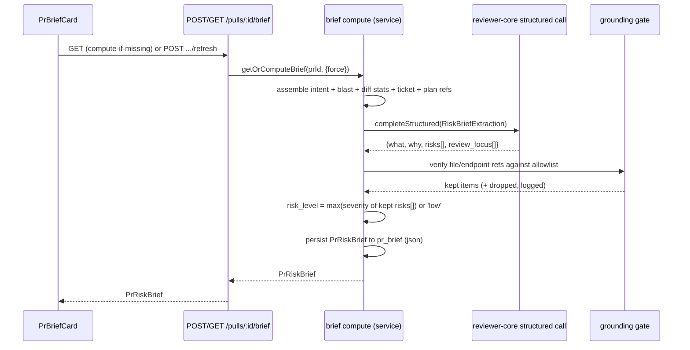

# Spec: PR Why + Risk Brief
Spec ID: SPEC-03-pr-why-risk-brief
Status: approved
Supersedes: none

## Problem & user

A reviewer opening a PR's Overview tab today sees several independent
signals — `VerdictBanner` (the code-review agent's verdict/score/finding
count, `client/.../_components/VerdictBanner/VerdictBanner.tsx:12-58`),
`IntentCard` (classified intent/scope, Intent Layer,
`client/.../_components/IntentCard/IntentCard.tsx:31-155`), and
`BlastRadiusCard` (symbols/callers/endpoints/crons,
`client/.../_components/BlastRadiusCard/BlastRadiusCard.tsx`) — but nothing
answers, in one place and before reading the diff, "what does this PR
change and why, how risky is it, and what should I look at first?" This
spec adds that one composed answer: a `Brief { what, why, risk_level,
risks[], review_focus[] }` from a single structured LLM call over
already-available signals (never raw diff hunk bodies), mechanically
grounded so every file/endpoint reference is real, cached per PR with an
explicit regenerate action, and surfaced as `PrBriefCard`.

**User**: a reviewer triaging a PR queue, deciding how much attention a
given PR deserves and where to start reading, before opening the full diff.

This is not a green-field feature — `server/src/db/schema/reviews.ts:93-97`
already has an empty `pr_brief` table (`{ prId, json }`, zero writers,
zero readers), and `server/src/vendor/shared/contracts/platform.ts:64-70`
already registers a `risk_brief` feature-model id ("Assesses merge risks
for a pull request", defaulting to `openai/gpt-4.1` — not the cheap
`deepseek` default used for `onboarding`/`review_intent`/`conventions`).
Both are reused as-is by this spec, not reinvented. A *different*,
already-populated contract, `brief.ts`'s `PrBrief { intent, blast, risks,
history }`, has the same "zero writers" status but a **different shape**
with no `what`/`why`/`risk_level`/`review_focus` — see Open Question 1 for
how this spec treats it.

## Goals / Non-goals

**Goals:**
- One structured LLM call producing `{what, why, risks[], review_focus[]}`
  from intent, a blast-radius summary, diff stats (file paths +
  addition/deletion counts, never hunk bodies), the linked issue, and
  resolved plan/spec excerpts.
- A mechanical grounding gate — the same "never trust the model's own
  citation, verify it" principle as `groundFindings()`
  (`reviewer-core/src/grounding.ts:52-84`) — that drops any `risks[]` or
  `review_focus[]` item referencing a file or endpoint not actually present
  in the inputs given to the model.
- `risk_level` computed deterministically server-side from the (post-
  grounding) `risks[]` severities — never an LLM self-report — matching the
  same principle already applied three times in this codebase: `tierFor()`
  (`server/src/modules/reviews/intent.ts:102-115`), `groundFindings()`, and
  the score-from-findings logic referenced at `intent.ts:88`.
- Compute-if-missing + cache + explicit forced regenerate, mirroring the
  Intent Layer's existing `getOrComputeIntent` pattern
  (`server/src/modules/reviews/intent.ts:348-377`) exactly — same in-flight
  de-dup, same "cache until told otherwise" semantics.
- `PrBriefCard`: a wholly separate card rendered above `VerdictBanner`
  (Open Question 5), with a risk-level badge and a clickable
  `review_focus[]` list — each item switches the PR-detail view to the
  "Files changed" tab and scrolls to that file/line (Open Question 6) —
  plus loading/unavailable/error states matching `IntentCard`'s existing
  pattern (`IntentCard.tsx:61-85`), plus a non-blocking staleness hint
  when `pull.headSha` has diverged from the brief's stored `headSha`
  (Open Question 4).
- Reuse the already-registered `risk_brief` feature-model id
  (`platform.ts:64-70`) via `resolveFeatureModel(container, workspaceId,
  'risk_brief')` — no new registry entry.

**Non-goals:**
- Not re-implementing `VerdictBanner`'s per-agent code-review verdict/score
  (the `reviews`/`findings` tables and their pipeline) — untouched.
- Not re-implementing Intent Layer or Blast Radius — this feature
  **consumes** their already-computed output as inputs; it does not
  recompute or duplicate their logic.
- Not auto-invalidating the cache when new commits land — matches Intent
  Layer's documented, accepted limitation
  (`docs/plans/intent-scope-drift.md`, decision 3: "the cached
  `intent`/`out_of_scope` устарів... автоматичне не робимо"). Regeneration
  is manual-only. See Open Question 4 for an optional non-blocking
  staleness *hint*, which is separate from auto-invalidation.
- Not full spec-conformance checking — `conformance` is a separate,
  already-registered feature-model id (`platform.ts:71-77`) with a
  different job (checking a PR against project spec). "Relevant specs"
  here means citing plan/spec paths as context for *why*, the same way
  Intent Layer already does via `plan_refs`, not verifying compliance.
- Not touching `git-why` / `WhyTimeline`
  (`server/src/vendor/shared/contracts/why.ts`) — an unrelated, already-
  shipped per-line blame timeline feature that happens to share the word
  "why". No contract or route name in this spec should collide with it.

## User stories

- As a reviewer opening a PR for the first time, I want a one-glance
  summary of what changed and why, so I can decide how deep to review
  before reading the diff.
- As a reviewer, I want an overall risk level and specific risks with real
  file references, so I know where to be careful.
- As a reviewer, I want a short, clickable "review this first" list, so I
  don't miss the highest-risk parts of a large PR.
- As a reviewer who just pushed a fix or wants a fresher read, I want an
  explicit regenerate action rather than waiting on invalidation I don't
  control.
- As a workspace admin, I want the risk-brief model to be overridable per
  workspace like every other `FeatureModelId`, without a new Settings UI
  path.

## Acceptance criteria (EARS)

**Compute / cache:**
1. WHEN (КОЛИ) a reviewer opens a PR's Overview tab and no cached
   `PrRiskBrief` exists for that PR, the system shall (shall) compute one
   via `GET /pulls/:id/brief` (compute-if-missing), mirroring `GET
   /pulls/:id/intent`'s contract.
2. WHEN (КОЛИ) a cached `PrRiskBrief` already exists for the PR, `GET
   /pulls/:id/brief` the system shall (shall) return it without issuing a
   new LLM call.
3. WHEN (КОЛИ) the reviewer clicks "Regenerate" on `PrBriefCard`, the
   system shall (shall) recompute the brief via `POST
   /pulls/:id/brief/refresh` regardless of any cached value.
4. WHILE (ПОКИ) a brief compute for a given PR is already in flight, the
   system shall (shall) share that in-flight computation for any
   concurrent request (compute-if-missing or forced) instead of starting a
   second one, mirroring `getOrComputeIntent`'s `inflight` map
   (`intent.ts:346,369-376`).

**Inputs:**
5. The system shall (shall) assemble the risk-brief prompt from the PR's
   intent, a blast-radius summary, diff stats (changed-file paths with
   addition/deletion counts), the linked issue, and resolved plan/spec
   excerpts, and from no other source.
6. IF (ЯКЩО) the assembled prompt would include diff hunk bodies (added or
   removed line content), THEN the system shall (shall) omit them — only
   file-level stats are included, matching `buildDiffStatFallback`'s
   existing file-list-only shape (`intent.ts:325-336`).
7. WHEN (КОЛИ) the PR's intent has not yet been computed at the time a
   brief is requested, the system shall (shall) compute it first
   (compute-if-missing, non-forced) before building the risk-brief prompt.
8. IF (ЯКЩО) intent computation degrades to unavailable (per
   `getOrComputeIntent`'s own degrade-to-`undefined` contract,
   `intent.ts:448-455`), THEN the risk-brief compute shall (shall) proceed
   without an intent section rather than fail outright.

**LLM call / output:**
9. The system shall (shall) obtain `what`, `why`, `risks[]`, and
   `review_focus[]` from exactly one structured LLM completion per compute
   — no follow-up calls, matching `classifyIntent`'s single-call shape
   (`reviewer-core/src/review/intent.ts:143-172`).
10. The system shall (shall) resolve the model for this call via the
    existing `risk_brief` feature-model id
    (`resolveFeatureModel(container, workspaceId, 'risk_brief')`), never a
    hardcoded model id.

**Grounding:**
11. IF (ЯКЩО) a `risks[]` or `review_focus[]` item references a file path
    not present in the PR's full changed-file set, THEN the system shall
    (shall) drop that item from the persisted and returned brief.
12. IF (ЯКЩО) a `risks[]` or `review_focus[]` item references an endpoint
    or cron string not present in the blast radius's
    `impacted_endpoints`/`impacted_crons` union
    (`server/src/vendor/shared/contracts/blast.ts:69-71`), THEN the system
    shall (shall) drop that item.
13. WHILE (ПОКИ) every item in one category (`risks[]` or `review_focus[]`)
    fails grounding, the system shall (shall) still return the rest of the
    brief with that category empty, rather than failing the whole request
    — matching `groundFindings()`'s drop-not-reject behavior.

**`risk_level`:**
14. The system shall (shall) compute `risk_level` deterministically as the
    maximum severity across the post-grounding `risks[]` list.
15. The system shall (shall) exclude `risk_level` from the LLM's structured
    output schema, so it can never be a direct model self-report.
16. WHILE (ПОКИ) `risks[]` is empty after grounding, the system shall
    (shall) default `risk_level` to `low`.

**Persistence:**
17. WHEN (КОЛИ) a brief compute succeeds, the system shall (shall) persist
    the result — including the PR's `headSha`
    (`server/src/db/schema/pulls.ts:20`) at compute time — to the existing
    `pr_brief` table, keyed by PR id.
18. IF (ЯКЩО) the structured LLM call fails, times out, or returns output
    that fails schema validation after retries, THEN the system shall
    (shall) leave any existing cached brief untouched and report the
    failure to the caller, matching Intent Layer's degrade-to-`undefined`
    contract (`intent.ts:448-455`) rather than persisting a partial or
    malformed result.
19. The system shall (shall) rate-limit `POST /pulls/:id/brief/refresh` to
    at most 10 requests per minute per workspace, matching `POST
    /pulls/:id/intent/refresh`'s existing policy
    (`server/src/modules/reviews/routes.ts:190-200`).

**UI:**
20. `PrBriefCard` shall (shall) render a risk-level badge and a clickable
    `review_focus[]` list.
21. WHILE (ПОКИ) the brief has not yet been computed for the current PR,
    `PrBriefCard` shall (shall) render a loading state, matching
    `IntentCard`'s skeleton pattern (`IntentCard.tsx:61-69`).
22. IF (ЯКЩО) the compute-if-missing request 404s (a genuine compute
    failure, not "not yet opened"), THEN `PrBriefCard` shall (shall) render
    an unavailable/error state offering retry, matching `IntentCard`'s
    `notComputed`/`isError` handling (`IntentCard.tsx:39,71-85`).
23. WHEN (КОЛИ) a reviewer clicks a `review_focus[]` item, `PrBriefCard`
    shall (shall) switch the PR-detail view to the "Files changed" tab and
    scroll to that item's file (and line, when present).
24. WHILE (ПОКИ) the PR's current `headSha` differs from the `headSha` the
    displayed brief was computed against, `PrBriefCard` shall (shall) show
    a non-blocking staleness hint, without auto-recomputing the brief.

## Edge cases

- **Zero changed files** (e.g. an empty PR) — no diff stats, no blast
  symbols; the brief should degrade to a minimal `what`/`why` from title/
  description alone, `risks: []`, `review_focus: []`, `risk_level: 'low'`,
  not fail.
- **No signal at all** — no description, no linked ticket, no resolved
  plan refs, no diff stat (degenerate case of the above) — same
  minimal-degrade behavior as Intent Layer's own "inferred" tier
  (`tierFor`, `intent.ts:114`), not a hard failure.
- **All `risks[]`/`review_focus[]` items fail grounding** — return the
  brief with `what`/`why` intact and both arrays empty, `risk_level:
  'low'`; never surface an ungrounded item "just in case."
- **Very large PR (hundreds of files)** — the grounding allowlist must be
  the PR's **full** changed-file set (`ReviewRepository.getPrFiles`), not
  just whatever truncated subset was shown in-prompt (see Open Question 7)
  — a file beyond the in-prompt cutoff can't be hallucinated about anyway
  (the model never saw it), so using the full set as the allowlist is
  strictly safe, never over-permissive.
- **Plan/spec excerpt re-read for this prompt** — `Intent.plan_refs` only
  stores validated *paths*, not content; when the brief-compute step reads
  those files itself to build its own prompt, it must re-apply
  `isSafePlanRefPath`'s shape-allowlist + containment guard
  (`intent.ts:236-256`) before every read, exactly as `resolvePlanRefs`
  does — trusting the path list alone (without re-guarding the actual
  read) would reopen the path-traversal risk Intent Layer already closed.
- **Two reviewers open the same never-briefed PR simultaneously** —
  covered by the in-flight de-dup (AC4); only one LLM call fires.
- **Regenerate clicked twice in quick succession** — same in-flight
  sharing applies to forced calls too, mirroring `getOrComputeIntent`'s
  existing behavior where the inflight check runs regardless of `force`.
- **Workspace admin points `risk_brief` at an invalid/unreachable model** —
  same failure path as AC17 (degrade, leave cache untouched, report
  failure); no special-casing needed beyond what `resolveFeatureModel`
  already does for every other feature-model id.

## Non-functional requirements

- **Timeout**: bounded per-request timeout for the structured call,
  analogous to `INTENT_CLASSIFY_TIMEOUT_MS = 20_000`
  (`intent.ts:41-50`) but likely longer given `risk_brief`'s stronger
  default model (`openai/gpt-4.1` vs. intent's cheap `deepseek` default) —
  proposed 30s; tune during implementation, not hardcoded from this spec.
- **Cost shape**: prompt size is bounded by file-list length, not diff
  size — no hunk bodies, matching this codebase's established
  "compact-notation over raw content" philosophy already used for
  `diffStat` fallbacks.
- **Model resolution**: no new `FeatureModelId` — reuse `risk_brief`
  (`platform.ts:64-70`), already exposed generically in Settings → Models
  per `SettingsModels.tsx`'s existing generic `FeatureModelId` picker.
- **No new migration required for the base case** — `pr_brief` already
  exists as `{ prId primary key, json jsonb }`
  (`server/src/db/schema/reviews.ts:93-97`); this feature only needs to
  decide the shape of `json`, not add a table or column, unless Open
  Question 4 (staleness hint) is accepted with a dedicated column instead
  of an in-blob field.

**Cross-module flow** (client → server → reviewer-core → grounding →
persistence — 5 hops, diagrammed per this repo's `specreator` convention):

## Inputs and provenance

| Input | Origin | Trust |
|---|---|---|
| PR title / description / body | VCS, author-controlled | Untrusted |
| Linked ticket title/body | VCS/issue tracker, third-party | Untrusted |
| Resolved plan/spec excerpts | Repo content, read via `Intent.plan_refs` paths | Untrusted |
| Blast-radius summary (symbols/callers/endpoints/crons) | `repo-intel` index, deterministic | Repo-content-derived, structurally trusted but author-influenced |
| Diff stats (file paths, +/- counts, no hunk bodies) | `ReviewRepository.getPrFiles` | Untrusted (paths are attacker-controlled strings) |
| Intent's own `intent`/`plan_refs` output | Already-computed `Intent` (itself LLM-derived from untrusted input) | Semi-trusted; still wrapped |
| `risks[].file_refs`, `review_focus[].file`/endpoint strings | LLM output (this call) | Untrusted — this is exactly what the grounding gate (Untrusted inputs, below) exists to check |

## Untrusted inputs

- Every author/repo-controlled text field listed above (title,
  description, ticket, plan excerpts, diff-stat file list) must be wrapped
  with `wrapUntrusted()` and preceded by an injection-defense system-prompt
  note, the same pattern `classifyIntent` already uses
  (`reviewer-core/src/review/intent.ts:16` `INJECTION_GUARD`'s sibling,
  its own scoped `INTENT_INJECTION_NOTE`, lines 100-110) — a new, similarly
  scoped note for this call, not a verbatim reuse of the diff-centric
  `assemblePrompt` guard (`prompt.ts:94`), matching how `classifyIntent`
  itself chose not to reuse it either.
- Diff-stat file paths here are **display-only strings** passed into the
  prompt — this feature never reads them off disk, unlike plan/spec
  excerpts. Call this out explicitly in the implementation so no one
  assumes diff-stat paths need the same filesystem containment guard as
  plan refs; they don't, because they're never used as a read target.
- Plan/spec excerpt paths **do** get read from disk and must re-apply
  `isSafePlanRefPath` (shape allowlist + containment,
  `intent.ts:236-256`) on every read this feature performs, even though
  `Intent.plan_refs` already validated them once when Intent itself was
  computed — the persisted `plan_refs` array is a list of paths, not
  cached content, so the guard must run again at read time.
- **The grounding gate is the primary untrusted-input control on the
  output side**: `risks[].file_refs` and `review_focus[].file` (plus any
  endpoint/cron strings) are LLM output and therefore untrusted by
  default — never rendered to the client, never persisted, until
  mechanically verified against the allowlist (full PR changed-file set ∪
  blast's `impacted_endpoints`/`impacted_crons`). Failed items are dropped
  server-side and logged (mirroring `groundingSummary()`,
  `reviewer-core/src/grounding.ts:87-90`), never surfaced with a
  "possibly hallucinated" caveat — dropped means dropped.

## Open questions

Each item below was resolved with the product owner on 2026-08-24. Nothing
here has been silently assumed.

1. **Contract reuse vs. a new file.** `brief.ts`'s existing `PrBrief {
   intent, blast, risks, history }` has zero writers but a different shape
   from `{what, why, risk_level, risks, review_focus}` (no `what`/`why`/
   `risk_level`/`review_focus`; a different, four-part composition).
   Proposal: follow the exact precedent `blast.ts` already set for this
   same situation (`PrBlastRadius` introduced as a new, `Pr`-prefixed type
   instead of reusing/reshaping the unused `BlastRadius` in `brief.ts`,
   see `blast.ts:1-19`'s own doc-comment) — add a new file
   `contracts/risk-brief.ts` with `RiskBriefExtraction` (raw LLM shape,
   mirroring `IntentExtraction`) and `PrRiskBrief` (persisted/transport,
   mirroring `Intent`), importing and reusing `Risk`/`RiskSeverity` from
   `brief.ts` since those two do match what's needed. The old `PrBrief`/
   `Risks`/`PrHistory` composition stays untouched and still unpopulated.
   **Accept this, or would you rather this feature finally populate the
   old `PrBrief` shape instead** (would require reshaping it — a breaking
   change to an unused-but-existing contract)?

   **Decision (2026-08-24):** accepted as proposed. New file
   `contracts/risk-brief.ts` with `RiskBriefExtraction` (raw LLM shape) and
   `PrRiskBrief` (persisted/transport), reusing `Risk`/`RiskSeverity` from
   `brief.ts`. `PrBrief` stays untouched and still unpopulated.
2. **`risk_level` provenance.** Acceptance Criteria 14-16 above assume
   `risk_level` is server-computed from `risks[]` severities, never an LLM
   self-report — the same "never trust a self-report" principle applied
   three times already in this codebase (`tierFor()`, `groundFindings()`,
   the score-from-findings logic at `intent.ts:88`). **Accept, or should
   the model self-report `risk_level` directly** (simpler prompt/schema,
   but breaks the established pattern and can't be independently
   verified)?

   **Decision (2026-08-24):** accepted as proposed. `risk_level` is
   excluded from the LLM's structured output schema entirely and computed
   server-side from post-grounding `risks[]` severities (AC14-16 already
   reflect this).
3. **Route shape.** You asked for a single `POST /pulls/:id/brief`.
   Proposal: split into `GET /pulls/:id/brief` (compute-if-missing,
   cached — mirrors `GET /pulls/:id/intent`) + `POST
   /pulls/:id/brief/refresh` (forced regenerate, rate-limited like
   `/intent/refresh`), so the "Regenerate" button maps to a route whose
   name states its own intent, matching every existing PR-detail cache in
   this codebase (Intent Layer's exact pair). **Accept, or is a single
   POST-only route intentional** for a reason not visible from the code?

   **Decision (2026-08-24):** accepted as proposed. `GET /pulls/:id/brief`
   (compute-if-missing, cached) + `POST /pulls/:id/brief/refresh` (forced,
   rate-limited) — matches AC1-4 as already written above. The original
   "`POST /pulls/:id/brief`" phrasing in the feature request refers to the
   feature's compute action in general, not a literal single-route
   constraint.
4. **Staleness hint (not auto-invalidation).** The cache never
   auto-recomputes on new commits (Non-goals). Proposal: store the
   `headSha` the brief was computed against inside the existing
   `pr_brief.json` blob (no migration) and have `PrBriefCard` show a
   non-blocking "PR has new commits since this brief" hint when
   `pull.headSha` has since diverged — the same staleness concept
   `pull_requests.lastReviewedSha`
   (`server/src/db/schema/pulls.ts:21`) already powers elsewhere, just
   read-only here, nudging toward Regenerate without forcing it. **Accept,
   decline (ship without the hint for v1), or explicitly out of scope**?

   **Decision (2026-08-24):** accepted as proposed. `headSha` is stored
   inside `pr_brief.json` at compute time (already required by AC17); no
   new migration. `PrBriefCard` shows the non-blocking staleness hint when
   `pull.headSha` has diverged from the stored value.
5. **Where `what`/`why` render relative to `VerdictBanner`.**
   `VerdictBanner` already renders an LLM-authored `summary` paragraph
   from the *code-review* agent (a separate model call,
   `reviews.summary`) alongside the verdict/score. No screenshot shows
   both a `VerdictBanner`-style summary and a distinct `what`/`why` pair
   at once with separate labels. Is `PrBriefCard` a wholly separate card
   (above/below `VerdictBanner`), or does it replace/merge with
   `VerdictBanner`'s summary line? Same question extends to `risks[]`:
   the screenshot's "RISK AREAS" block sits inside/near the Intent card
   region, but `IntentCard.tsx`'s current code
   (`IntentCard.tsx:87-152`) has no such section today — does `risks[]`
   render inside `IntentCard`, or as part of `PrBriefCard` as its own new
   card?

   **Decision (2026-08-24):** accepted as proposed. `PrBriefCard` is a
   wholly separate card rendered above `VerdictBanner`, owning
   `what`/`why`/`risk_level` badge/`risks[]`/`review_focus[]` entirely.
   `VerdictBanner`'s own `summary` and `IntentCard` are untouched — no
   merge, no new section added to either existing component.
6. **`review_focus` click behavior.** The screenshot shows clickable
   `file:line` items, but no existing PR-detail component
   (`BlastRadiusCard`, `IntentCard`) currently implements a
   file→"Files changed"-tab jump — there's no precedent to copy. Does
   clicking a `review_focus` item switch to the Files-changed tab and
   scroll to that file/line, open a modal/drawer, or something else?

   **Decision (2026-08-24):** accepted as proposed. Clicking a
   `review_focus` item switches the PR-detail view to the "Files changed"
   tab and scrolls to that file (and line, when a line number is present)
   — same target surface as the existing `Files changed` tab shown in
   screenshot 1.
7. **Diff-stat input width.** Intent Layer's diff-stat fallback caps at 20
   files (`MAX_DIFF_STAT_FILES`, `intent.ts:39`) because it's a
   low-confidence last resort there. Here, diff stats are a **primary**
   input for a stronger, non-cheap model (`risk_brief` defaults to
   `openai/gpt-4.1`). Reuse the same 20-file cap for consistency, or go
   higher given the model and the fact this isn't a fallback signal?

   **Decision (2026-08-24):** left to implementation to tune, not
   hardcoded from this spec. Start from `MAX_DIFF_STAT_FILES` (20) for
   consistency with the rest of the codebase; raise it during
   implementation if real large-PR testing shows it starves the model of
   signal. Not a blocking question — no acceptance criterion depends on
   the exact number.
