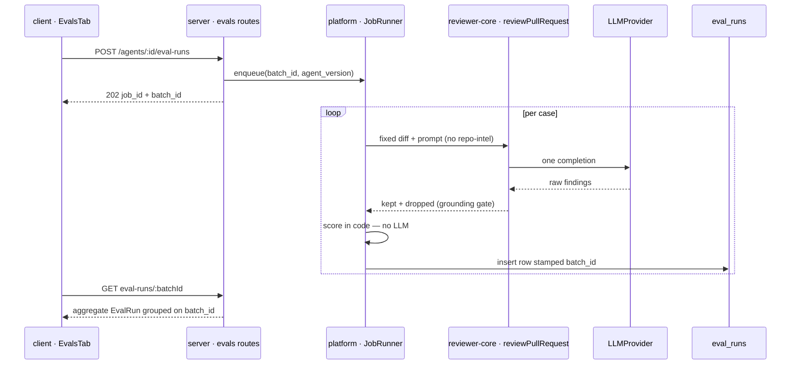

# Spec: Eval Pipeline
Spec ID: SPEC-04-eval-pipeline
Status: draft
Supersedes: none

## Problem & user

Every time a reviewer clicks **Accept** or **Dismiss** on a finding, the
decision is persisted as a timestamp on that finding row
(`findings.accepted_at` / `findings.dismissed_at`,
`server/src/db/schema/reviews.ts:65-66`, written by `actOnFinding`,
`server/src/modules/reviews/findings.ts:22-33`). That file's own doc
comment already names the intent: *"These decisions are the dataset later
lessons build on (eval cases from accept/dismiss…)"*. Today nothing
consumes them. An accepted finding is a human saying "this was a real
problem at `src/config.ts:12`"; a dismissed finding is a human saying
"flagging `src/config.ts:12` was noise". Both are regression-test signals,
and both are thrown away the moment the reviewer moves on.

The consequence is that **agent quality is unmeasurable**. Editing a
Security Reviewer's system prompt, swapping its model, or linking a new
skill are all one-click operations in the Agent editor today
(`PUT /agents/:id`, which already bumps `agents.version` and snapshots the
full config — including `system_prompt` — into `agent_versions.config_json`,
`server/src/modules/agents/repository.ts:119-182`). Nothing tells the
author whether the edit made the agent better or worse. The only feedback
loop is running the agent on a live PR and eyeballing the findings, which
is non-reproducible (the diff changes), slow, and costs real LLM spend per
look.

**User**: the agent author working in the Skills Lab — the person editing
a Security Reviewer's system prompt who needs a *numeric, reproducible*
before/after for that edit, and the same person triaging a PR queue who
wants a one-click way to bank a good or bad finding as a permanent
regression case.

This spec turns those decisions into a real eval suite living in Postgres:
a set of frozen cases per agent, a runner that executes the agent against
every case with **fixed** inputs, and recall / precision /
citation_accuracy computed by **pure code** — no LLM judge anywhere in
scoring.

**This is a from-scratch build on given scaffolding, not an extension.**
Confirmed by reading:

- `eval_cases` and `eval_runs` tables exist and are empty — zero writers,
  zero readers (`server/src/db/schema/eval.ts:7-35`; `grep evalCases`
  across `server/src` hits only `db/schema.ts`'s barrel).
- Every Zod contract this feature needs already exists: `EvalRun`,
  `EvalPerTrace`, `EvalOwnerKind`, `EvalCase`
  (`server/src/vendor/shared/contracts/knowledge.ts:90-125`) and
  `EvalCaseInput`, `EvalRunRecord`, `EvalRunResult`, `EvalTrendPoint`,
  `EvalDashboard` (`.../contracts/eval-ci.ts:20-89`).
- **The entire UI copy is already written** and unread by any component —
  `client/messages/en/eval.json` (84 lines: `dashboard`, `caseEditor`,
  `evalsTab`, `page` breadcrumbs), plus `shell.json`'s
  `nav.eval: "Eval Dashboard"` and `agents.json`'s
  `editor.tabs.evals: "Evals"`. Per `client/INSIGHTS.md` (2026-08-12), a
  populated `messages/en/<ns>.json` with no reader is a spec, not dead
  weight — this file's key names are treated as binding here.
- No server module serves any of it — `server/src/modules/` has no
  `evals/` folder, and `modules/index.ts` mentions eval only in a comment.
- Client-side there is one literal "coming soon" placeholder,
  `client/src/app/skills/[id]/_components/SkillEditor/_components/EvalsTab/EvalsTab.tsx`,
  whose own comment says *"No eval-case runner is wired up for skills
  yet"*.

This is the same five-layer "scaffolded but unconnected" pattern root
`INSIGHTS.md` records twice (2026-08-12 Skills, 2026-08-23 Project
Context). The lesson from both applies: the pre-existing scaffolding
silently pre-answers design questions, so it is read as constraint, not
discovered as convenience.

## Goals / Non-goals

**Goals:**

- A per-agent **case set** of ≥8 frozen cases, each holding a snapshot
  diff plus an expected-output assertion, stored in the existing
  `eval_cases` table.
- **One-click case creation from a real finding**, on the PR detail page's
  finding action row, covering both expectation directions: an *accepted*
  finding becomes a `must_find` case; a *dismissed* finding becomes a
  `must_not_flag` case.
- A **runner** — `POST /agents/:id/eval-runs` — that enqueues a background
  job executing the agent against every case in its set with fixed inputs,
  persists one `eval_runs` row per case under a shared `batch_id`, and
  exposes the aggregate `EvalRun` computed on read.
- **Code-only scoring**: recall, precision, and citation_accuracy derived
  mechanically from file match + line-range intersection, and from the
  grounding gate's own kept/dropped counts. Zero additional LLM calls.
- **Comparability across agent versions**: every eval run records the
  agent config version it ran under, so two runs of the same case set are
  comparable and the system prompts behind them are diffable —
  `agent_versions.config_json.system_prompt` already holds the history
  (`knowledge.ts:339-356`; its own comment says the snapshot exists for
  *"reproducibility (eval replays a past version)"*).
- **Version rollback from the compare view**: "Promote prompt & model vN"
  restores an older snapshot's config onto the agent through the existing
  `AgentsService.update()` path (`server/src/modules/agents/service.ts:95`),
  which snapshots a *new* version rather than mutating history. The control
  is deliberately labelled for the subset it restores — linked skills and
  context documents are out of that path's reach and are left as they
  stand.
- The four UI surfaces the design sources show: the **Eval Dashboard**
  (all agents), the **per-agent drill-down**, the **Compare-runs modal**,
  and the Agent editor's **Evals tab** with its **case editor modal**.
- A verification script (`pnpm verify:l06`) can check every acceptance
  criterion below without reading source — endpoint shapes, the scoring
  rule, and the case-count threshold are all stated concretely for that
  reason.

**Non-goals:**

- **No LLM-as-judge anywhere in scoring.** This is the point of the
  feature. Expectations are `file` + line range, so a deterministic
  comparison is sufficient; nothing about the finding's *prose* is graded.
  (Contrast the `evals/` package's own harness, which needs a judge model
  precisely because it grades free-text reasoning —
  `EVAL_JUDGE_MODEL_*` in `.github/workflows/evals.yml`. That harness
  grades *this repo's agents-as-prompts*; this spec grades *DevDigest's
  product review agents*. They are separate systems and neither replaces
  the other.)
- **Not redesigning `eval_cases`/`eval_runs`** or any of the nine given
  Zod contracts. Their columns and shapes are consumed as-is. Exactly three
  additions are agreed (decisions 1, 2, 3 in the resolution log), each
  strictly additive: two nullable columns on `eval_runs`
  (`agent_version integer`, `batch_id uuid`), one unique constraint on
  `eval_cases (owner_id, name)`, and one new `EvalExpectation` schema in
  `@devdigest/shared`. No existing column or schema changes shape.
- **Not building eval for skills.** `eval_cases.owner_kind` accepts
  `'skill'`, and `EvalOwnerKind` is a two-value enum, but every design
  source is agent-scoped and a skill has no model or system prompt of its
  own to evaluate. `client/src/app/skills/[id]/_components/SkillEditor/_components/EvalsTab/EvalsTab.tsx`
  stays exactly as it is — the "coming soon" placeholder and
  `skills.evals.comingSoon*` / `skills.runOnEvalsHint` copy are not touched
  by this spec.
- **Not adding the `Learn` or `Reply to author` finding actions.** Design
  source 1 shows a five-button action row, but `actOnFinding` explicitly
  rejects both with `400 invalid_action` — *"Action 'learn' is not
  available in the starter"* (`findings.ts:31-33`), even though the i18n
  keys `prReview.finding.learn` / `.replyToAuthor` already exist. This spec
  adds exactly one button to that row.
- **Not adding the `Stats` or `CI` agent-editor tabs.** Design source 5
  describes Evals as a sibling of Config/Skills/Context/**Stats**/**CI**,
  but `AgentEditor/constants.ts:11-15` has only three tabs today, and
  `agents.json`'s `editor.tabs` pre-declares all six. This spec adds the
  fourth (`evals`) only.
- **Not running evals in CI**, on a schedule, or on a webhook. Every run is
  user-initiated from the UI or by the verification script.
- **Not auto-creating cases.** No background job mines historical
  accept/dismiss decisions into cases; each case is an explicit click.

## User stories

1. As an agent author, I open **Agents → Security Reviewer → Evals** and
   see recall, precision, citation accuracy, and traces-passed for the last
   run, plus the full case list with a pass/fail state per case, so I know
   the agent's current standing before I change anything.
2. As an agent author, I edit the agent's system prompt, click **Run all
   evals**, and see the three metrics move — so the edit has a measured
   effect rather than a felt one.
3. As an agent author, I select two runs in the per-agent drill-down and
   click **Compare**, and get the metric deltas side by side with a diff of
   the system prompt between the two versions — so I can attribute a
   precision drop to the exact line I added.
4. As a reviewer triaging a PR, I see a finding I agree with, click **Turn
   into eval case**, and it becomes a permanent `must_find` regression case
   for that agent without leaving the page.
5. As a reviewer, I see a false positive, dismiss it, click **Turn into
   eval case**, and it becomes a `must_not_flag` case — so the next prompt
   edit that reintroduces it is caught numerically.
6. As an agent author, I open the **Eval Dashboard** from the Skills Lab
   sidebar and see every agent's standing side by side, so I can tell
   which agent needs attention without opening each one.
7. As an agent author, I write a case by hand in the case editor — pasting
   a diff and typing the expected findings as raw JSON — so I can assert a
   scenario no PR in my history happens to contain.

## Acceptance criteria (EARS)

**Case set:**

1. The system shall (shall) provide at least 8 eval cases for the agent
   used in the demo (Security Reviewer), created by seed or by the
   verification script's own fixture, before `pnpm verify:l06` asserts any
   metric.
2. WHEN (КОЛИ) a client requests `GET /agents/:id/eval-cases`, the system
   shall (shall) respond `200` with an array of `EvalCase`
   (`knowledge.ts:114-125`) scoped to that agent's workspace.
3. WHEN (КОЛИ) a client sends `POST /agents/:id/eval-cases` with an
   `EvalCaseInput` body (`eval-ci.ts:20-29`), the system shall (shall)
   respond `201` with the created `EvalCase`.
4. WHEN (КОЛИ) a client sends `PUT /eval-cases/:id` with an
   `EvalCaseInput` body, the system shall (shall) respond `200` with the
   updated `EvalCase`.
5. WHEN (КОЛИ) a client sends `DELETE /eval-cases/:id`, the system shall
   (shall) respond `204` and delete that case's `eval_runs` rows with it
   (the existing `onDelete: 'cascade'` FK, `eval.ts:26`).
6. IF (ЯКЩО) a request addresses an eval case whose `workspace_id` does
   not match the caller's workspace, THEN the system shall (shall) respond
   `404`, never `403`, matching `actOnFinding`'s existing cross-workspace
   behavior (`findings.ts:18-20`).
7. IF (ЯКЩО) a create or update request would give a case a `name` already
   used by another case with the same `owner_id`, THEN the system shall
   (shall) reject it with `409`, enforced by a unique constraint on
   `eval_cases (owner_id, name)`.

**Case creation from a real finding:**

8. WHEN (КОЛИ) a reviewer expands a finding on the PR detail page, the
   system shall (shall) render a **Turn into eval case** control in the
   finding's action row, positioned between `Dismiss` and the disabled
   `Learn` affordance.
9. WHEN (КОЛИ) a reviewer activates **Turn into eval case** on a finding
   whose `accepted_at` is set, the system shall (shall) create an eval case
   whose `expected_output` is a single entry with `expect: 'must_find'` at
   that finding's `file`, `start_line`, and `end_line`.
10. WHEN (КОЛИ) a reviewer activates **Turn into eval case** on a finding
    whose `dismissed_at` is set, the system shall (shall) create an eval
    case whose `expected_output` is a single entry with
    `expect: 'must_not_flag'` at that finding's `file`, `start_line`, and
    `end_line`.
11. WHEN (КОЛИ) an eval case is created from a finding, the system shall
    (shall) populate `input_diff` from the already-persisted patch text for
    that finding's file (`pr_files.patch`,
    `server/src/db/schema/pulls.ts:36-44`), never by re-fetching from the
    VCS provider.
12. WHEN (КОЛИ) an eval case is created from a finding, the system shall
    (shall) set the case's `owner_kind` to `'agent'` and its `owner_id` to
    the agent that produced the finding's review.
13. WHEN (КОЛИ) an eval case is created from a finding, the system shall
    (shall) derive the case `name` deterministically from that finding's
    title slug and `file:start_line`, so the same finding always yields the
    same name.
14. IF (ЯКЩО) a case with that deterministic name already exists for the
    same agent, THEN the system shall (shall) respond `200` with the
    existing case and create no duplicate.
15. WHEN (КОЛИ) an eval case is created from a finding, the system shall
    (shall) populate `input_meta` with the finding's PR title, body, and
    number as they stand at creation time, so the case never depends on
    live PR state afterwards.
16. WHEN (КОЛИ) an eval case is created from a finding, the system shall
    (shall) record the source pull request's id and head SHA inside the
    same `input_meta` document, as the case's provenance.
17. IF (ЯКЩО) a reviewer activates **Turn into eval case** on a finding
    that has neither `accepted_at` nor `dismissed_at` set, THEN the system
    shall (shall) reject the request with `400` rather than guessing an
    expectation direction.
18. IF (ЯКЩО) the finding's file has no stored patch text, THEN the system
    shall (shall) reject the request with `400` and a message naming the
    missing patch, rather than creating a case with an empty diff.

**Running (asynchronous):**

19. WHEN (КОЛИ) a client sends `POST /agents/:id/eval-runs`, the system
    shall (shall) respond `202` with a job id and a server-generated
    `batch_id`, without waiting for any case to finish.
20. WHEN (КОЛИ) an eval batch is accepted, the system shall (shall)
    enqueue it through the existing job runner
    (`server/src/platform/jobs.ts`), so its lifecycle is observable as the
    `jobs` table's `queued` → `running` → `done` states
    (`server/src/db/schema/ops.ts:15-19`).
21. WHILE (ПОКИ) an eval batch's job is `queued` or `running`, the system
    shall (shall) report that status from
    `GET /agents/:id/eval-runs/:batchId` with a null aggregate.
22. WHEN (КОЛИ) an eval batch's job reaches `done`,
    `GET /agents/:id/eval-runs/:batchId` shall (shall) return the aggregate
    `EvalRun` (`knowledge.ts:99-109`) whose `per_trace` holds one
    `EvalPerTrace` per case.
23. WHILE (ПОКИ) an eval batch is running, the system shall (shall)
    publish its per-case progress on the existing run bus
    (`server/src/platform/sse.ts`), keyed by `batch_id`.
24. IF (ЯКЩО) an eval batch's job reaches `failed`, THEN the system shall
    (shall) surface that status with the job's recorded error rather than
    reporting an empty successful batch.
25. WHEN (КОЛИ) an eval batch executes, the system shall (shall) run the
    agent against every eval case whose `owner_kind` is `'agent'` and whose
    `owner_id` is that agent.
26. WHEN (КОЛИ) an eval batch executes a case, the system shall (shall)
    build the review call from that case's stored `input_diff`,
    `input_files`, and `input_meta` and from the agent's own configuration
    alone.
27. IF (ЯКЩО) an eval run would enrich the prompt with repo-derived
    context (callers digest, repo map, project-context documents, or PR
    intent, all of which `run-executor.ts:230-260` supplies for a live
    review), THEN the system shall (shall) omit that enrichment, so two
    runs of the same case are comparable.
28. WHEN (КОЛИ) an eval batch finishes a case, the system shall (shall)
    persist exactly one `eval_runs` row for it, carrying `actual_output`,
    `pass`, `recall`, `precision`, `citation_accuracy`, `duration_ms`, and
    `cost_usd`.
29. WHEN (КОЛИ) an eval batch persists a case's row, the system shall
    (shall) stamp that row's `batch_id` with the batch's id, so the
    aggregate can be grouped from it on read.
30. WHEN (КОЛИ) an eval batch persists a case's row, the system shall
    (shall) stamp that row's `agent_version` with the agent's
    `agents.version` as read at dispatch time, so the run is attributable
    to exactly one `agent_versions` config snapshot.
31. The system shall (shall) derive every batch aggregate by grouping
    `eval_runs` rows on `batch_id` at read time, never by persisting a
    second aggregate row.
32. WHEN (КОЛИ) a client sends `POST /eval-cases/:id/run`, the system
    shall (shall) execute that single case synchronously and respond `200`
    with an `EvalRunResult` (`eval-ci.ts:49-54`).
33. IF (ЯКЩО) an agent has zero eval cases when `POST
    /agents/:id/eval-runs` is called, THEN the system shall (shall) respond
    `400` without enqueuing a job or issuing any LLM call.
34. IF (ЯКЩО) one case's review call fails or times out, THEN the system
    shall (shall) persist that case's `eval_runs` row with `pass = false`
    and continue running the remaining cases, rather than aborting the
    batch.

**Scoring (pure code, zero LLM calls):**

35. The system shall (shall) compute every eval metric without issuing any
    LLM completion beyond the one review call the case itself requires.
36. The system shall (shall) treat an expected entry and an actual finding
    as **matched** when their `file` values are equal **and** their
    `[start_line, end_line]` ranges intersect.
37. IF (ЯКЩО) an expected entry omits `end_line`, THEN the system shall
    (shall) treat its `end_line` as equal to its `start_line` for the
    intersection test.
38. The system shall (shall) compute `recall` as the number of matched
    `must_find` expectations divided by the total number of `must_find`
    expectations in the case.
39. IF (ЯКЩО) a case has zero `must_find` expectations, THEN the system
    shall (shall) report its `recall` as `1`.
40. The system shall (shall) compute `precision` as the number of actual
    findings matching at least one `must_find` expectation divided by the
    total number of actual findings the run produced.
41. IF (ЯКЩО) a case produces zero actual findings, THEN the system shall
    (shall) report its `precision` as `1`.
42. IF (ЯКЩО) one actual finding matches both a `must_find` and a
    `must_not_flag` expectation, THEN the system shall (shall) count it as
    matching the `must_not_flag` expectation.
43. IF (ЯКЩО) one actual finding matches both a `must_find` and a
    `must_not_flag` expectation, THEN the system shall (shall) leave that
    `must_find` expectation unmatched for the purposes of `recall`.
44. The system shall (shall) compute `citation_accuracy` as the number of
    findings kept by the grounding gate divided by the number of findings
    the model produced before that gate — the `kept` and `dropped` counts
    `groundFindings` already returns (`reviewer-core/src/grounding.ts:52-82`,
    surfaced on `ReviewOutcome` as `grounding` and `dropped`,
    `reviewer-core/src/review/run.ts:106-109,205-219`).
45. IF (ЯКЩО) the model produced zero findings before the grounding gate,
    THEN the system shall (shall) report that case's `citation_accuracy`
    as `1`.
46. The system shall (shall) mark a case as `pass = true` only when every
    `must_find` expectation matched **and** no actual finding matched any
    `must_not_flag` expectation.
47. The system shall (shall) exclude an expectation's `severity`,
    `category`, and `title` from every metric, storing and displaying them
    without ever scoring against them.
48. IF (ЯКЩО) an eval case's `expected_output` does not parse as
    `z.array(EvalExpectation)`, THEN the system shall (shall) reject it at
    the route boundary with `422`.

**Comparability and comparison:**

49. WHEN (КОЛИ) an agent author selects exactly two runs in the per-agent
    drill-down and activates **Compare**, the system shall (shall) present
    the two runs' `recall`, `precision`, `citation_accuracy`, and
    `cost_usd` side by side with the signed delta for each.
50. WHEN (КОЛИ) two compared runs carry different `agent_version` values,
    the system shall (shall) present a line-level diff of the two versions'
    `system_prompt` values read from `agent_versions.config_json`.
51. IF (ЯКЩО) two compared runs carry the same `agent_version`, THEN the
    system shall (shall) state that the configuration is identical instead
    of rendering an empty diff panel.
52. WHILE (ПОКИ) fewer than two runs or more than two runs are selected,
    the system shall (shall) keep the **Compare** control disabled.
53. WHEN (КОЛИ) an agent's system prompt changes and the same case set is
    re-run, the system shall (shall) produce a second aggregate `EvalRun`
    whose metrics are independently comparable against the first — same
    cases, same fixed inputs, different recorded agent version.

**Version rollback ("Promote vN"):**

54. WHILE (ПОКИ) a compared run's recorded `agent_version` differs from
    the agent's current `agents.version`, the system shall (shall) keep
    that side's **Promote** control enabled, evaluated independently per
    side of the pair.
55. IF (ЯКЩО) a compared run's recorded `agent_version` equals the agent's
    current `agents.version`, THEN the system shall (shall) keep that
    side's **Promote** control disabled.
56. WHEN (КОЛИ) an agent author activates **Promote** for version N, the
    system shall (shall) apply that version's stored `config_json` to the
    agent as its live configuration.
57. WHEN (КОЛИ) a promote completes, the system shall (shall) leave the
    agent at a newly-created version greater than the previously-current
    one, so no historical `agent_versions` row is modified or removed.
58. The system shall (shall) restore only the configuration fields the
    existing agent-update path accepts — `provider`, `model`,
    `system_prompt`, `output_schema`, `strategy`, `ci_fail_on`, and
    `repo_intel` — leaving the agent's linked skills and attached context
    documents as they currently stand.
59. The system shall (shall) label the rollback control **"Promote prompt
    & model vN"**, naming the subset it restores rather than the bare
    "Promote vN" of design source 4, which would imply a full revert the
    action does not perform.

**Dashboard and Evals tab:**

60. WHEN (КОЛИ) a client requests `GET /agents/:id/eval-dashboard`, the
    system shall (shall) respond `200` with an `EvalDashboard`
    (`eval-ci.ts:68-88`) whose `owner_kind` is `'agent'` and `owner_id` is
    that agent.
61. WHEN (КОЛИ) a client requests `GET /eval-dashboard`, the system shall
    (shall) respond `200` with an array of `EvalDashboard` holding one
    entry per agent in the workspace.
62. WHERE (ДЕ) a `since` query parameter is supplied to either dashboard
    endpoint, the system shall (shall) restrict `trend` and `recent_runs`
    to runs whose `ran_at` is at or after that instant.
63. IF (ЯКЩО) a supplied `since` value is not a parseable ISO-8601
    instant, THEN the system shall (shall) reject the request with `422`.
64. The system shall (shall) compute `EvalDashboard.delta` as the current
    run's metrics minus the immediately preceding run's metrics for the
    same agent.
65. IF (ЯКЩО) an agent has exactly one recorded run, THEN the system shall
    (shall) report every `EvalDashboard.delta` field as `0`.
66. WHEN (КОЛИ) `EvalDashboard.delta.precision` is negative, the system
    shall (shall) populate `EvalDashboard.alert` with a message naming the
    metric, the magnitude of the drop, and the version it occurred on.
67. WHILE (ПОКИ) an agent has no recorded eval runs, the system shall
    (shall) render the empty state under `eval.dashboard.noRuns` rather
    than zeroed metric tiles.
68. WHEN (КОЛИ) an agent author opens the Agent editor, the system shall
    (shall) render an **Evals** tab alongside the existing Config, Skills,
    and Context tabs.
69. WHEN (КОЛИ) the Evals tab renders a case that has never been run, the
    system shall (shall) show it with the never-run state
    (`eval.evalsTab.neverRun`) rather than a failing state.
70. WHEN (КОЛИ) an agent author opens the Eval Dashboard, the system shall
    (shall) list every enabled agent in the workspace with its latest
    metrics and pass fraction.
71. The system shall (shall) render an **Eval Dashboard** entry in the
    sidebar's `SKILLS LAB` section, labelled from the already-present
    `shell.nav.eval` key.
72. WHEN (КОЛИ) an agent author activates **Run all agents**, the system
    shall (shall) present a confirmation naming the total number of cases
    across every agent's set before dispatching anything.
73. IF (ЯКЩО) that confirmation is dismissed, THEN the system shall
    (shall) enqueue no job and issue no LLM call.

**Case editor:**

74. WHILE (ПОКИ) the case editor's expected-output text is not parseable
    as JSON, the system shall (shall) show the `invalid JSON` state
    (`eval.caseEditor.invalidJson`) and keep **Save** disabled.
75. WHEN (КОЛИ) an agent author activates the finding-skeleton helper in
    the case editor, the system shall (shall) insert one expectation entry
    with empty `file` and `start_line` fields into the expected-output
    text.
76. WHERE (ДЕ) the case editor's **Run on save** toggle is enabled, the
    system shall (shall) execute that single case immediately after a
    successful save.
77. WHEN (КОЛИ) the case editor renders its input tab strip, the system
    shall (shall) offer three tabs — Diff, Files, and PR meta.
78. IF (ЯКЩО) an expected entry's line range falls outside every hunk of
    that case's own `input_diff`, THEN the system shall (shall) display a
    warning at save time naming the offending entry, computed with
    `reviewer-core`'s exported `buildLineIndex`
    (`reviewer-core/src/grounding.ts:23-37`).
79. IF (ЯКЩО) such an out-of-hunk warning is displayed, THEN the system
    shall (shall) still persist the case, leaving the warning
    non-blocking.

## Edge cases

- **A case whose diff no longer resembles the repo.** Cases are frozen
  snapshots by design (AC 26). A case created in March still runs in
  August against a diff that no longer exists anywhere. This is correct —
  it is what makes runs comparable — but it means a case can assert
  behavior on code that has since been deleted. There is still no
  *automatic* staleness signal; what AC 16 provides is provenance (source
  PR id + head SHA in `input_meta`) so a human can tell how old a case is
  and against which commit it was captured.
- **Zero findings on a `must_not_flag` case.** The desired outcome.
  `recall = 1` (AC 39), `precision = 1` (AC 41), `citation_accuracy = 1`
  (AC 45), `pass = true` (AC 46). All four degenerate divisions are
  defined so the case scores perfectly rather than producing `NaN`.
- **A finding matching two expectations at once** — e.g. a `must_find` at
  `src/a.ts:10-20` and a `must_not_flag` at `src/a.ts:18-25`, with an
  actual finding at `src/a.ts:15-19`. It matches both. `must_not_flag`
  wins (AC 42), so it counts against precision, and AC 43 additionally
  denies it credit toward recall — a single finding can never both satisfy
  a positive expectation and violate a negative one at the same location.
  The case fails under AC 46.
- **The same finding turned into a case twice.** Handled by construction:
  the case name is derived deterministically from the finding (AC 13) and
  `(owner_id, name)` is unique (AC 7), so a second click returns the
  existing case with `200` (AC 14). A double click, or two reviewers acting
  on the same finding, cannot produce two rows that double-count in recall.
  Note this de-duplicates on the *derived name*, not on a `finding_id`
  column — two genuinely different findings that slug to the same name
  (same title, same `file:start_line`) would collide and the second would
  silently return the first.
- **A finding whose review's agent has since been deleted.** `eval_cases`
  has a bare `owner_id uuid` with **no foreign key** to `agents`
  (`eval.ts:13`), so deleting an agent orphans its cases silently rather
  than cascading. The Evals tab is unreachable for a deleted agent, but the
  rows survive and still count toward any workspace-wide aggregate.
- **An agent with cases but no LLM key configured.** `loadConfig` marks
  every secret optional (`server/AGENTS.md`), so a missing key surfaces at
  call time. Under AC 34 every case fails individually and the batch
  aggregates to all-zeros rather than surfacing a single clear
  configuration error. The job itself still reaches `done`, not `failed`
  (AC 24 covers only a failure of the job wrapper, not of every case
  inside it) — so an all-zero batch is ambiguous between "the agent is
  terrible" and "the key is missing".
- **A very large case set.** Resolved by running asynchronously (AC 19-24):
  the HTTP request returns `202` immediately and the job runner owns the N
  LLM calls, so a 50-case set no longer risks a proxy timeout. The residual
  edge is that nothing caps the set size or the total spend of one batch.
- **`Run all agents` on the dashboard.** Gated behind a confirmation
  naming the total case count across every agent (AC 72), and dismissing it
  enqueues nothing (AC 73). The confirmation states a case *count*, not a
  cost estimate — no per-model price preview is in scope.
- **Two batches for the same agent at once.** Each batch gets its own
  server-generated `batch_id` (AC 19) stamped onto every row it writes (AC
  29), so interleaved rows from concurrent batches group correctly on read
  (AC 31). Nothing prevents a second batch being enqueued while the first
  is still `running`, which doubles spend without warning.
- **A case whose `input_diff` is not parseable as a unified diff.**
  `reviewPullRequest` takes an already-parsed `UnifiedDiff`
  (`reviewer-core/src/review/run.ts:49-50`), so the runner must parse the
  stored text first. A hand-pasted diff in the case editor can be
  malformed; the parse must fail as a `400`/case-level failure, never as an
  unhandled throw mid-batch.
- **Line numbers on a `must_find` case with no matching hunk.** If the
  expected `start_line` is not inside any hunk of the case's own
  `input_diff`, the grounding gate will drop any finding the model
  correctly produces there — so the case is unpassable by construction.
  The case editor warns about this at save time (AC 78) but deliberately
  does **not** block it (AC 79), so an unpassable case can still be saved
  and will simply always score `recall = 0`.
- **Deleting the last case of an agent that has runs.** The FK cascade
  (`eval.ts:26`) removes that case's `eval_runs` rows, which retroactively
  changes historical aggregates on the dashboard's trend chart. Past runs
  become un-reproducible after a case edit or delete. This is not mitigated
  — the trend chart is best-effort history, not an audit log.
- **Promoting an old version whose skills have since changed.** AC 58
  scopes the rollback to the seven config fields the existing update path
  accepts. An agent whose v6 snapshot listed three linked skills and which
  now has one will, after promoting v6, run v6's *prompt* with *today's*
  skills — a configuration that never historically existed. Accepted
  deliberately (resolution 18): the mitigation is disclosure, not
  prevention — AC 59 requires the control to say what it actually restores.
  A subsequent eval run of that agent is therefore not strictly comparable
  to the original v6 run if the skill set moved in between, even though
  both carry a recorded `agent_version`.

## Non-functional requirements

**Verification.** A `pnpm verify:l06` script is expected to exist and to
end green. It does not exist today — `grep verify:l0` across the root,
`server/`, and `client/` `package.json` files and `scripts/` returns
nothing. Designing that script is out of this spec's scope; what is in
scope is that every acceptance criterion above is stated concretely enough
for it to check without reading source: exact HTTP method and path, exact
status code, the exact match rule (AC 25), the exact degenerate-case values
(ACs 28, 30, 32), and the exact case-count threshold (AC 1).

**Server architecture.** A new `server/src/modules/evals/` plugin
following the onion layering the `backend-onion-architecture` skill
enforces and `agents/` and `skills/` already demonstrate:
`routes.ts` → `service.ts` → `repository.ts`, plus `constants.ts` and
`helpers.ts` for the pure scoring functions. Registered statically with one
import and one `app.register` in `modules/index.ts` (`server/AGENTS.md`).
Routes declare Zod `params`/`body` schemas from `@devdigest/shared` via
`fastify-type-provider-zod`; no handler hand-rolls `Schema.parse(req.body)`.
External I/O — the LLM provider — is resolved through the DI container so
tests can swap `src/adapters/mocks.ts`.

**Module ownership of `POST /findings/:id/eval-case`.** Despite the
`/findings/:id/*` path prefix belonging to `reviews`
(`reviews/routes.ts:229-234`), this route is registered by
`evals/routes.ts` and reads the finding through a repository method on the
evals side. `reviews/` is not modified by this spec at all. The rule being
followed is that a module owns writes to its own tables — the write target
here is `eval_cases`. The cost is that one path prefix is now served by two
plugins, which a reader grepping `reviews/routes.ts` for "every
`/findings/` route" will not see; the route's doc-comment block must name
the sibling so that grep has something to find.

**Version rollback reuses the existing update path.** `restoreVersion`
composes two methods that already exist —
`AgentsService.getVersion(workspaceId, agentId, version)`
(`agents/service.ts:131`) and `AgentsService.update(...)`
(`agents/service.ts:95`). Because `update()` runs `isConfigChange()` and
bumps `agents.version` + snapshots into `agent_versions` on any config
delta (`agents/repository.ts:127-151`), a rollback naturally lands as a new
version rather than mutating history (AC 57). No new repository method and
no schema change are needed. Note `AgentVersionConfig` also carries
`skills` and `context_docs`, which `update()`'s patch type does **not**
accept — they are set through `setSkills`/`setContextDocs` instead. That is
exactly why AC 58 scopes the restore to the seven fields `update()` does
accept, and why AC 59 requires the control to be labelled for that subset
— a partial revert behind a label that promises a full one is the failure
mode being designed out, not a wording preference.

**Scoring purity.** The match/recall/precision/citation functions must be
pure, exported, and unit-testable without a database, mirroring how
`buildSmartDiff` stays pure while its caller does the filtering. Note the
trap `server/INSIGHTS.md` records for exactly this shape (2026-08-19): a
test asserting a *filtered* behavior against the pure function is a false
test if the filtering happens one layer up. Grounding-gate filtering
happens inside `reviewPullRequest`, not in the scorer — so
`citation_accuracy` (AC 31) **cannot** be derived from the returned
findings alone. `ReviewOutcome.review.findings` is already
post-grounding; the pre-gate total only exists as
`kept.length + dropped.length` on the outcome's `grounding`/`dropped`
fields.

**Asynchronous execution.** The batch runner uses the existing
`JobRunner.enqueue(workspaceId, kind, payload)`
(`server/src/platform/jobs.ts:49`), which inserts a `jobs` row and
schedules the handler — the same pattern `OnboardingService` already uses
(`onboarding/service.ts:83-87`). Two consequences carried over from
`server/INSIGHTS.md` (2026-08-23): `enqueue()` only awaits the DB insert
before returning, so a `GET` fired immediately after it reliably observes
the transitional `queued`/`running` status without any artificial delay —
do not add one to a test. Progress events go on the existing `RunBus`
(`server/src/platform/sse.ts:19,103`, exposed as `container.runBus`),
keyed by `batch_id` rather than by a review `runId`.

**The `jobs` table has no result column.** Its columns are
`{ id, workspaceId, kind, payload, status, attempts, scheduledAt,
startedAt, finishedAt, error }` (`server/src/db/schema/ops.ts:6-27`) —
there is nowhere to stash a completed job's return value. This is why AC
31 computes the aggregate by grouping `eval_runs` on `batch_id` at read
time instead of persisting it: the `batch_id` is generated server-side at
dispatch, handed back on the `202`, and carried in the job payload, so the
client never needs a job result — it reads the batch endpoint. No `jobs`
schema change is required.

**Rate limiting and cost.** `POST /agents/:id/eval-runs` and `POST
/eval-cases/:id/run` are LLM-triggering endpoints and take the same
per-route limit the existing ones use — `config: { rateLimit: { max: 10,
timeWindow: '1 minute' } }` (`reviews/routes.ts:41,196,221`). Note that
`@fastify/rate-limit` is not registered under `NODE_ENV=test`
(`server/INSIGHTS.md`, 2026-08-18), so an integration test asserting a
`429` needs its own `buildApp()` with `NODE_ENV: 'production'`.
`cost_usd` is already computed end-to-end by every provider and summed onto
`ReviewOutcome.costUsd` (root `INSIGHTS.md`, 2026-08-01) — surfacing it per
eval run costs zero extra calls and must never add a pricing lookup.

**Client architecture.** Per `client/AGENTS.md` and the
`frontend-architecture` skill: all data access through new hooks in
`src/lib/hooks/evals.ts` calling the generic `src/lib/api.ts` — no
per-endpoint wrapper functions added to `api.ts`, which stays generic
(`client/INSIGHTS.md`, 2026-08-17). Server state in TanStack Query, never
mirrored into `useState`. Every user-facing string resolves through
`next-intl` against the **already-written** `messages/en/eval.json` keys.
Any file importing from `@devdigest/ui` must be `"use client"` — a Server
Component importing it crashes the whole app, not just its route
(`client/INSIGHTS.md`, 2026-08-10). The new sidebar entry is added by
editing `src/vendor/ui/nav.ts` directly: `client/INSIGHTS.md` (2026-08-23)
records this as the settled convention after investigating and rejecting a
composition seam, which would touch *more* vendored files, not fewer.

**Tab registration.** The `evals` tab key must be added to
`AgentEditor/constants.ts`'s `TABS` only — `VALID_TABS` is already derived
from it (`constants.ts:17-21`), so the page-level allowlist drift that
silently bounced the Context tab back to `config` cannot recur.

**Contract copies.** The new `EvalExpectation` schema lands in
`server/src/vendor/shared/contracts/eval-ci.ts` first and is hand-copied
into `client/src/vendor/shared/contracts/eval-ci.ts` — the two are
independent copies, not a symlink, and nothing fails loudly when they
drift (root `INSIGHTS.md`, 2026-08-04). Its agreed shape is
`{ expect: 'must_find' | 'must_not_flag' (default 'must_find'), file:
string, start_line: int, end_line?: int, severity?: Severity, category?:
FindingCategory, title?: string }`, reusing the existing `Severity` and
`FindingCategory` enums from `contracts/findings.ts:11-15` rather than
restating them. `EvalCaseInput.expected_output` stays `z.unknown()` on the
given contract — it is validated as `z.array(EvalExpectation)` at the route
boundary (AC 48), so the given contract file's existing field is not
reshaped.

**Schema migrations.** Three additive changes, generated with
`cd server && pnpm db:generate` then `pnpm db:migrate` (migrations do not
run on boot — root `AGENTS.md`): `eval_runs.agent_version integer` nullable,
`eval_runs.batch_id uuid` nullable, and a unique constraint on
`eval_cases (owner_id, name)`. Both columns are nullable specifically so
the migration is safe against rows that predate them; no existing column
changes type, and no table is dropped.

**Implementation-time i18n gaps.** Three surfaces this spec puts in scope
have no copy in `client/messages/en/eval.json` yet, and the plan must
budget for authoring it (writing the literal strings is not this spec's
job): (a) an entire `eval.compare.*` section for the Compare-runs modal —
title, the four metric-delta cards, the "System prompt diff" panel, Close,
and the rollback control, whose key must carry AC 59's **"Promote prompt &
model vN"** wording rather than design source 4's bare "Promote v7";
(b) a `files` key under `eval.caseEditor.tabs`, which today has only `diff`
and `prMeta` while AC 77 requires three tabs; (c) a label for the
date-range control AC 62 adds. A fourth gap sits outside `eval.json`:
`prReview.json`'s `finding.*` block has `learn` and `replyToAuthor` but
nothing for **Turn into eval case** (AC 8).

**Auto-save.** Toggles in the case editor and Evals tab follow the app's
existing auto-save-on-click model; a batched "change several things, then
Save" interaction reads as broken here (`client/INSIGHTS.md`,
2026-08-12). The **Run on save** toggle (AC 51) is the deliberate
exception, because it modifies the behavior of an explicit Save action
rather than being one.

**Cross-module flow.** The run path spans client → server route → job
runner → `reviewer-core` → LLM and back, with the scoring step sitting
*between* the engine's return and persistence. Two things in this ordering
are load-bearing: scoring reads the pre-gate count that only exists on the
outcome object, and the HTTP response returns before any case runs, so the
client learns the outcome by reading the batch back rather than from the
`202`:

## Inputs and provenance

| Input | Origin | Trusted? |
|---|---|---|
| `agents.system_prompt` | Author-typed in the Agent editor, workspace-scoped | Trusted — already treated as the trusted system message by `reviewPullRequest` (`run.ts:45-46`) |
| `agents.model`, `.provider`, `.strategy` | Author-chosen from a server-provided list | Trusted |
| `eval_cases.input_diff` | Copied from `pr_files.patch` (VCS-provided PR content) or pasted by the author | **Untrusted** — third-party PR content |
| `eval_cases.input_files` | Derived from the PR's changed-file list, or author-entered | **Untrusted** |
| `eval_cases.input_meta` | PR title/body/number, i.e. PR-author-controlled text | **Untrusted** |
| `input_meta`'s provenance fields (source PR id, head SHA) | Server-written at case creation (AC 16) | Trusted — but stored in the same untrusted jsonb document, so read them by key, never by assuming document shape |
| `eval_cases.expected_output` | Author-typed raw JSON in the case editor, or server-built from a finding row | Semi-trusted — author-supplied free text, validated as `z.array(EvalExpectation)` at the boundary (AC 48) |
| `eval_cases.name`, `.notes` | Author-typed | Semi-trusted — rendered in the UI |
| `findings.file`, `.start_line`, `.end_line` | LLM output already survived `groundFindings` against a real diff | Trusted for shape; grounded for location |
| `findings.accepted_at` / `.dismissed_at` | Human click, persisted by `actOnFinding` | Trusted |
| `eval_runs.actual_output` | LLM output for the case | **Untrusted** — model-generated |
| `ReviewOutcome.grounding` / `.dropped` | Computed mechanically in `reviewer-core` | Trusted — deterministic |
| `agent_versions.config_json` | Server-written snapshot on config change | Trusted, but see the untyped-`jsonb` caveat below |
| `agents.version` | Server-incremented integer | Trusted |
| `eval_runs.agent_version` | Server-stamped at dispatch from `agents.version` (AC 30) | Trusted |
| `eval_runs.batch_id` | Server-generated at dispatch (AC 19) | Trusted |
| `since` query parameter | Client-supplied date string on both dashboard endpoints (AC 61) | **Untrusted** — parsed and rejected with `422` when malformed (AC 62) |
| `jobs.status` / `jobs.error` | Server-written by the job runner | Trusted; `error` is a message string, never rendered as markup |

## Untrusted inputs

- **`input_diff`, `input_meta`, `input_files` reaching the prompt.**
  These are PR content and author-pasted text, and they are exactly what
  `reviewer-core/AGENTS.md` requires to be fenced: *"Untrusted content
  (diffs, PR bodies) must be fenced with `wrapUntrusted()` +
  `INJECTION_GUARD` before it reaches the prompt."* Because the eval runner
  calls `reviewPullRequest` — the same entry point a live review uses,
  which already applies `wrapUntrusted` to its `diff` and `prDescription`
  slots (`reviewer-core/src/prompt.ts`) — this protection is inherited, not
  re-implemented. **The requirement is that the eval runner routes through
  `reviewPullRequest` rather than assembling its own prompt**; a bespoke
  assembly path would silently lose the fence. This maps to OWASP A05
  (Injection) in the agentic form the `security` skill calls ASI01 Goal
  Hijacking.

- **`expected_output` at the route boundary.** `EvalCaseInput.expected_output`
  is deliberately `z.unknown()` (`eval-ci.ts:27`), and the case editor feeds
  it a raw JSON textarea (design source 6). `z.unknown()` accepts anything,
  including a 10 MB string or a deeply nested object, so a validating schema
  is required for AC 48 to be enforceable. Per the `zod` skill's
  `parse-never-trust-json` and `schema-use-unknown-not-any` rules this is a
  **new named schema in `@devdigest/shared`**, `EvalExpectation` — no
  existing schema fits, since `Finding` (`findings.ts:47-62`) requires `id`,
  `rationale`, `confidence`, and `title`, none of which an expectation
  supplies. Contract changes start in `@devdigest/shared` first, per root
  `AGENTS.md`; the shape is fixed under "Contract copies" above. Two
  boundary details this forces: `expect` takes `.default('must_find')` so a
  hand-written entry without the tag still parses (and a bare `[]` stays
  valid, meaning "this diff should produce nothing at all"), and the array
  needs an explicit length cap, since neither `z.unknown()` nor
  `z.array()` bounds it by default.

- **`name` and `notes` rendered in the UI.** React's JSX escaping is the
  mitigation and no `dangerouslySetInnerHTML` is involved, so this is
  LOW-confidence per the `security` skill's confidence table and is noted,
  not flagged. The one real constraint is a length cap at the boundary —
  `EvalCaseInput.name` is `z.string().min(1)` with no `.max()`.

- **`actual_output` persisted from the model.** Stored as `jsonb` and
  rendered back in the case editor's last-run summary and the compare
  modal. It is never re-fed into a prompt, so the injection surface is
  closed; it is untrusted only in the sense that its *contents* are
  model-generated and must not be treated as ground truth by the scorer —
  which AC 24-33 guarantee by construction, since the scorer only reads
  `file` and the two line numbers.

- **Cross-workspace access.** `eval_cases.workspace_id` has a real FK to
  `workspaces` with `onDelete: 'cascade'` (`eval.ts:9-11`), but
  `eval_runs` reaches a workspace only transitively via `case_id`. Every
  read and write must scope on `workspace_id` explicitly (AC 6) — this is
  OWASP A01, and the IDOR shape here is a bare `uuid` `owner_id` with no
  FK, so nothing at the database level prevents pointing a case at another
  workspace's agent id.

- **`agent_versions.config_json` is untyped `jsonb`.** Root `INSIGHTS.md`
  (2026-08-18) records that this column has **no** `.$type<AgentVersionConfig>()`
  annotation (`server/src/db/schema/agents.ts:45`), so the compiler cannot
  check the hand-built literal in `snapshotVersion`, and
  `AgentVersionConfig.parse()` silently returns defaults for fields absent
  from old snapshots. AC 50 reads `system_prompt` out of that column and AC
  56 writes it back onto a live agent; `system_prompt` is a required field
  with no default, so a malformed or pre-existing row will throw rather
  than silently degrade. Both the compare modal and the promote action must
  handle that parse failure explicitly rather than assuming every
  historical snapshot is well-formed — a promote is the higher-stakes of
  the two, because a partially-parsed snapshot written back would corrupt
  the agent's live configuration.

- **The promote action mutates agent configuration.** AC 56 turns a
  read-only comparison screen into a write against `agents`. It must
  resolve the agent through the same workspace-scoped path every other
  agent mutation uses, and reject a version number that does not belong to
  that agent with `404` — OWASP A01, and the shape to avoid is trusting a
  `version` integer from the request to address a snapshot without
  re-checking the agent's own workspace first.

- **The `since` query parameter.** Client-supplied and fed into a date
  comparison in a database query. Per the `zod` skill's
  `schema-coercion-for-form-data` rule, query values arrive as strings and
  need explicit coercion plus rejection on failure (AC 62) rather than
  being passed through to the driver — an unparsed value silently becoming
  `Invalid Date` would filter out every row instead of erroring.

## Open questions

All 17 questions raised in the first draft were decided by the product
owner on 2026-08-26 and are now baked into the sections above. The log is
kept because several decisions are non-obvious and a future reader will
otherwise re-litigate them.

**Resolved:**

1. **`eval_runs` version link** — accepted: additive nullable
   `eval_runs.agent_version integer`. Not derived from `ran_at`. → AC 30.
2. **Batch identity** — accepted: additive nullable `eval_runs.batch_id
   uuid`; the aggregate is computed on read by grouping on it, never
   persisted as a second row. → ACs 29, 31.
3. **`expected_output` shape** — accepted: new `EvalExpectation` schema in
   `@devdigest/shared`, validated as `z.array(EvalExpectation)`.
   `severity`/`category`/`title` are stored and displayed but never
   scored. → ACs 47, 48, and "Contract copies".
4. **`[]` vs. tagged `must_not_flag`** — accepted: the button on a
   dismissed finding emits the tagged single-entry form; a hand-authored
   `[]` stays valid and means the stricter whole-diff assertion. → AC 10.
5. **Precedence on a double match** — `must_not_flag` wins, and the
   finding is additionally denied recall credit. → ACs 42, 43.
6. **De-duplication** — uniqueness on `(owner_id, name)` with a
   deterministic name derived from the finding; a repeat click is
   idempotent and returns `200`. → ACs 7, 13, 14.
7. **Sync vs. async** — asynchronous, through the existing job runner,
   with `202` + job id + `batch_id` and run-bus progress. → ACs 19-24.
8. **"Run all agents"** — in scope, gated behind a confirmation naming the
   total case count. → ACs 72, 73.
9. **Skill-side evals** — confirmed out of scope; the existing placeholder
   is untouched. → Non-goals.
10. **"Promote vN"** — a real rollback via `getVersion` + the existing
    `update()` path, enabled per side whenever that side's version differs
    from the live one. → ACs 54-59.
11. **Provenance** — source PR id and head SHA go in the existing
    `input_meta` jsonb; no new column. → AC 16.
12. **Out-of-hunk expectations** — warn at save time via `buildLineIndex`,
    non-blocking. → ACs 78, 79.
13. **Route ownership** — `POST /findings/:id/eval-case` lives in
    `evals/routes.ts`; `reviews/` is untouched. → "Module ownership".
14. **All-agents dashboard** — new workspace-level `GET /eval-dashboard`
    returning `EvalDashboard[]`, not an N+1. → AC 61.
15. **Third input tab** — Files is added alongside Diff and PR meta. →
    AC 76.
16. **Compare-runs modal** — in scope for v1; its `eval.compare.*` copy
    does not exist yet and is flagged as an implementation-time i18n gap.
17. **Date-range filter** — in scope for v1 as a `since` parameter on both
    dashboard endpoints. → ACs 62, 63.

18. **Scope of a promote** — accepted option (a): a promote restores only
    the seven fields `AgentsService.update()` accepts, and the control is
    labelled **"Promote prompt & model vN"** so it never implies a full
    revert. `AgentVersionConfig` also snapshots `skills[]` and
    `context_docs[]` (`knowledge.ts:347-354`), which are written only
    through `setSkills`/`setContextDocs` (`agents/service.ts:152,211`) and
    are therefore left untouched. Rejected: extending `restoreVersion` to
    call all three methods (a genuine full rollback, but it can fail
    halfway with no transaction spanning the three writes), and blocking
    promote when the snapshot's skills differ from today's (safe, but it
    disables the control in exactly the case an author most wants it).
    → ACs 58, 59.

**No open questions remain.** Every item above is decided; ACs 1-79
encode the decisions, and the resolution log is retained so a future
reader does not re-litigate them.
